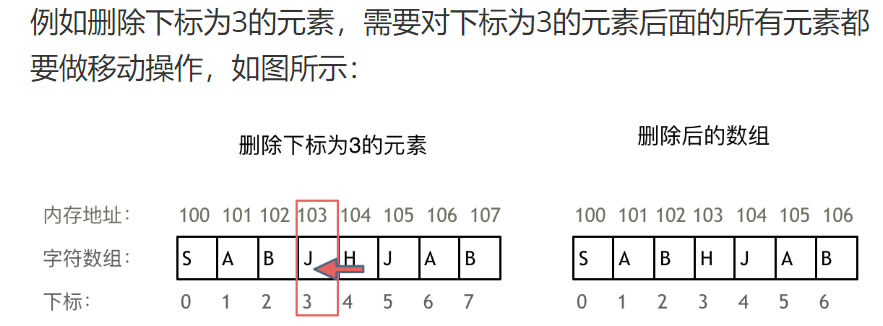
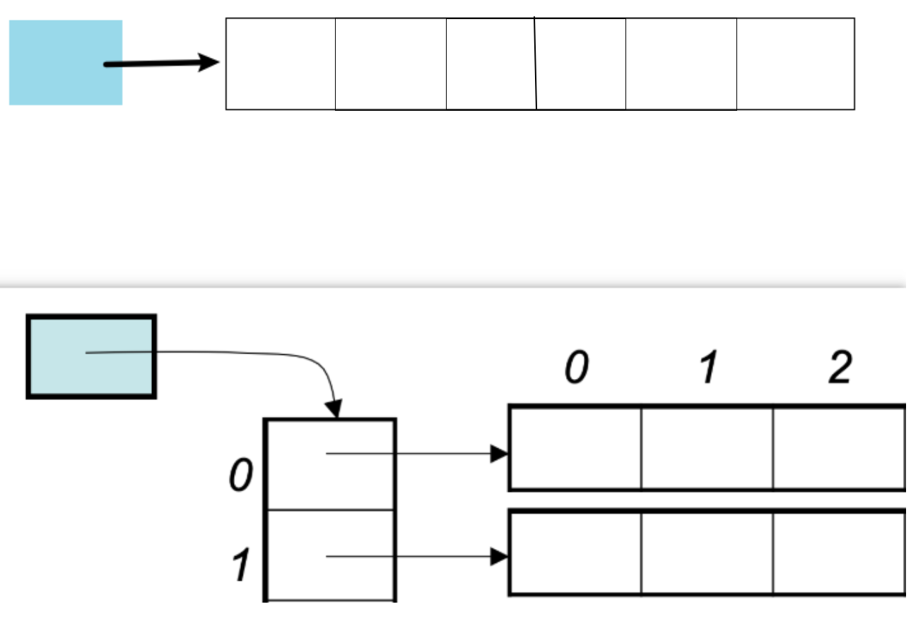

1.思维想法简单，实现难，主要考察对代码的掌控能力

+ 循环不变量：1，5
+ 双指针：2
+ 滑动窗口：4
+ 模拟：5


2. 一维数组
+ 数组下标都是从0开始的

+ 数组在内存的地址是连续的，所以删增元素的时候，要移动其他元素的地址



3. 二维数组

```java
int array[2][3] = {
    {0, 1, 2},
    {3, 4, 5}
};
// array[行][列]. 行指出哪个int[],列指出int[]中哪个int 
array[1][0] = 3
```

+ 二维数组在内存的地址： 不同语言的内存管理不一样
在C++中连续 
Java没有指针，不暴露元素的地址，寻址操作完全交给虚拟机。

分别如下（蓝色在栈中，白色在堆中）


