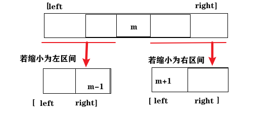
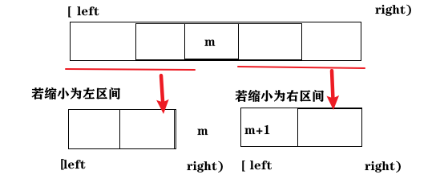

# 704. 题目

https://leetcode-cn.com/problems/binary-search/

给定一个n个元素有序的（升序）整型数组nums 和一个目标值target ，写一个函数搜索nums中的 target，如果目标值存在返回下标，否则返回 -1。

示例 1:
输入: nums = [-1,0,3,5,9,12], target = 9
输出: 4
解释: 9 出现在 nums 中并且下标为 4

示例2:
输入: nums = [-1,0,3,5,9,12], target = 2
输出: -1
解释: 2 不存在 nums 中因此返回 -1

提示：
* 你可以假设 nums中的所有元素是不重复的。
* n将在[1, 10000]之间。
* nums的每个元素都将在[-9999, 9999]之间。

# 思路

+ 二分法前提：
  + 数组为有序数组

  + 无重复元素：否则二分查找返回的下标可能不唯一

+ 难点：边界条件

  `while(left < right)` 还是 `while(left <= right)`

  `right = middle`，还是`right = middle - 1`

+ 循环不变量规则：重点是**区间的定义**，是不变量。循环中边界的处理都要根据区间的定义来操作。 
  + 只有在循环中坚持对区间的定义，才能清楚的把握循环中的各种细节
  
+ 定义target所在区间，通过循环比较，不断缩小这个区间

##  target 是在[left, right]

+ while (left <= right) ，因为当left == right，[left,right]中仍有元素未与target比较 
+ `right = middle - 1`，因为当前这个nums[middle]一定不是target，那么接下来要查找的左区间结束下标位置就是 middle - 1



 ```java
// O(n*logn)
public class Solution {   
	public static void main(String[] args) {
        int[] nums = new int[]{-1,0,3,5,9,12};
        int target = 9;
        System.out.println(search(nums, target));

        nums = new int[]{-1,0,3,5,9,12};
        target = 2;
        System.out.println(search(nums, target));
    }

    //! 注释为标答中更优的方式
    static int search(int[] nums, int target){
        /* 避免当 target 小于nums[0] nums[nums.length - 1]时多次循环运算
        if (target < nums[0] || target > nums[nums.length - 1]) {
            return -1;
        }
         */
        int l = 0, r = nums.length - 1, m; // l r m 为数组下标
        // 定义target在左闭右闭的区间里，[left, right]
        while (l <= r){  // 当left==right，区间[left, right]依然有效，所以用 <=
            m = (l + r) / 2;
            //! m = left + ((right - left) >> 1); 防止溢出
            if (nums[m] == target)
                return m; // 数组中找到目标值，直接返回下标
            else if (nums[m] > target){
                r = m - 1; // target 在左区间，所以[left, middle - 1]
            }else {
                l = m + 1; // target 在右区间，所以[middle + 1, right]
            }
        }
        return -1;  // 未找到目标值
    }
}
 ```

## target在[left, right)  

+ while (left < right)， 因为当left == right，[left,right）为空 
+ `right = middle`，因为当前nums[middle]不等于target，去左区间继续寻找，而寻找区间是左闭右开区间，所以right更新为middle，即：下一个查询区间不会去比较nums[middle]
+ 
+ 

```c++
class Solution { // cpp
public:
    int search(vector<int>& nums, int target) {
        int left = 0;
        int right = nums.size(); // 定义target在左闭右开的区间里，即：[left, right)
        while (left < right) { // 因为left == right的时候，在[left, right)是无效的空间，所以使用 <
            int middle = left + ((right - left) >> 1);
            if (nums[middle] > target) {
                right = middle; // target 在左区间，在[left, middle)中
            } else if (nums[middle] < target) {
                left = middle + 1; // target 在右区间，在[middle + 1, right)中
            } else { // nums[middle] == target
                return middle; // 数组中找到目标值，直接返回下标
            }
        }
        // 未找到目标值
        return -1;
    }
};
```

# 相关题目

* [35.搜索插入位置](https://programmercarl.com/0035.搜索插入位置.html)
* [34.在排序数组中查找元素的第一个和最后一个位置](https://programmercarl.com/0034.%E5%9C%A8%E6%8E%92%E5%BA%8F%E6%95%B0%E7%BB%84%E4%B8%AD%E6%9F%A5%E6%89%BE%E5%85%83%E7%B4%A0%E7%9A%84%E7%AC%AC%E4%B8%80%E4%B8%AA%E5%92%8C%E6%9C%80%E5%90%8E%E4%B8%80%E4%B8%AA%E4%BD%8D%E7%BD%AE.html)
* 69.x 的平方根
* 367.有效的完全平方数
