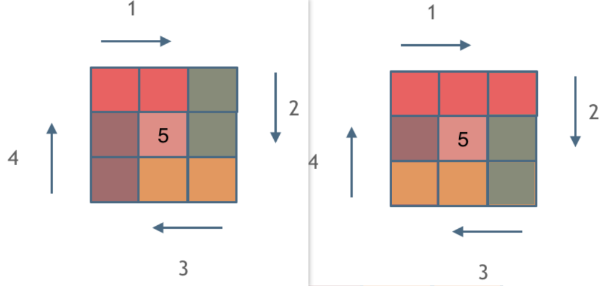

## 59.螺旋矩阵II

[力扣题目链接](https://leetcode-cn.com/problems/spiral-matrix-ii/)

给定一个正整数 n，生成一个包含 1 到 $n^2$ 所有元素，且元素按顺时针顺序螺旋排列的正方形矩阵。

示例:

输入: 3
输出:
[
 [ 1, 2, 3 ],
 [ 8, 9, 4 ],
 [ 7, 6, 5 ]
]

## 思路

+ 不涉及算法，就是模拟过程: 顺时针画矩阵，由外向内一圈一圈

+ 坚持**循环不变量原则**：按照固定规则来遍历

  每条边：左闭右开（图1），或者左开又闭，或者所有未被填写的元素（图2）

+ 每种颜色，代表一条边




### 左开右闭

```CPP
public static void main(String[] args) {
    int n = 1;
    int[][] ret = fun(n);
    for (Object o : ret) {
        System.out.println(Arrays.toString((int[])o));
    }
}

public static int[][] fun(int n){
    int[][] arr = new int[n][];
    for (int i = 0; i < n; i++) {
        arr[i] =  new int[n];
        // Arrays.fill(arr[i], 0); // 不需要
    }
    int num = 1; // 被填入的值
    int startX = 0, startY = 0; // 某次循环写入一个圈，圈的起始位置
    int x, y; // 临时变量，记录被填入的位置
    int len = n - 1;// 每次循环的每条边的长度
    for (int i = 0; i < n / 2; i++) {// 循环几圈（n为奇数时，最中间的一个元素不计入）
        // right
        x = startX;
        for (int j = 0; j < len; j++) {
            arr[startY][x++] = num++;
        }
        // down
        y = startY;
        for (int j = 0; j < len; j++) {
            arr[y++][x] = num++;
        }
        // left
        for (int j = 0; j < len; j++) {
            arr[y][x--] = num++;
        }
        // up
        for (int j = 0; j < len; j++) {
            arr[y--][startX] = num++;
        }
        // 更新变量，用于下一圈
        len -= 2; // 下一圈里，每条边的长度
        startX = startY = startX+1; // 下一圈的起始位置加1
    }
    // n为奇数，填入中间的元素
    if (n % 2 == 1){
        int mid = n/2; // 矩阵中间的位置
        // 例如：n为3 中间的位置就是(1，1)，n为5，中间位置为(2, 2)
        arr[mid][mid] = num;
    }
    return arr;
}
```

### 每条边：所有未被填写的元素（我的解法）

```java
public class Solution{
    public static int[][] fun(int n){
        int[][] arr = new int[n][];
        for (int i = 0; i < n; i++) {
            arr[i] =  new int[n];
            // Arrays.fill(arr[i], 0); // 不需要
        }
    
        int num = 1, i = 0, j = 0;
        boolean isFinish = false; // 标记完成 
        // 顺时针逐条边填写（每次循环填写四条，即一圈）
        while (!isFinish){
            // right
            isFinish = true;
            while (true){
                if (j == n || arr[i][j] != 0){ // 下一个位置无效(越界)或者已有内容 则转向
                    j--;
                    i++;
                    break;
                }
                isFinish = false; // 本方向有新填入的位置
                arr[i][j++] = num++;
            }
            if (isFinish) break; // 当某条边写入的次数为0，则所有填写完
            // down
            isFinish = true;
            while (true){
                if (i == n || arr[i][j] != 0){
                    i--;
                    j--;
                    break;
                }
                isFinish = false;
                arr[i++][j] = num++;
            }
            if (isFinish) break;
            // left
            isFinish = true;
            while (true){
                if (j == -1 || arr[i][j] != 0){
                    j++;
                    i--;
                    break;
                }
                isFinish = false;
                arr[i][j--] = num++;
            }
            if (isFinish) break;
            // up
            isFinish = true;
            while (true){
                if (i == -1 || arr[i][j] != 0){
                    i++;
                    j++;
                    break;
                }
                isFinish = false;
                arr[i--][j] = num++;
            }
            if (isFinish) break;
        }
        return arr;
    }
}
```


## 类似题目

* 54.螺旋矩阵
* 剑指Offer 29.顺时针打印矩阵