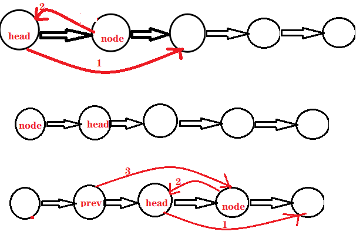

## 24. 两两交换链表中的节点

[力扣题目链接](https://leetcode-cn.com/problems/swap-nodes-in-pairs/)

给定一个链表，两两交换其中相邻的节点，并返回交换后的链表。

你不能只是单纯的改变节点内部的值，而是需要实际的进行节点交换。

 </img></div>

## 思路

正常模拟就可以了。

虚拟头结点，方便很多，要不然每次单独处理 头结点（没有前一个指针指向头结点）

接下来就是交换相邻两个元素了，**一定要画图**

初始时，cur指向虚拟头结点，然后进行如下三步：


 黑线为操作前，红线为操作后


```CPP
class Solution {
public ListNode swapPairs(ListNode head) { 
        if (head == null) return null; // 0个节点
        ListNode node = head;
        ListNode next = node.next;
        ListNode prev = new ListNode(-1, head); // 虚拟头结点
        head = prev;
        while (next != null){
            // prev - node - next - ...
            node.next = next.next;
            prev.next = next;
            next.next = node;
            // prev - next - node ...
            prev = node;
            node = node.next;
            if (node == null) break;
            next = node.next;
        }
        return head.next;
    }
}
```

* 时间复杂度：O(n)
* 空间复杂度：O(1)

### 普通



```java
// 无头结点
public class Solution {

    class ListNode {
          int val;
          ListNode next;
          ListNode() {}
          ListNode(int val) { this.val = val; }
          ListNode(int val, ListNode next) { this.val = val; this.next = next; }
     }

    public ListNode swapPairs(ListNode head) {
        if (head == null || head.next == null) 
            return head; // 只有0/1 个节点
        ListNode next = head.next;
        ListNode prev = null;
        ListNode node = head;
        ListNode list = head.next; // 交换后的头节点
        while (next != null){
            // 交换head和next,连接到后面的链表
            head.next = next.next; // 1
            next.next = node; // 2
            // 连接到前面的链表
            if (prev != null) // 3
                prev.next = next;
            prev = node; // 4
            // 更新到下一组(注意，此时next在node前面)
            node = node.next; // 5
            if(node == null) break;
            next = node.next; // 6
        }
        return list;
    }
}
```

