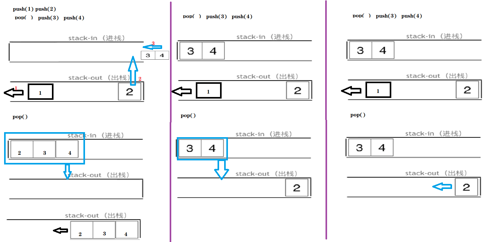

# 232.用栈实现队列

 https://leetcode-cn.com/problems/implement-queue-using-stacks/ 

使用栈实现队列的下列操作：

push(x) -- 将一个元素放入队列的尾部。     
pop() -- 从队列首部移除元素。    
peek() -- 返回队列首部的元素。    
empty() -- 返回队列是否为空。   


示例:

```cpp
MyQueue queue = new MyQueue();
queue.push(1);
queue.push(2);
queue.peek();  // 返回 1
queue.pop();   // 返回 1
queue.empty(); // 返回 false
```

说明:

* 你只能使用标准的栈操作 -- 也就是只有 push to top, peek/pop from top, size, 和 is empty 操作是合法的。
* 你所使用的语言也许不支持栈。你可以使用 list 或者 deque（双端队列）来模拟一个栈，只要是标准的栈操作即可。
* 假设所有操作都是有效的 （例如，一个空的队列不会调用 pop 或者 peek 操作）。

## 思路

模拟题，栈来模式队列，需要两个栈 

### 法1

+ 2个栈：stack和tmp。

  元素都存在stack。tmp只在pop和peek时，临时存，之后需要放回stack

+ 问题：

   

  如上三列：push(1)   push(2)   pop()   push(3)   push(4)   pop() 

  出的顺序应为12

  + 图1为法一，pop需要放入tmp，再放回stack
  + 为何放回？见图2，如果不放回，第二次pop，34进入tmp后，st2在后面，无法先出
  + 问题：其实，若不放回，第二次pop，34不用进入tmp，只用2出（见图3）(此方法，pop/peek时间减半)

```java
class MyQueue{
    Stack<Integer> stack;
    Stack<Integer> tmp;

    public MyQueue() {
        stack = new Stack<>();
        tmp = new Stack<>();
    }

    // O(1)
    public void push(int x) {
        stack.push(x);
    }
    // 所有移到tmp，取出最后一个入栈元素，再将tmp移回stack
    // O(2n)
    public int pop() {
        while (!stack.isEmpty()){
            tmp.push(stack.pop());
        }
        int ret = tmp.pop();
        while (!tmp.isEmpty()){
            stack.push(tmp.pop());
        }
        return ret;
    }
	// O(2n)
    public int peek() {
        while (!stack.isEmpty()){
            tmp.push(stack.pop());
        }
        int ret = tmp.peek();
        while (!tmp.isEmpty()){
            stack.push(tmp.pop());
        }
        return ret;
    }

    public boolean empty() {
        return stack.isEmpty();
    }

    public static void main(String[] args) {
        final Stack<Object> objects = new Stack<>();
    }
}
```

### 法二：两个队列分别模拟 出入栈

queue.push(1);     
queue.push(2);       
queue.pop(); **注意此时的输出栈的操作**   
queue.push(3);    
queue.push(4);     
queue.pop();    
queue.pop();**注意此时的输出栈的操作**   
queue.pop();      
queue.empty();      


+ push：数据放进输入栈 

+ pop：输出栈如果为空，就把进栈数据**全部导入进来**，再从出栈弹出数据，如果输出栈不为空，则直接从出栈弹出
+ 判空：进栈和出栈都为空

```java
class MyQueue{
    Stack<Integer> in;
    Stack<Integer> out;

    public MyQueue() {
        in = new Stack<>();
        out = new Stack<>();
    }
	// O(1)
    public void push(int x) {
        in.push(x);
    }
	// O(n)
    public int pop() {
        if (!out.isEmpty()){ // 直接从out取出，因为out中剩余的元素，一定在in的元素前进入
            return out.pop();
        }
        // out为空，in 全部放入 out
        in2out();
        return out.pop();
    }
	// O(n)
    public int peek() {
        if (!out.isEmpty()){ // 直接从out取出，因为out中剩余的元素，一定在in的元素前进入
            return out.peek();
        }
        // out为空，in 全部放入 out
        in2out();
        return out.peek();
    }

    // peek和pop的 部分代码 重复: in全部放入out
    private void in2out(){
        while (!in.isEmpty()){
            out.push(in.pop());
        }
    }
    
    public boolean empty() {
      return in.isEmpty() && out.isEmpty();
    }
}
```
