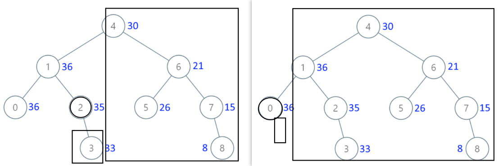

# 538.把二叉搜索树转换为累加树

[力扣题目链接](https://leetcode-cn.com/problems/convert-bst-to-greater-tree/)

给出二叉 搜索 树的根节点，该树的节点值各不相同，请你将其转换为累加树（Greater Sum Tree），使每个节点 node 的新值等于原树中大于或等于 node.val 的值之和。

提醒一下，二叉搜索树满足下列约束条件：

节点的左子树仅包含键 小于 节点键的节点。
节点的右子树仅包含键 大于 节点键的节点。
左右子树也必须是二叉搜索树。

示例 1：


* 输入：[4,1,6,0,2,5,7,null,null,null,3,null,null,null,8]
* 输出：[30,36,21,36,35,26,15,null,null,null,33,null,null,null,8]

示例 2：
* 输入：root = [0,null,1]
* 输出：[1,null,1]

示例 3：
* 输入：root = [1,0,2]
* 输出：[3,3,2]

示例 4：
* 输入：root = [3,2,4,1]
* 输出：[7,9,4,10]

提示：

* 树中的节点数介于 0 和 104 之间。
* 每个节点的值介于 -104 和 104 之间。
* 树中的所有值 互不相同 。
* 给定的树为二叉搜索树。

 

## 递归

+ 二叉搜索树，有序

  有序数组[2, 5, 13]，求从后到前的累加数组，也就是[20, 18, 13]

+ so按顺序遍历节点，更新数值

  从大到小累加，so反中序遍历（右中左）


+ 需要一个pre指针记录当前遍历节点的前一个节点，用于累加。

  或者一个int变量存当前累加的和

```CPP
class Solution {
private:
    int pre; // 记录前一个节点的数值
    void traversal(TreeNode* cur) { // 右中左遍历
        if (cur == NULL) return; // 终止：遇空 
        traversal(cur->right);  // 右
        cur->val += pre;        // 中：累加
        pre = cur->val;
        traversal(cur->left);   // 左
    }
public:
    TreeNode* convertBST(TreeNode* root) {
        pre = 0;
        traversal(root);
        return root;
    }
};
```

## 迭代法

 

```CPP
class Solution {
private:
    int pre; // 记录前一个节点的数值
    void traversal(TreeNode* root) {
        stack<TreeNode*> st;
        TreeNode* cur = root;
        while (cur != NULL || !st.empty()) {
            if (cur != NULL) {
                st.push(cur);
                cur = cur->right;   // 右
            } else {
                cur = st.top();     // 中
                st.pop();
                cur->val += pre;
                pre = cur->val;
                cur = cur->left;    // 左
            }
        }
    }
public:
    TreeNode* convertBST(TreeNode* root) {
        pre = 0;
        traversal(root);
        return root;
    }
};
```

## 递归2



不论左右孩子，需要累加：它的右子树，所有的右侧祖先及这些祖先的右子树 

```java
public class Solution4 {
    public TreeNode convertBST(TreeNode root) {
        traverse(root, 0);
        return root;
    }

    // 传递：所有右祖先及他们的右子树的和
    // 返回：root所有节点的和
    // 并在遍历中更新当前节点值(+右子树的和+all右祖先及其右子树)
    int traverse(TreeNode root, int prevSum){
        // 终止：空节点
        if(root == null) return 0;
        // 递归右：见左图（2是右孩子）
        int rightSum = traverse(root.right, prevSum); 
        // 递归左：见右图（0是左孩子）
        int leftSum = traverse(root.left, prevSum + root.val + rightSum);
        // 中：更新节点的累加值，计算并返回树的和
        int sum = leftSum + rightSum + root.val;
        root.val += rightSum + prevSum;
        return sum;
    }
}
```