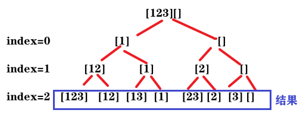

# 78.子集

[力扣题目链接](https://leetcode-cn.com/problems/subsets/)

给定一组不含重复元素的整数数组 nums，返回该数组所有可能的子集（幂集）。

说明：解集不能包含重复的子集。

示例:
输入: nums = [1,2,3]
输出:
[
  [3],
  [1],
  [2],
  [1,2,3],
  [1,3],
  [2,3],
  [1,2],
  []
]

## 回溯1 

+ 例 nums = [1,2,3]

  遍历树，记录所有节点，就是要求的子集集合

  

 区别：组合问题有要求，so只在叶子得结果。子集则在所有节点得结果


+ **求取子集问题，不需要任何剪枝！因为子集就是要遍历整棵树**。

+ 终止条件：startIndex超范围（但在for中避免了这种情况继续递归

  so，不用 if 判断 

  不会无限递归，因每次递归for从i+1开始。

```java
public class Solution1 {

    List<List<Integer>> results = new ArrayList<>(); // 结果集

    ArrayList<Integer> path = new ArrayList<>(); // 当前处理的子集

    public List<List<Integer>> subsets(int[] nums) {
        backtrace(nums, 0);
        return results;
    }

    // 本次 从nums[startIndex] 开始处理
    void backtrace(int[] nums, int startIndex){
        // 终止：startIndex超范围（但在for中避免了这种情况继续递归
        // 过程中，树的节点作为结果收集起来
        results.add(new ArrayList<Integer>(path));
        // 本层：添加一个元素
        for(int i = startIndex; i < nums.length; i++){
            path.add(nums[i]);
            backtrace(nums, i+1); // 递归
            path.remove(path.size() - 1); // 回溯
        }
    }
}
```

 

## 回溯 2

另一种理解：对于每个元素，可取/不取。

构成一颗二叉树，层数=数组大小

 

注意：无for循环，因为每次递归处理一个元素，只有取/不取 2种情况

```java
public class Solution1 {
    List<List<Integer>> results = new ArrayList<>();

    ArrayList<Integer> path = new ArrayList<>();

    public List<List<Integer>> subsets(int[] nums) {
        backtrace(nums, 0);
        return results;
    }

    // 本次处理 nums[index] 这个元素
    void backtrace(int[] nums, int index){
        // 终止：所有元素处理完
        if(index == nums.length){
            results.add(new ArrayList<Integer>(path));
            return;
        }
        // 取/不取
        path.add(nums[index]);
        backtrace(nums, index+1);
        path.remove(path.size() - 1); // 回溯

        backtrace(nums, index+1);
    }
}
```

