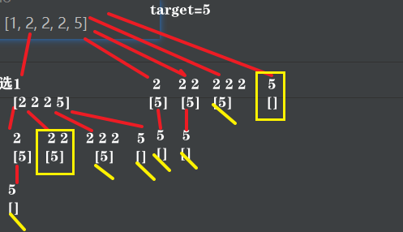

> 这篇可以说是全网把组合问题如何去重，讲的最清晰的了！

# 40.组合总和II

[力扣题目链接](https://leetcode-cn.com/problems/combination-sum-ii/)

给定一个数组   candidates   和一个目标数   target   ，找出   candidates   中所有可以使数字和为   target   的组合。

candidates   中的每个数字在每个组合中只能使用一次。

说明：
所有数字（包括目标数）都是正整数。
解集不能包含重复的组合。   

示例   1:
输入: candidates =   [10,1,2,7,6,1,5], target =   8,
所求解集为:
[
  [1, 7],
  [1, 2, 5],
  [2, 6],
  [1, 1, 6]
]

示例   2:
输入: candidates =   [2,5,2,1,2], target =   5,
所求解集为:
[
    [1,2,2],
    [5]
]

# 思路

+ 和[39.组合总和](https://programmercarl.com/0039.组合总和.html)区别：

  1. candidates   每个元素在每个组合中只能用一次 

  2. candidates 元素有重复，而[39.组合总和](https://programmercarl.com/0039.组合总和.html)是无重复元素的数组candidates

+ 总结

  39：candidates 每个数字 选任意次

  40：candidates 每个数字 选0-m次（m为数字出现次数）

+ **难点：**

  区别2中：数组candidates 有重复元素，但结果中不能有重复的组合。

  ```
  eg：（1表示选取）
   [1,1,2] target=3
    1   1
      1 1
  2情况相同
  
  [1,2,2,2,5] target=5
   1 1 1
   1 1   1 
   1   1 1 
          1
  前三种情况相同
  ```


## 回溯1

### used数组去重
+ **去重， 就是用过的数不能重复选 **

  + 用过 的 两种含义： 一个维度是同一树枝（纵向）用过，一个维度是同一树层（横向）用过。

    **没有理解这两个层面上的“使用过” 是造成大家没有彻底理解去重的根本原因。**

  + 元素在同一组合内（纵向）可重复选，但两个组合间（横向）不能 取相同次数。

    因此，去重 同一树层上的“使用过”，同一树枝上的 是一个组合里的元素，可以出现多次（不用去重）

    

+ 思路：

  + used[i] = 本条路径 path，是否选取 candidates[i] 

  + 对于[1,1,2]，若某条路径 used=[0,1,]，则与之前某路径 used=[1,0,]，出现重复结果

    

    so，对于[...,a,...,a,...] 

    不能出现 used = [...,0,..,1,...,]（树层出现重复，导致path重复） 

    只可[...,1,..,1,0,...,]（树枝出现重复元素，可重复选，不用去重）

    

    对于 candidates[i] == candidates[i - 1]
    used[i - 1] == false，说明同一树层candidates[i - 1]使用过 

    used[i - 1] == true，说明同一树枝candidates[i - 1]使用过
    集合中可以取重复元素，但结果不能含重复子集
    

    即：若当前处理的元素，非 candidates 第一次出现。则之前出现的all同值元素，都必须被选，才能选当前元素

  + **强调：树层去重，需要对数组排序！**

   

* 


```java
public class Solution8 {
    List<List<Integer>> results = new ArrayList<>();
    ArrayList<Integer> path = new ArrayList<>();
    int[] used; // 记录 元素是否使用过 

    public List<List<Integer>> combinationSum2(int[] candidates, int target) {
        used = new int[candidates.length];
        // 首先 candidates排序，让 相同元素 挨一起。
        Arrays.sort(candidates);
        backtrace(candidates, target, 0);
        return results;
    }
	// startIndex: 本次递归，处理的首个元素的下标
    void backtrace(int[] candidates, int target, int startIndex){
        // 终止：到达target
        if(target < 0){ // 这个条件其实可以省略(在for，有剪枝的操作)
            return;
        } else if (target == 0){
            results.add(new ArrayList<Integer>(path));
            return;
        }
        // 本层：添加当前数
        // 去重：若 当前数在candidates非第一次出现，需要取所有前面的相同数，才能取当前数
        for(int i = startIndex; i < candidates.length; i++){
        // 剪枝：i < candidates.length && candidates[i] <= target;
             
            if(i != 0 && candidates[i] == candidates[i-1] && used[i-1] == 0){
                continue;
            }
            path.add(candidates[i]);
            used[i] = 1;
            backtrace(candidates, target-candidates[i], i+1);
            path.remove(path.size() - 1); // 回溯
            used[i] = 0;
        }
    }
}
```


+ 直接用startIndex来去重， 不用used数组。

```CPP
class Solution {
private:
    vector<vector<int>> result;
    vector<int> path;
    void backtracking(vector<int>& candidates, int target, int sum, int startIndex) {
        if (sum == target) {
            result.push_back(path);
            return;
        }
        for (int i = startIndex; i < candidates.size() && sum + candidates[i] <= target; i++) {
            // candidates[i] == candidates[i-1]，表示之前有相同元素
            // i>startIndex：对同一树层（横向）去重
            // i=startIndex：对同一树枝（纵向）不去重
            if (i > startIndex && candidates[i] == candidates[i - 1]) {
                continue;
            }
            sum += candidates[i];
            path.push_back(candidates[i]);
            backtracking(candidates, target, sum, i + 1); // 和39.组合总和的区别1，这里是i+1，每个数字在每个组合中只能使用一次
            sum -= candidates[i];
            path.pop_back();
        }
    }

public:
    vector<vector<int>> combinationSum2(vector<int>& candidates, int target) {
        path.clear();
        result.clear();
        // 首先把给candidates排序，让其相同的元素都挨在一起。
        sort(candidates.begin(), candidates.end());
        backtracking(candidates, target, 0, 0);
        return result;
    }
};

```

### set去重


```CPP
class Solution {
private:
    vector<vector<int>> result;
    vector<int> path;
    void backtracking(vector<int>& candidates, int target, int sum, int startIndex) {
        if (sum == target) {
            result.push_back(path);
            return;
        }
        unordered_set<int> uset; // 控制某一节点下的同一层元素不能重复
        for (int i = startIndex; i < candidates.size() && sum + candidates[i] <= target; i++) {
            if (uset.find(candidates[i]) != uset.end()) {
                continue;
            }
            uset.insert(candidates[i]); // 记录元素
            sum += candidates[i];
            path.push_back(candidates[i]);
            backtracking(candidates, target, sum, i + 1);
            sum -= candidates[i];
            path.pop_back();
        }
    }

public:
    vector<vector<int>> combinationSum2(vector<int>& candidates, int target) {
        path.clear();
        result.clear();
        sort(candidates.begin(), candidates.end());
        backtracking(candidates, target, 0, 0);
        return result;
    }
};
```


## 回溯2

思路：理解为每个数字可选0-m次，m为该数字出现次数

每次递归，处理一个数字（对应多个同值元素），选1-m次


(黄/为不符合要求的叶子，黄框为符合要求的叶子，存到结果集)

```java
public class Solution8 {
    List<List<Integer>> results = new ArrayList<>();
    ArrayList<Integer> path = new ArrayList<>();

    public static List<List<Integer>> combinationSum2(int[] candidates, int target) {
        Arrays.sort(candidates); //! 先排序
        backTrace(candidates, 0, target);
        return results;
    }

    // index: candidates中首个可选的元素的下标
    static void backTrace(int[] candidates, int index, int target) {
        // 终止：累计和超过目标；达目标
        if(target < 0){
            return;
        } else if(target == 0){
            results.add(new ArrayList<Integer>(path));
            return;
        } 
        // 处理一个数字（对应多个同值元素），选择该数字 1~cnt 次
        for(int i = index; i < candidates.length;){
            // 本次处理的数字，及其最多可选的次数cnt
            // 让i到下一个数的下标/出界
            int candidate = candidates[i];
            int cnt = 0;
            while ( i < candidates.length && candidate == candidates[i]){
                i++;
                cnt++;
            }
            // 讨论完这个数所有的选取方式（选1~cnt个）（选0个这种情况,出现于下次for循环中）
            for (int j = 1; j <= cnt; j++) { // j为这个数选取的个数
                path.add(candidate);
                backTrace(candidates, i, target - candidate*j);
            }
            for (int j = 1; j <= cnt; j++) { // 全部回溯
                path.remove(path.size() - 1);
            }
        }
    }
}
```

