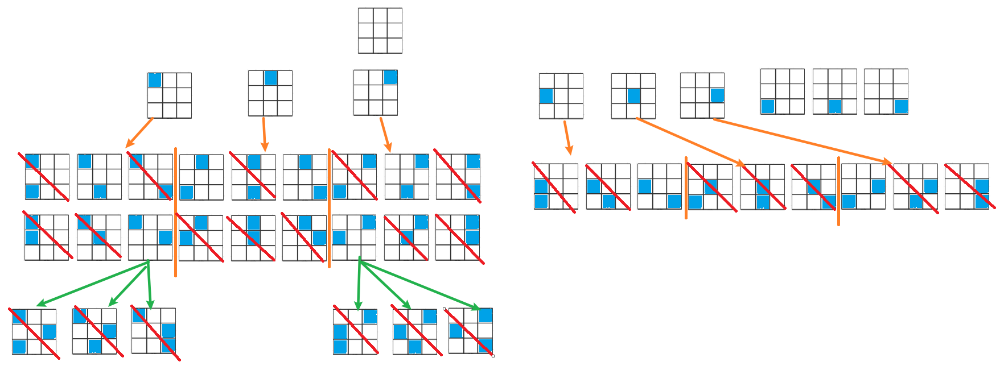

# 第51题. N皇后

[力扣题目链接](https://leetcode-cn.com/problems/n-queens/)

n 皇后问题 研究的是如何将 n 个皇后放置在 n×n 的棋盘上，并且使皇后彼此之间不能相互攻击。

给你一个整数 n ，返回所有不同的 n 皇后问题 的解决方案。

每一种解法包含一个不同的 n 皇后问题 的棋子放置方案，该方案中 'Q' 和 '.' 分别代表了皇后和空位。

示例 1：


* 输入：n = 4
* 输出：[[".Q..","...Q","Q...","..Q."],["..Q.","Q...","...Q",".Q.."]]
* 解释：如上图所示，4 皇后问题存在两个不同的解法。

示例 2：

* 输入：n = 1
* 输出：[["Q"]]

### 思路

想法的变化：

+ 二重：每次递归，选一个位置放皇后（遍历棋盘all位置）

  + 去重：（A放皇后，B放皇后）与（B放皇后，A放皇后）
    皇后位置 行列 都递增

    + 问题: 01 13 20 32 (不满足 行 列 都递增)

  + 去重：行递增

    

    + 效率低，会出现隔层加皇后，无效结果

+ 一重，见下

### 回溯 1重

+ 约束条件：

  不能同行、同列、同斜线

* 树

  矩阵高 = 树的高度，

  矩阵宽 = 每个节点的宽度。 

  用皇后的约束条件，来回溯搜索这棵树，**只要搜索到了树的叶子节点（到第n行），说明出现结果**

  

* 参数row：控制棋盘的行，

  不检查行 是否有皇后

  树枝中，每次递归 向下处理一行，不用去重（因为本行还未处理过） 

* 每次递归for循环（树层）col控制棋盘列，

  每次递归，处理新的一行，so 从起始位置开始搜（列=0）。 

```java
 public class Solution0 {
    int n; // 不变
    boolean[] col; // 列上是否有皇后
    boolean[][] panel; // 棋盘所有位置 是否有皇后

    //    int cnt = 0; // 不用记：总皇后数，因回溯函数中传递当前行，就==皇后数
    List<List<String>> results = new ArrayList<>(); // 存结果

    public List<List<String>> solveNQueens(int n) {
        col = new boolean[n];
        panel = new boolean[n][n];
        backtrack(0);
        return results;
    }

    // 本次加皇后，行=startRow
    void backtrack(int startRow){
        // 终止：到最后一行
        if(startRow == n){
            results.add(getResult());
            return;
        }
        // 本层：
        // 1维递归（for循环），在row找一个节点
        // 要遍历所有列坐标 
        for(int j = 0; j < n; j++){
            // 要求：行、列、斜线无皇后
            if(col[j]) continue;// 列有皇后，跳过
            if(slashHaveQueen(startRow, j)) continue; // 斜线有皇后，跳过
            col[j] = true; // 递归
            panel[startRow][j] = true;
            backtrack(startRow+1);
            col[j] = false; // 回溯
            panel[startRow][j] = false;
        }

    }
    // 从当前panel，转化为字符串格式的结果
    ArrayList<String> getResult(){
        ArrayList<String> result = new ArrayList<>();
        for(int i = 0; i < n; i++){
            StringBuffer sb = new StringBuffer();
            for(int j = 0; j < n; j++){
                if(panel[i][j]){ // 有皇后
                    sb.append('Q');
                } else {
                    sb.append('.');
                }
            }
            result.add(sb.toString());
        }
        return result;
    }

    // row行，col列。四个方向的斜线上有无queen
    // 优化：添加顺序 行递增，so只用判断左上右上
    boolean slashHaveQueen(int row, int col){
        int i, j;
        // 左上
        for(i=row-1, j=col-1; i>=0 && j>=0; i--,j--){
            if(panel[i][j]) return true;
        }
        // 右上
        for(i=row-1, j=col+1; i>=0 && j<n; i--,j++){
            if(panel[i][j]) return true;
        }
        return false;
    } 
};
```

###  

 ## 错：2重回溯

只展示 for 循环（2重）

```java
// 本层
// 二维递归（for循环），从startRow开始，遍历所有坐标（需该列0个.再判断满足斜线）
for(int i = startRow; i < n; i++){ 
    for(int j = 0; j < n; j++){
    	if(col[j]) continue;// 列有皇后，跳过
        if(slashHaveQueen(i, j)) continue; // 斜线有皇后，跳过
        // 行、列、斜线无皇后，递归回溯
        col[j] = true;
        panel[i][j] = true;
        cnt++;
        backtrack(i+1);
        col[j] = false;
        panel[i][j] = false;
        cnt--;
    }
}
```