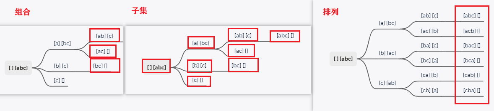

 

 </img></div>

视频：[带你学透回溯算法（理论篇）](https://www.bilibili.com/video/BV1cy4y167mM/) 

## 什么是回溯法

+ 也叫回溯搜索法，一种搜索的方式。

  深度优先的方式。类似枚举的搜索解空间

  从一条路往前走，能进则进(深度优先)。不能进（已不满足求解条件）则退回来，换条路再试

+ 回溯是递归的副产品

  **回溯函数也是递归函数，同一个函数**。 

  所以回溯法也经常和二叉树遍历，深度优先搜索混在一起，因为这两种方式都是用了递归。

+ 搜索过程中用剪枝函数，避免无效搜索。

+ 在二叉树系列中，多次提到回溯 [二叉树：以为使用了递归，其实还隐藏着回溯](https://programmercarl.com/二叉树中递归带着回溯.html)


+ **回溯法解决的问题。都可抽象为树形结构** 

  因为回溯法解决的，都是在集合中递归查找子集，

  集合大小 构成 树的宽度（N叉树）

  递归深度 构成 树的深度（有终止条件，so必然是一棵高度有限的树） 

  （注意图中，举例集合大小和孩子的数量是相等的！ 

   for循环横向遍历，递归纵向遍历，回溯不断调整结果集
  
  


## 模板

回溯三部曲。

```java
// 返回值:一般为void。一般在叶子得结果，记到全局变量
// 参数:不像二叉树递归那么容易确定。一般先写逻辑，需要什么参数，就填什么参数。
//     （但后面的回溯题目的讲解中，为了方便理解，在一开始把参数确定下来。
void backtracking(参数) {
    // 终止条件 (类比树形结构。搜到叶子节点，就找到满足条件的一条答案，把答案存起来，并结束递归。 
    if (终止条件) {
        存结果;
        return;
    }
	// for循环-横向遍历：遍历集合区间，可以理解一个节点有多少个孩子，这个for循环就执行多少次。 
	// backtracking递归-纵向遍历 
    for (选择：本层集合中元素（树中节点孩子的数量就是集合的大小）) {
        处理节点;
        backtracking(路径，选择列表); // 递归
        回溯，撤销处理结果
    }
}
```

## 效率

+ 不高效

  本质：穷举所有可能，然后选出想要的答案

  提效：加一些剪枝操作

+ 为什么还要用它？

  没得选，一些问题能暴力搜出来就不错了，撑死了再剪枝一下，还没有更高效的解法。 


## 问题分类

+ 题目要求

| 题号     | 集合      | 每个元素选择次数        | 选择元素数 | 要求                     |
| -------- | --------- | ----------------------- | ---------- | ------------------------ |
| 组合2    | [1,...,n] | 0/1                     | k          |                          |
| 4        | [1,...,9] | 0/1                     | k          | 和为n                    |
| 7        | 不重复    | 任意                    | 任意       | 和为target               |
| 8        | 重复      | 0-m （m为元素出现次数） | 任意       | 和为target               |
| 子集11   | 不重复    | 0/1                     | 任意       |                          |
| 13       | 重复      | 0-m                     | 任意       |                          |
| 子序列14 | 重复      | 0-m                     | >=2        | 按原顺序。值递增（可等） |
| 排列15   | 不重复    | 1                       | 所有       | 结果有序                 |
| 16       | 重复      | 1                       | 所有       | 结果有序                 |

深度：终止条件（选择个数、目标和）（不用处理：集合都用完，因for避免该情况继续递归） 

+ 分类
  + 组合问题：N个数里面按一定规则找出k个数的集合
    * [abc]选2个
  + 切割问题：一个字符串按一定规则有几种切割方式
  + 子集问题：一个N个数的集合里有多少符合条件的子集
    * [abc]的子集
  + 排列问题：N个数按一定规则全排列，有几种排列方式
    * [abc]的全排列
  + 棋盘问题：N皇后，解数独 



+ 对比

|      | 组合     | 切割         | 子集 | 子序列 | 排列         |
| ---- | -------- | ------------ | ---- | ------ | ------------ |
| 收集 | 叶子     | 叶子         | 所有 | 所有   | 叶子         |
| 终止 | 选够个数 | 遍历完整个串 |      |        | 取完所有数字 |

子集，子序列终止条件：所有元素遍历完，不用判断终止，因为for会防止继续递归

## 去重

+ 树枝去重：当前结果集中，元素不重复取

  + 组合，子集，子序列：startIndex 递增，调整下层递归的起始位置

    （7可无限选，则startIndex递增或相等，st可再次选择该元素）

  + 排列：

    + startIndex 每次从0开始，无法用于去重

      因结果有序，可以先选后面的，再选前面的。无法控制递增选

      如：1在[1,2]中用过了，但在[2,1]还要用

    + used数组 对树枝去重（满足 used[i] == false）

+ 树层去重：若集合有重复数字，但结果集不能有重复

  不选同树层（for中）选过的元素

  8，13，16

  + 组合，子集，排列：used数组 / set 

    + 先排序

    + used数组：所有元素是否被用（path里都放了哪些元素）

      若之前出现过同元素，必须选之前的元素，st该元素是在上层（树枝）选，本层不重复选

      不可：i != 0 && nums[i] == nums[i - 1] && used[i - 1] == false

    + set：记录for循环（树层）选过的元素

      注意：局部变量，不传给下层递归，so不用回溯

      不可：uset.find(nums[i]) != uset.end()

    + i

      不可：i > startIndex && nums[i] == nums[i - 1]

      本次递归，for从startIndex开始，若当前元素非本次for的第一个，且前一个是同元素，说明树层出现重复

      用i去重，因为递归的时候下一个startIndex是i+1而不是0（排列不可此法

  + 子序列

    + 要保持原顺序，so不能对原数组排序
    + 用set去重，保证for循环不选重复元素

## 各类问题的关系

+ 组合是一种子集问题。

  组合：满足要求的节点，再递归下去，将不再满足要求，so在叶子节点得结果

  而子集是所有节点都满足

+ 递增子序列 类似 子集

  都在所有节点得结果.

  区别：保持原数组的顺序

+ 子集的另一种思路：对每个元素分类讨论

  | 题号              | 被处理的         | 对每个元素 |
  | ----------------- | ---------------- | ---------- |
  | 从多个集合求组合5 | 数字字符串       | 映射到字母 |
  | 子集11            | nums（不重复）   | 取/不取    |
  | 子集13            | nums（may重复）  | 取/不取    |
  | 数独37            | 棋盘所有空白位置 | 1-9选一个  |

+ 优化：常先排序，再剪枝

## 性能分析

空间复杂度：把系统栈（不是数据结构里的栈）所占空间算进去。

|        | 时间                                                         | 空间                                     |
| ------ | ------------------------------------------------------------ | ---------------------------------------- |
| 子集   | O(2^n) 每一个元素 取/不取（非n!，因有剪枝）                  | O(n) 递归深度为n，每层递归所用空间是常数 |
| 组合   | O(2^n) 是一种子集问题，最坏情况不超子集时间复杂度            | 同子集                                   |
| 排列   | O(n!) 每层节点为n，第二层每一个分支都延伸了n-1个分支，再往下又是n-2个分支 | 同子集                                   |
| N皇后  | O(n!) 看树形图直觉是O(n^n)，但搜索过程 有剪枝(皇后间不能见面) | 同子集                                   |
| 解数独 | O(9^m) m是空白的数目                                         | O(n^2)，递归的深度是n^2                  |

+ 去重：使用 used数组 / set

  + set 频繁的insert，需要哈希映射费时间，而且insert的时候其底层的符号表也要做相应的扩充

  + set 空间复杂度也高了。组合，子集，排列问题的空间复杂度都是O(n)

    但如果使用set去重，空间复杂度就变成O(n^2)，因为每次递归都有一个set集合，系统栈空间是n，每一个空间都有set集合。

  + 用used数组也占用O(n)空间

    但是全局变量，每层与每层之间公用一个used数组，所以空间复杂度是 O(n + n) ，最终空间复杂度还是$O(n)