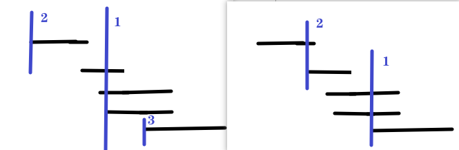

# 452. 用最少箭引爆气球

[力扣题目链接](https://leetcode-cn.com/problems/minimum-number-of-arrows-to-burst-balloons/)

在二维空间中有许多球形的气球。对于每个气球，提供的输入是水平方向上，气球直径的开始和结束坐标。由于它是水平的，所以纵坐标并不重要，因此只要知道开始和结束的横坐标就足够了。开始坐标总是小于结束坐标。

一支弓箭可以沿着 x 轴从不同点完全垂直地射出。在坐标 x 处射出一支箭，若有一个气球的直径的开始和结束坐标为 xstart，xend， 且满足  xstart ≤ x ≤ xend，则该气球会被引爆。可以射出的弓箭的数量没有限制。 弓箭一旦被射出之后，可以无限地前进。我们想找到使得所有气球全部被引爆，所需的弓箭的最小数量。

给你一个数组 points ，其中 points [i] = [xstart,xend] ，返回引爆所有气球所必须射出的最小弓箭数。


示例 1：
* 输入：points = [[10,16],[2,8],[1,6],[7,12]]
* 输出：2
* 解释：对于该样例，x = 6 可以射爆 [2,8],[1,6] 两个气球，以及 x = 11 射爆另外两个气球

示例 2：
* 输入：points = [[1,2],[3,4],[5,6],[7,8]]
* 输出：4

示例 3：
* 输入：points = [[1,2],[2,3],[3,4],[4,5]]
* 输出：2

示例 4：
* 输入：points = [[1,2]]
* 输出：1

示例 5：
* 输入：points = [[2,3],[2,3]]
* 输出：1

提示：
* 0 <= points.length <= 10^4
* points[i].length == 2
* -2^31 <= xstart < xend <= 2^31 - 1

## 贪心

+ 错：优先 气球数最多的 xstart
          因为 即使只有1个气球，也需要射一只箭

      按照左边界 排序后，如果气球重叠了，重叠气球中右边边界的最小值 之前的区间一定需要一个弓箭
      
+ 局部最优：

  按start排序，后到前遍历，若有气球 就在  start 射出（同时射此处重叠的气球）

  why 最优：

  + 有气球必定要射1箭，

  + 遍历所有气球，在其重叠最多处射箭 xstart， 而非 (xstart, xend]，

    遍历从后到前，xstart 可能的重叠气球数 最多 （贪心） 

    + 气球的范围是闭区间，在气球的起止 也可射中，

    ​		 两气球挨在一起，但无重叠，也可一起射爆

    ​         在每段射箭 **效果等同于** 在每段的xstart射箭

  + 若前到后，在 end 射：not 按end排序，不正确

+ eg：优先 气球数最多 | 排序后遍历

 

+ **如何模拟：气球射爆**

  **在数组中移除元素？还是做标记？**

  如果把气球排序后，遍历气球，被射过的气球跳过就行，没必要让气球数组remove气球

+ **为了让气球尽可能重叠，需要对数组进行排序**。

  排序方式都可：按气球起始位置 / 终止位置

  但对应的遍历顺序不同
  
  按 start 排序，

```java
class Solution { 
    public int findMinArrowShots(int[][] points) {
        // 按 xstart 从小到大排序
        Arrays.sort(points, new Comparator<int[]>(){
            public int compare(int[] a, int[] b){
                return a[0] - b[0];
            }
        });
        // 遍历所有 xstart ，此处有气球 需射箭 
        //      并跳过 xstart射箭  覆盖的 所有气球
        // 遍历方向：后到前，因第一箭 可能的气球数 更多
        int cnt = 0; // 记录射箭总数
        int i = points.length-1; // 气球下标
        while(i >= 0){
            int xstart = points[i][0];
            cnt++;
            // 跳过 xstart 射中的气球
            while(i >= 0 && points[i][0] <= xstart 
                  && points[i][1] >= xstart){ 
                i--;
            }
        }
        return cnt;
    }
}
```

 

* 时间复杂度：O(n\log n)，因为有一个快排
* 空间复杂度：O(1) 

 