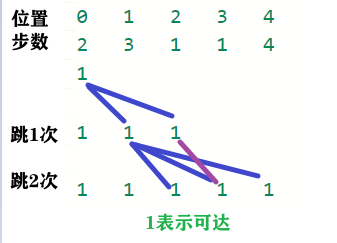

# 45.跳跃游戏II

[力扣题目链接](https://leetcode-cn.com/problems/jump-game-ii/)

给定一个非负整数数组，你最初位于数组的第一个位置。

数组中的每个元素代表你在该位置可以跳跃的最大长度。

你的目标是使用最少的跳跃次数到达数组的最后一个位置。

示例:
* 输入: [2,3,1,1,4]
* 输出: 2
* 解释: 跳到最后一个位置的最小跳跃数是 2。从下标为 0 跳到下标为 1 的位置，跳 1 步，然后跳 3 步到达数组的最后一个位置。

说明：假设你总是可以到达数组的最后一个位置。

## 贪心1 

+ 记录：跳跃次数 及 本次跳跃可达

  遍历 本次跳跃可达，更新 下次跳跃可达




```java
class Solution {   
    public int jump(int[] nums) {  
        int cover = 0;     // 当前可达范围 [0,cover]
        int nextCover = 0; // 下次可达范围，由[0,cover]跳跃所得
        int cnt = 0;       // 当前跳跃次数  
        // 遍历所有可达位置。更新可达范围、跳跃次数
        int pos = 0;
        while(pos < nums.length){
            if(pos <= cover) { 
                // pos 是 本次跳跃 可达位置
                // 更新 下次跳跃 可达范围（从pos起跳）
                nextCover = Math.max(nextCover, pos + nums[pos]);
                pos++;
            } else { 
                // 遍历完 本次跳跃 所有可达位置
                // 进行一次跳跃，更新为 下次跳跃可达范围
                cover = nextCover;
                cnt++;
            }
        }
        return cnt;
    }
}  
```


+ **以最小的步数，增加最大的覆盖范围，直到覆盖范围覆盖了终点**。

+ 局部最优：cover 尽可能多覆盖 

  整体最优：更早到终点，get 最小步数 

+ 本题求最小步数，那么就要想清楚什么时候步数才+1

  如果移动下标达到了当前这一步的最大覆盖最远距离了，还没有到终点的话，那么就必须再走一步来增加覆盖范围，直到覆盖范围覆盖了终点。 

## 贪心2 

思路和1差不多，代码更简洁

**针对于方法一的特殊情况，可以统一处理**，即：移动下标只要遇到当前覆盖最远距离的下标，直接步数加一，不考虑是不是终点的情况。

想要达到这样的效果，只要让移动下标，最大只能移动到nums.size - 2的地方就可以了。

因为当移动下标指向nums.size - 2时：

* 如果移动下标等于当前覆盖最大距离下标， 需要再走一步（即ans++），因为最后一步一定是可以到的终点。（题目假设总是可以到达数组的最后一个位置），如图：


* 如果移动下标不等于当前覆盖最大距离下标，说明当前覆盖最远距离就可以直接达到终点了，不需要再走一步。如图：


```CPP
class Solution {
public:
    int jump(vector<int>& nums) {
        int curDistance = 0;    // 当前覆盖的最远距离下标
        int ans = 0;            // 记录走的最大步数
        int nextDistance = 0;   // 下一步覆盖的最远距离下标
        for (int i = 0; i < nums.size() - 1; i++) { // 注意这里是小于nums.size() - 1，这是关键所在
            nextDistance = max(nums[i] + i, nextDistance); // 更新下一步覆盖的最远距离下标
            if (i == curDistance) {                 // 遇到当前覆盖的最远距离下标
                curDistance = nextDistance;         // 更新当前覆盖的最远距离下标
                ans++;
            }
        }
        return ans;
    }
};
```

精髓在于控制移动下标i只移动到nums.size() - 2的位置，所以移动下标只要遇到当前覆盖最远距离的下标，直接步数加一，不用考虑别的了。


## dp1

```java
class Solution {   
    public int jump(int[] nums) { 
        // 1.dp[i] 从初始到i所需最少次数
        int[] dp = new int[nums.length];
        // 3.初始化： 
        Arrays.fill(dp, Integer.MAX_VALUE); // 都不可达
        dp[0] = 0;
        // 4.遍历方向：i++
        // 2.dp[i+j] = min(dp[i]+1, dp[j])  
        //   从i 可跳到的 所有位置 i+j，更新为 最少次数
        for(int i = 0; i < nums.length; i++){
            for(int j = 1; j <= nums[i] && i+j < nums.length; j++){
                dp[i+j] = Math.min(dp[i]+1, dp[i+j]);
            }
        }
        return dp[nums.length - 1];
    }
}
```


## dp2

```java
class Solution { 
    public int jump1(int[] nums) { 
        // canJump 改为 times
        //    dp[i]：从位置i到最后所需最少次数（-1表示不可达）
        // if(nums.length == 1) return 0; // 特殊情况
        int[] times = new int[nums.length];
        Arrays.fill(times, -1);
        times[times.length - 1] = 0;
        // dp:从后往前遍历，记录最少跳跃次数
        for(int i = nums.length - 2; i >= 0; i--){
            // 从i位置，能直接完成
            if(i + nums[i] >= nums.length - 1){ 
                times[i] = 1;
                continue;
            }
            // 从i位置，跳j步，跳到一个能完成的位置？
            for(int j = 1; j <= nums[i]; j++){
                if(times[i + j] != -1){ // 跳到一个能完成的位置
                    int s = 1 + times[i+j]; // 选择先跳j步,此方式所需最少次数
                    if(times[i] == -1 || times[i] > s){ // 若更优则更新
                        times[i] = s; 
                    }
                }
            }   
        }
        return times[0];
    } 
}
```

