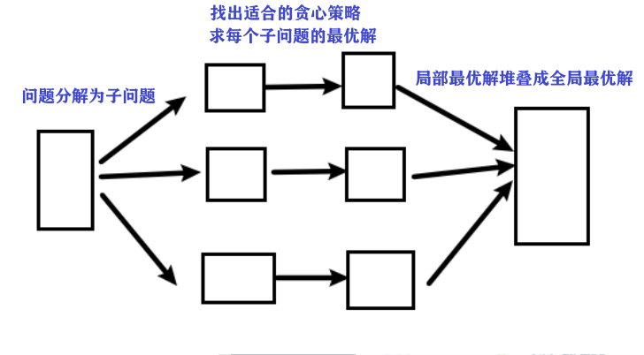

​    

 </img>

## 什么是贪心

**本质：选择每一阶段的局部最优，从而达到全局最优**。

例子：

+ 有一堆钞票，你可以拿走十张，如果想达到最大的金额，怎么拿？

  每次拿最大的（局部最优），最终结果就是拿走最大数额的钱（全局最优）

+ 有一堆盒子，有1个包体积为n，如何把背包尽可能装满

  不可：选最大的盒子

  需 动态规划 (dp)

## 什么时候用贪心

 

+ 如何看出：局部最优 推出整体最优？

  手动模拟，如果模拟可行，就可以试一试贪心策略

  不可行，可能需要动态规划。

+ 如何验证：可用贪心？

  **举反例，如果想不到反例，就试一试贪心**。

+ 面试中基本不会让面试者现场证明贪心的合理性 

   贪心有时候就是常识性的推导 

 

## 解题步骤

1. 将问题分解为若干个子问题

2. 找出适合的贪心策略
3. 求每个子问题的最优解
4. 将局部最优解堆叠成全局最优解

（真正做题，步骤很难分这么细，因为贪心题目往往和其他方面的知识混在一起。

 

