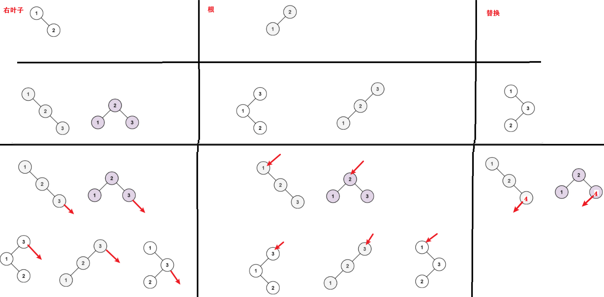
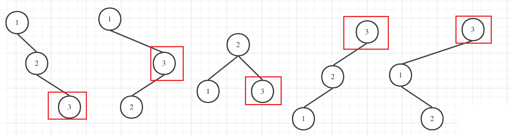

# 96.不同的二叉搜索树

[力扣题目链接](https://leetcode-cn.com/problems/unique-binary-search-trees/)

给定一个整数 n，求以 1 ... n 为节点组成的二叉搜索树有多少种？

示例:


## 思路

+ 错

  二叉搜索树,每个新节点都是最大的，可以作为：

  + 最右叶子 

  + 根  (其他节点都在左子树) 

  + 替换上个数,并把上个数放在左子

    (需上个数在最右叶子,否则都有左孩子)

  错：不全，i不止可以替换i-1，还可以替换其他数

  


+ 找规律：

  

+ n=3

  

### dp1

思路1

+ 新节点是最大的。其他节点都在左侧

+ 以新节点分割树，分两部分：

  左上和左下，且左上都比左下小

+ 左上和左下分别可看作一颗树，

  该树可能的样式 = dp[树的节点数]

+ dp[i] += dp[j] * dp[i-j-1]   

  j 为左上树的节点数

  j 可为0（节点i为根）；可为 i-1（节点i为叶子）

```java
class Solution9 {
    public int numTrees(int n) {  
        // 1.dp数组：i=节点个数, dp[i]=不同二叉搜索树种数
        int[] dp = new int[n+1];
        // 2.递推公式：dp[i] += dp[j] * dp[i-j-1]; (其中 j=[0, i-1]) 
        // 3.初始化：
        dp[0] = 1;
        dp[1] = 1;
        // 4.遍历方向：节点数递增
        // 从递归公式看出，节点数为i的状态是依靠 i之前节点数的状态。
        for(int i = 2; i <= n; i++){ 
            for(int j = 0; j <= i-1; j++){
                dp[i] += dp[j] * dp[i-j-1];
            }
        }
        return dp[n];
    }
} 
```

  
### dp2

思路2

+ 以 j 为头节点，分类讨论 ( j = [1,i] )

+ 左右子树 节点个数 确定
  头节点 左子树 都小于 j
  头节点 右子树 都大于 j

+ 子树可能的样式 = dp[子树的节点数]

+ dp[i] += dp[j-1] * dp[i-j] 

```CPP
class Solution {
public:
    int numTrees(int n) {
        vector<int> dp(n + 1);
        // 初始化
        // 当以1为头结点，左子树0个节点，因此初始化[0]=1 
        // 否则乘法的结果就都变成0了 
        // 推导的基础，都是dp[0]
        dp[0] = 1;
        // j-1 为j为头结点左子树节点数量，
        // i-j 为以j为头结点右子树节点数量
        for (int i = 1; i <= n; i++) {
            for (int j = 1; j <= i; j++) {
                dp[i] += dp[j - 1] * dp[i - j];
            }
        }
        return dp[n];
    }
};
```

5. 举例推导dp数组

   n为5时候的dp数组状态如图：

   


* 时间复杂度：O(n^2)
* 空间复杂度：O(n)

 

