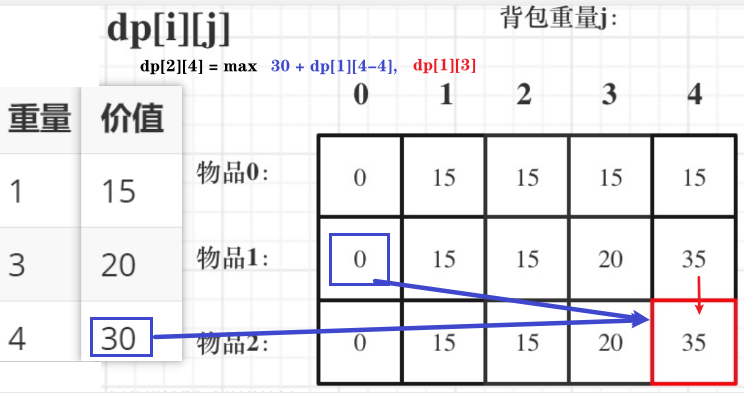

# 动态规划：01背包 

对于面试，掌握01背包，和完全背包，就够用了，最多可以再来一个多重背包。其他背包，leetcode上连多重背包的题目都没有 


+ **此处 01背包原理，后续再讲解leetcode题目如何转化为01背包**。 

+ 难：初始化和遍历顺序

## 01 背包

n件物品 和 一个最多能背重量为w的背包。

第i件物品的重量是weight[i]，得到的价值是value[i] 

**每件物品只能用一次**，求解将哪些物品装入背包里物品价值总和最大。


+ 暴力解法

  每一件物品其实只有两个状态，取或者不取，

  回溯法 搜索所有情况，时间复杂度 o(2^n)，
  
  这里的n表示物品数量，指数级别。进而需要动态规划优化

+ 例 

  背包最大重量为4。

  物品为：

|       | 重量 | 价值 |
| ---   | ---  | ---  |
| 物品0 | 1    | 15   |
| 物品1 | 3    | 20   |
| 物品2 | 4    | 30   |

问背包能背的物品最大价值是多少？

 

## 二维dp数组01背包

1. 确定dp数组以及下标的含义

   二维数组`dp[i][j] `

   表示从下标为[0...i]的物品里任取，放进容量j的背包，最大的价值总和 
   
   
   
2. 递推公式

   有两个方向推出 `dp[i][j]`，

   对于 大小为j 的背包，考虑是否放入物品i，2种情况： 

* **不放物品i**：

  “前i-1件物品放入容量为 j 的背包中

  由`dp[i-1][j]`推出，

  不放物品i的最大价值，此时`dp[i][j]`就是`dp[i-1][j]`

  (其实就是当物品i的重量 大于 背包j的重量时，物品i 无法放进背包中，所以背包内的价值依然和前面相同)

* **放物品i**：

  由`dp[i-1][j-weight[i]]`推出，
  
  放了物品i后，剩余容量为 `j-weight[i]`，可取的物品是 [0..i-1]
  
  前i-1件物品放入剩下的容量为 j-weight[i]的背包中
  
  那么`dp[i-1][j-weight[i]] + value[i] `（物品i的价值），就是背包放物品i得到的最大价值

+ 公式： `dp[i][j] = max(dp[i-1][j], dp[i-1][j-weight[i]] + value[i]);`

  

3. dp数组初始化 

+ 如果背包容量 j为0，`即dp[i][0]`，

  无论是选取哪些物品，背包价值总和一定为0。

   

+ `dp[0][j]`：i为0，只存放物品0，各个容量 j 的背包所能存的最大价值。 

  状态转移方程 `dp[i][j] = max(dp[i-1][j], dp[i-1][j-weight[i]] + value[i]); ` 

  i 是由 i-1 推导出来，那么i为0的时候就一定要初始化。
  
  当 j < weight[0]的时候，`dp[0][j] `应该是 0，因为背包容量比编号0物品重量还小。
  
  当 j >= weight[0]时，`dp[0][j]` 应该是value[0]，因为背包容量放足够放编号0物品。

``` java
// 当然这一步，如果把dp数组预先初始化为0了，这一步就可以省略 
for (int j = 0 ; j < weight[0]; j++) {  
    dp[0][j] = 0;
}
// 正序遍历
for (int j=weight[0]; j<=bagweight; j++) {
    dp[0][j] = value[0];
}
```


+ 其他下标应该初始化多少呢？

  其实从递归公式： `dp[i][j] = max(dp[i - 1][j], dp[i - 1][j - weight[i]] + value[i]);`

  可以看出`dp[i][j]  `是由左上方数值推导出来，那么 其他下标初始为什么数值都可以，因为都会被覆盖。 


最后初始化代码如下：

```
// 初始化 dp
vector<vector<int>> dp(weight.size(), vector<int>(bagweight + 1, 0));
for (int j = weight[0]; j <= bagweight; j++) {
    dp[0][j] = value[0];
} 
```

4. 遍历顺序


   有两个遍历维度：物品与背包重量

   

**先遍历 物品还是先遍历背包重量呢？**

**其实都可以！！ 但是先遍历物品更好理解**。

+ 先遍历物品，然后遍历背包重量的代码。

```java
// weight数组的大小 就是物品个数
for(int i = 1; i < weight.size(); i++) { // 遍历物品
    for(int j = 0; j <= bagweight; j++) { // 遍历背包容量
        if (j < weight[i]) dp[i][j] = dp[i - 1][j]; 
        else dp[i][j] = max(dp[i - 1][j], dp[i - 1][j - weight[i]] + value[i]);

    }
}
```

+ **先遍历背包，再遍历物品，也是可以的 **

```java
// weight数组的大小 就是物品个数
for(int j = 0; j <= bagweight; j++) { // 遍历背包容量
    for(int i = 1; i < weight.size(); i++) { // 遍历物品
        if (j < weight[i]) dp[i][j] = dp[i - 1][j];
        else dp[i][j] = max(dp[i - 1][j], dp[i - 1][j - weight[i]] + value[i]);
    }
}
```

+ 为什么也是可以的呢？

  **要理解递归的本质和递推的方向**。

  `dp[i][j] = max(dp[i - 1][j], dp[i - 1][j - weight[i]] + value[i]); `

  `dp[i][j]`是靠`dp[i-1][j]和dp[i-1][j-weight[i]]`推导出来

  都在`dp[i][j]`左上角方向（包括正上），循环遍历的次序 不影响 结果
  
  + 先遍历物品，再遍历背包的过程如图所示：
  
  

+ 先遍历背包，再遍历物品呢，如图：

  

 

5. 举例推导dp数组

   来看一下对应的dp数组的数值，最终结果就是`dp[2][4]` 
   
   

 

## 完整 代码

+ cpp

```cpp
void test_2_wei_bag_problem1() {
    vector<int> weight = {1, 3, 4};
    vector<int> value = {15, 20, 30};
    int bagweight = 4;

    // 二维数组
    vector<vector<int>> dp(weight.size(), vector<int>(bagweight + 1, 0));

    // 初始化
    for (int j = weight[0]; j <= bagweight; j++) {
        dp[0][j] = value[0];
    }

    // weight数组的大小 就是物品个数
    for(int i = 1; i < weight.size(); i++) { // 遍历物品
        for(int j = 0; j <= bagweight; j++) { // 遍历背包容量
            if (j < weight[i]) dp[i][j] = dp[i - 1][j];
            else dp[i][j] = max(dp[i - 1][j], dp[i - 1][j - weight[i]] + value[i]);

        }
    }

    cout << dp[weight.size() - 1][bagweight] << endl;
}

int main() {
    test_2_wei_bag_problem1();} 
```

+ java

```java
    public static void main(string[] args) {
        int[] weight = {1, 3, 4};
        int[] value = {15, 20, 30};
        int bagsize = 4;
        testweightbagproblem(weight, value, bagsize);
    }

    public static void testweightbagproblem(int[] weight, int[] value, int bagsize){
        int wlen = weight.length, value0 = 0;
        //定义dp数组：dp[i][j]表示背包容量为j时，前i个物品能获得的最大价值
        int[][] dp = new int[wlen + 1][bagsize + 1];
        //初始化：背包容量为0时，能获得的价值都为0
        for (int i = 0; i <= wlen; i++){
            dp[i][0] = value0;
        }
        //遍历顺序：先遍历物品，再遍历背包容量
        for (int i = 1; i <= wlen; i++){
            for (int j = 1; j <= bagsize; j++){
                if (j < weight[i - 1]){
                    dp[i][j] = dp[i - 1][j];
                }else{
                    dp[i][j] = math.max(dp[i - 1][j], dp[i - 1][j - weight[i - 1]] + value[i - 1]);
                }
            }
        }
        //打印dp数组
        for (int i = 0; i <= wlen; i++){
            for (int j = 0; j <= bagsize; j++){
                system.out.print(dp[i][j] + " ");
            }
            system.out.print("\n");
        }
    }
```

