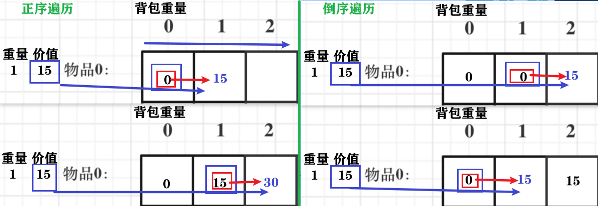

# 动态规划：01背包（滚动数组）

滚动数组：把二维dp降为一维dp

背包最大重量为4，能背的物品最大价值是多少？

| 物品  | 重量 | 价值 |
| ----- | ---- | ---- |
| 物品0 | 1    | 15   |
| 物品1 | 3    | 20   |
| 物品2 | 4    | 30   |

## 一维dp数组 

+ 一道面试题目

  先实现一个纯二维的01背包，再问为什么两个for循环的嵌套顺序这么写？反过来写行不行？再讲一讲初始化的逻辑。

  实现一个一维数组的01背包，两个for循环的顺序反过来写行不行？

  01背包的dp数组定义、递推公式、初始化、遍历顺序从二维数组到一维数组统统深度剖析了一遍  

+ 改进思路

  + 二维数组，递推公式：

    `dp[i][j] = max(dp[i-1][j], dp[i-1][j-weight[i]] + value[i]);`

    `dp[i][j]` 从下标[0...i]的物品里任意取，放进容量为j的背包，价值总和最大是多少。

  + 状态 可以压缩，把dp[i - 1]那一层拷贝到dp[i]上

    表达式 `dp[i][j] = max(dp[i][j], dp[i][j-weight[i]] + value[i]);`

  + **只用一个一维数组** dp[j]（滚动数组）

    重复利用上一层 i-1，直接拷贝到当前层 i。（因此 i需要递增）

动规五部曲分析如下：

1. 确定dp数组的定义

   dp[j]：容量为j的背包，所背的物品价值 最大为dp[j]。

2. 一维dp 递推公式

   ```
   dp[j] = max(dp[j], dp[j-weight[i]] + value[i]);
   ```

   不放物品i：dp[j] 相当于 二维dp数组中的`dp[i-1][j]`
   
   放物品i：`dp[j-weight[i]] + value[i]` 

3. 一维dp数组 初始化

   **关于初始化，一定要和dp数组的定义吻合，否则到递推公式的时候就会越来越乱**

   + dp[j]：容量为j的背包，从没有任何物品, 所背的物品价值可以最大为dp[j]，
     + dp[0]是0，

       因为没有任何物品可背
     
       而不是因为背包容量为0（因为有可能有物品weight==0）

     + 其他下标应初始化多少？

       递归公式：dp[j] = max(dp[j], dp[j-weight[i]] + value[i]);  取价值最大的数

       若物品价值都是正整数，那么非0下标都初始化为0

       因为：**dp数组在递归公式的过程中取的最大的价值，覆盖初始值**。

     + 背包并非必须被装满,

       那么任何容量的背包都有一个合法解“什么都不装”,这个解的价值为0,
       所以初始时状态的值也就全部为0了。

     + 恰好装满背包,

       f[0]为0        其它f[1..V]均设为−∞,
       保证最终得到的f[N]是一种恰好装满背包的最优解。

       没有任何物品，要求背包恰好装满,  此时只有容量为0的背包满足
       其它容量的背包均没有合法的解,属于未定义的状态,−∞

     

4. 一维dp数组 遍历顺序

```java
for(int i = 0; i < weight.size(); i++) { // 遍历物品
    for(int j = bagWeight; j >= 0; j--) { // 遍历背包容量
        if(j >= weight[i])
            dp[j] = max(dp[j], dp[j-weight[i]] + value[i]);
        else 
            dp[j] = dp[j];
    }
}
// 优化1
for(int i = 0; i < weight.size(); i++) { // 遍历物品
    for(int j = bagWeight; j >= 0; j--) { // 遍历背包容量
        if(j >= weight[i])
            dp[j] = max(dp[j], dp[j-weight[i]] + value[i]); 
    }
}
// 优化2
for(int i = 0; i < weight.size(); i++) { // 遍历物品
    for(int j = bagWeight; j >= weight[i]; j--) { // 遍历背包容量
        dp[j] = max(dp[j], dp[j-weight[i]] + value[i]);
    }
}
```

+ 倒序遍历 背包容量j 从大到小 

  **为了保证物品i只被放入一次！**。否则物品0就会被重复加入多次！

  例：物品0 重量weight[0] = 1，价值value[0] = 15

  

  + 正序遍历

    dp[1] = dp[1-weight[0]] + value[0] = 15

    dp[2] = dp[2-weight[0]] + value[0] = 30 (意味着物品0，被放入两次

  + 为什么倒序遍历，就可以保证物品只放入一次呢？
 
    dp[2] = dp[2-weight[0]] + value[0] = 15  （dp数组已经都初始化为0）

    dp[1] = dp[1-weight[0]] + value[0] = 15

  + 更新 `[i][j]`，需要使用 `[i-1][j]` 和 `[i-1][j-]`(某小于j的元素) 的数据

    错：正序遍历，先更新 `[i][j-]`，`[i-1][j-]`被覆盖

    之后更新 `[i][j]`。是使用 `[i][j-]`  更新（因为`[i-1][j-]`已被覆盖 ）
    可看成二维的 `dp[i][j] = dp[i][j-w[i]] + v[i]`

  + 倒序遍历，

    先使用 i-1 层 更新`[i][j+]`，之后使用 i-1 层 更新 `[i][j]` （`[i-1][j-]` 未被覆盖）

    每次取得状态不会和之前状态重合，这样每种物品就只取一次了

    可以看成二维的 `dp[i][j] = dp[i-1][j-w[i]] + v[i]`

  + **为什么二维dp数组历的时候不用倒序呢？**

    因为对于二维dp，i-1层的数据都被存起来了，不会被 i 层覆盖

    `dp[i][j]` 通过上一层即`dp[i - 1][j]`计算而来

+ 遍历j，需满足 j >= weight[i] 

  因为 `dp[j] = max(dp[j], dp[j-weight[i]] + value[i]); `

  若背包容量 小于 物品i的重量，不用考虑是否放入物品 i

+ **两个for循环的顺序，先遍历物品，再遍历背包容量**

  因为一维dp，背包容量一定倒序遍历，

  如果先遍历背包容量，那么每个dp[j]就只会放入一个物品，即：背包里只放入了一个物品。

  （这里如果读不懂，就在回想一下dp[j]的定义，或者就把两个for循环顺序颠倒一下试试！）

5. 举例推导dp数组

   一维dp，分别用物品0，物品1，物品2 来遍历背包，最终得到结果如下：


##  完整C++测试代码

```CPP
void test_1_wei_bag_problem() {
    vector<int> weight = {1, 3, 4};
    vector<int> value = {15, 20, 30};
    int bagWeight = 4;

    // 初始化
    vector<int> dp(bagWeight + 1, 0);
    for(int i = 0; i < weight.size(); i++) { // 遍历物品
        for(int j = bagWeight; j >= weight[i]; j--) { // 遍历背包容量
            dp[j] = max(dp[j], dp[j - weight[i]] + value[i]);
        }
    }
    cout << dp[bagWeight] << endl;
}

int main() {
    test_1_wei_bag_problem();
}

```


+ java

  

  ```java
      public static void main(String[] args) {
          int[] weight = {1, 3, 4};
          int[] value = {15, 20, 30};
          int bagWight = 4;
          testWeightBagProblem(weight, value, bagWight);
      }
  
      public static void testWeightBagProblem(int[] weight, int[] value, int bagWeight){
          int wLen = weight.length;
          //定义dp数组：dp[j]表示背包容量为j时，能获得的最大价值
          int[] dp = new int[bagWeight + 1];
          //遍历顺序：先遍历物品，再遍历背包容量
          for (int i = 0; i < wLen; i++){
              for (int j = bagWeight; j >= weight[i]; j--){
                  dp[j] = Math.max(dp[j], dp[j - weight[i]] + value[i]);
              }
          }
          //打印dp数组
          for (int j = 0; j <= bagWeight; j++){
              System.out.print(dp[j] + " ");
          }
      }
  ```

  


