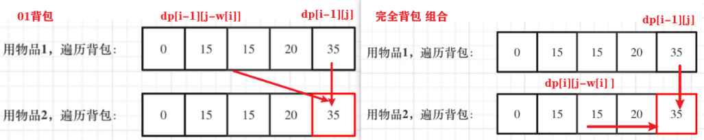

## 完全背包

+ 面试题

  纯完全背包，要求先用二维dp数组实现

  再用一维dp数组实现，

  最后在问，两个for循环的先后是否可以颠倒？

+ N件物品 和 一个容量W的背包。第i件物品的重量是weight[i]，价值是value[i] 

  **每件物品都有无限个（可放入背包多次）**，求解 将哪些物品装入背包里物品价值总和最大。

  **区别01背包**：每种物品有无限件。不是考虑是否取，而是考虑 取0件、取1件、取2件......等

+ 思路1

  `f[i][v] = max{f[i−1][v − k*c[i]] + k*w[i]}`

  （`f[i][v]`表示前i种物品恰放入一个容量为v的背包的最
  大权值

+ 思路2

  转化为01背包问题：将一种物品拆成多件物品。

  第i种物品最多选V/c[i]件,

  于是把第i种物品转化为V/c[i] 件费用及价值均不变的物品,然后求解这个01背包问题。

  这样完全没有改进基本思路的时间复杂度,

+ 思路3：一维数组

  

  区别01背包的一维数组：遍历顺序
  + 01背包的核心代码

    内嵌的循环（背包容量）是从大到小遍历，
  
    为了保证 第i次循环中 状态`dp[i][j]`是由 `dp[i-1][j-weight[i]]` 递推而来。（`dp[i-1][j-weight[i]]`没被i覆盖）
    每个物品仅被添加一次。

  + 完全背包

    物品可选无限件，

    在考虑“加选一件第i种物品”。需要一个可能已选入第i种物品的子结果`dp[i][j-weight[i]]`

    所以要从小到大遍历
    
    等价：`dp[i][j] = max(dp[i-1][j], dp[i][j-weight[i] + value[i]])`

```CPP
// 01背包：
for(int i = 0; i < weight.size(); i++) { // 遍历物品
    for(int j = bagWeight; j >= weight[i]; j--) { // 遍历背包容量
        dp[j] = max(dp[j], dp[j-weight[i]] + value[i]);
    }
}
// 完全背包：
for(int i = 0; i < weight.size(); i++) { // 遍历物品
    for(int j = weight[i]; j <= bagWeight ; j++) { // 遍历背包容量
        dp[j] = max(dp[j], dp[j-weight[i]] + value[i]);

    }
}
```

+ 例子：背包最大重量为4。

| 物品  | 重量 | 价值 |
| ----- | ---- | ---- |
| 物品0 | 1    | 15   |
| 物品1 | 3    | 20   |
| 物品2 | 4    | 30   |

dp状态图如下：


+ **遍历物品在外层，遍历背包容量在内层？**

   01背包中二维dp数组的两个for遍历的先后循序是可以颠倒了，一维dp数组的两个for循环先后循序一定是先遍历物品，再遍历背包容量。

+ **完全背包，一维dp数组，两个for循环嵌套顺序同样无所谓！**

  因为dp[j] 是根据 下标j之前所对应的dp[j]计算出来的。 只要保证下标j之前的dp[j]都是经过计算的就可以了。

  + 遍历物品在外层循环，遍历背包容量在内层循环，状态如图：

    

  + 遍历背包容量在外层循环，遍历物品在内层循环，状态如图：

    

 不影响计算dp[j]所需要的值（这个值就是下标j之前所对应的dp[j]）。

 

+ 如果题目稍稍有点变化，就会体现在遍历顺序上。

  如果问装满背包有几种方式的话？ 那么两个for循环的先后顺序就有很大区别了

+ 先遍历被背包在遍历物品，代码如下：

```CPP
// 先遍历背包，再遍历物品
for(int j = 0; j <= bagWeight; j++) { // 遍历背包容量
    for(int i = 0; i < weight.size(); i++) { // 遍历物品
        if (j - weight[i] >= 0) dp[j] = max(dp[j], dp[j - weight[i]] + value[i]);
    }
    cout << endl;
}
```

## C++

```CPP
// 先遍历物品，在遍历背包
void test_CompletePack() {
    vector<int> weight = {1, 3, 4};
    vector<int> value = {15, 20, 30};
    int bagWeight = 4;
    vector<int> dp(bagWeight + 1, 0);
    for(int i = 0; i < weight.size(); i++) { // 遍历物品
        for(int j = weight[i]; j <= bagWeight; j++) { // 遍历背包容量
            dp[j] = max(dp[j], dp[j - weight[i]] + value[i]);
        }
    }
    cout << dp[bagWeight] << endl;
}
int main() {
    test_CompletePack();
}
```

```CPP

// 先遍历背包，再遍历物品
void test_CompletePack() {
    vector<int> weight = {1, 3, 4};
    vector<int> value = {15, 20, 30};
    int bagWeight = 4;

    vector<int> dp(bagWeight + 1, 0);

    for(int j = 0; j <= bagWeight; j++) { // 遍历背包容量
        for(int i = 0; i < weight.size(); i++) { // 遍历物品
            if (j - weight[i] >= 0) dp[j] = max(dp[j], dp[j - weight[i]] + value[i]);
        }
    }
    cout << dp[bagWeight] << endl;
}
int main() {
    test_CompletePack();
}

```
 
+ Java

```java
//先遍历物品，再遍历背包
private static void testCompletePack(){
    int[] weight = {1, 3, 4};
    int[] value = {15, 20, 30};
    int bagWeight = 4;
    int[] dp = new int[bagWeight + 1];
    for (int i = 0; i < weight.length; i++){ // 遍历物品
        for (int j = weight[i]; j <= bagWeight; j++){ // 遍历背包容量
            dp[j] = Math.max(dp[j], dp[j - weight[i]] + value[i]);
        }
    }
    for (int maxValue : dp){
        System.out.println(maxValue + "   ");
    }
}

//先遍历背包，再遍历物品
private static void testCompletePackAnotherWay(){
    int[] weight = {1, 3, 4};
    int[] value = {15, 20, 30};
    int bagWeight = 4;
    int[] dp = new int[bagWeight + 1];
    for (int i = 1; i <= bagWeight; i++){ // 遍历背包容量
        for (int j = 0; j < weight.length; j++){ // 遍历物品
            if (i - weight[j] >= 0){
                dp[i] = Math.max(dp[i], dp[i - weight[j]] + value[j]);
            }
        }
    }
    for (int maxValue : dp){
        System.out.println(maxValue + "   ");
    }
}
```
