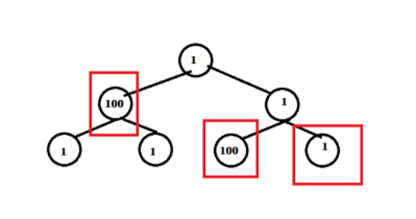

## 337.打家劫舍 III

[力扣题目链接](https://leetcode-cn.com/problems/house-robber-iii/)

在上次打劫完一条街道之后和一圈房屋后，小偷又发现了一个新的可行窃的地区。这个地区只有一个入口，我们称之为“根”。 除了“根”之外，每栋房子有且只有一个“父“房子与之相连。一番侦察之后，聪明的小偷意识到“这个地方的所有房屋的排列类似于一棵二叉树”。 如果两个直接相连的房子在同一天晚上被打劫，房屋将自动报警。

计算在不触动警报的情况下，小偷一晚能够盗取的最高金额。


## 思路

+ 树遍历方式

  前中后序（深度优先搜索）层序（广度优先搜索）。  

+ 层序 求每层的总和 存于数组，对该数组 进行dp

  错：某层的节点，不一定同时都选择

  

+ 最高金额确定方向：

  + 从根到叶，子要考虑 父 与 父的父。

    dp[节点] = max(dp[父], 节点的val + dp[父的父])

    错：从根到叶，有多条路径，不可

  + 从叶到根。父要考虑 两个子的 最高金额

### 动态规划

+ 关键：当前节点抢还是不抢。

  + 如果抢了当前节点，两个孩子就不能动，而是考虑四个孙子节点

  + 如果没抢当前节点，就可以考虑抢左右孩子

    （**注意这里说的是“考虑”**，而不是一定要

+ 对比后面两种方法

  + 对一个节点 偷与不偷得到的最大金钱都没有做记录，而是需要实时计算。

  + 而动态规划，使用状态转移容器 记录状态的变化，

    这里使用一个长度为2的数组，记录当前节点偷与不偷所得到的的最大金钱。

+ **树形dp的入门题，在树上进行状态转移，**

  讲二叉树的时候说过递归三部曲，下面以递归三部曲为框架，其中融合动规五部曲

```java
class Solution31 { 
    public int rob(TreeNode root) {
        int[] ret = fun(root);
        return ret[0];
    } 
        
    // a.参数与返回值：dp数组 （ dp的值不能存在全局变量，会被覆盖。只能作为返回值
    // root 为根的树
    // [0]树的最高金额 (考虑盗取root，但不一定偷root)
    // [1]树的两子树的最高金额之和 (不考虑盗取root)
    int[] fun(TreeNode root){
        int[] ret = new int[2]; // 返回的数组
        // b.终止：空节点，偷还是不偷都是0
        if(root == null) return ret;
        // c.单层：递归左右子树
        int[] left = fun(root.left); // 左节点偷与不偷的金钱
        int[] right = fun(root.right); // 右节点偷与不偷的金钱
        // 考虑偷root节点。不偷root节点。
    	// dp[节点] = max(dp[左子]+dp[右子], 节点的val + dp[左子的子] + dp[右子的子])
        ret[0] = Math.max(left[0] + right[0], root.val + left[1] + right[1]); 
        ret[1] = left[0] + right[0];
        return ret;
    }
}
```

5. 举例推导dp数组

   以示例1为例，dp数组状态如下：（**注意用后序遍历的方式推导**）


**最后头结点 取下标0 就是偷得的最大金钱**。

 

```CPP
class Solution {
public:
    int rob(TreeNode* root) {
        vector<int> result = robTree(root);
        return max(result[0], result[1]);
    }
    // 长度为2的数组，0：不偷，1：偷
    vector<int> robTree(TreeNode* cur) {
        if (cur == NULL) return vector<int>{0, 0};
        vector<int> left = robTree(cur->left);
        vector<int> right = robTree(cur->right);
        // 偷cur
        int val1 = cur->val + left[0] + right[0];
        // 不偷cur
        int val2 = max(left[0], left[1]) + max(right[0], right[1]);
        return {val2, val1};
    }
};
```

* 时间复杂度：O(n)，每个节点只遍历了一次
* 空间复杂度：O(\log n)，算上递推系统栈的空间

### 暴力递归

```CPP
class Solution {
public:
    int rob(TreeNode* root) {
        if (root == NULL) return 0;
        if (root->left == NULL && root->right == NULL) return root->val;
        // 偷父节点
        int val1 = root->val;
        if (root->left) val1 += rob(root->left->left) + rob(root->left->right); // 跳过root->left，相当于不考虑左孩子了
        if (root->right) val1 += rob(root->right->left) + rob(root->right->right); // 跳过root->right，相当于不考虑右孩子了
        // 不偷父节点
        int val2 = rob(root->left) + rob(root->right); // 考虑root的左右孩子
        return max(val1, val2);
    }
};
```

* 时间复杂度：O(n^2)，这个时间复杂度不太标准，也不容易准确化，例如越往下的节点重复计算次数就越多
* 空间复杂度：O(\log n)，算上递推系统栈的空间

+ 超时：有重复计算

  计算了root的四个孙子（左右孩子的孩子）为头结点的子树

  又计算了root的左右孩子为头结点的子树，

  计算左右孩子的时候其实又把孙子计算了一遍。

### 记忆化递推

map 保存 计算过的结果，这样如果计算过孙子了，那么计算孩子的时候可以复用孙子节点的结果。

```CPP
class Solution {
public:
    unordered_map<TreeNode* , int> umap; // 记录计算过的结果
    int rob(TreeNode* root) {
        if (root == NULL) return 0;
        if (root->left == NULL && root->right == NULL) return root->val;
        if (umap[root]) return umap[root]; // 如果umap里已经有记录则直接返回
        // 偷父节点
        int val1 = root->val;
        if (root->left) val1 += rob(root->left->left) + rob(root->left->right); // 跳过root->left
        if (root->right) val1 += rob(root->right->left) + rob(root->right->right); // 跳过root->right
        // 不偷父节点
        int val2 = rob(root->left) + rob(root->right); // 考虑root的左右孩子
        umap[root] = max(val1, val2); // umap记录一下结果
        return max(val1, val2);
    }
};

```

* 时间复杂度：O(n)
* 空间复杂度：O(\log n)，算上递推系统栈的空间


 
