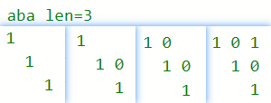

## 647. 回文子串

[力扣题目链接](https://leetcode-cn.com/problems/palindromic-substrings/)

给定一个字符串，你的任务是计算这个字符串中有多少个回文子串。

具有不同开始位置或结束位置的子串，即使是由相同的字符组成，也会被视作不同的子串。

示例 1：

输入："abc"
输出：3
解释：三个回文子串: "a", "b", "c"

示例 2：

输入："aaa"
输出：6
解释：6个回文子串: "a", "a", "a", "aa", "aa", "aaa"

提示：

输入的字符串长度不会超过 1000 。

## 暴力解法

两层for循环，遍历区间起始位置和终止位置

判断这个区间是不是回文。

时间复杂度：O(n^3)

## 动态规划

+ s[i..j]  是否为连续回文子串

  | 情况        | eg    | 是否为连续回文子串                              |
  | ----------- | ----- | ----------------------------------------------- |
| i == j      | a     | true                                            |
  | i、j 相差1  | aa    | s[i] == s[j]                                    |
  | i、j 相差1+ | acbca | `s[i] == s[j] && dp[i+1][j-1]`  看cbc是不是回文 |
  
+ 遍历方向：

  

  **从下到上  i--，从左到右 j++**

  **保证`dp[i + 1][j - 1]`已经计算过**。

+ **注意因为dp[i][j]的定义，所以j一定是大于等于i的，`dp[i][j]`只填充右上半部分**。

+ dp1：初始化考虑 i==j

```java
class Solution {
    public int countSubstrings(String s) {
        int length = s.length();
        // 1.dp[i][j]：s[i..j]是否为连续回文子串
        boolean[][] dp = new boolean[length][length];
        // 2.dp[i][j] = dp[i+1][j-1] && s[i]==s[j] 
        // (注意：要求 i+1 < j-1，即ij至少相差2)
        // 3.初始化：i == j的情况 （也可以在4遍历中考虑）
        for(int i = 0; i < length; i++)
            dp[i][i] = true;
        // 4.遍历方向：i-- j++，由中间向两侧扩展
        for(int i = length-2; i >= 0; i--){
            // 特：j=i+1 
            //      否则，内层for 要单独考虑 i+1 > j-1
            dp[i][i+1] = s.charAt(i) == s.charAt(i+1);
            for(int j = i+2; j < length; j++){
                dp[i][j] = s.charAt(i) == s.charAt(j)
                    && dp[i+1][j-1]; 
            }
        } 
        // 结果：从[0][0]开始，累加所有回文串
        // 优化：在4遍历中，累加结果
        int cnt = 0;
        for(int i = 0; i < length; i++){
            for(int j = 0; j < length; j++){
                // System.out.print(dp[i][j]);  
                if(dp[i][j]) cnt++; 
            }
            // System.out.println();
        }
        return cnt; 
    }
}
```

+ dp2：遍历时，考虑 i、j的差

  dp1是在for的遍历范围上，考虑不同情况

  dp2是在for内 考虑3种情况

```CPP
class Solution {
    public int countSubstrings(String s) {
        int length = s.length();
        // 1.dp[i][j]：s[i..j]是否为连续回文子串
        boolean[][] dp = new boolean[length][length];
        // 2.dp[i][j] = dp[i+1][j-1] && s[i]==s[j]
        // 3.初始化：0
        // 4.遍历方向：i-- j++，由中间向两侧扩展
        for(int i = length-1; i >= 0; i--){
            for(int j = i; j < length; j++){
                // 3种情况: i==j / 相差1 / 相差1+ 
                if(i == j)  
                    dp[i][j] = true;
                else if(i+1 == j)
                    dp[i][j] = s.charAt(i) == s.charAt(j);
                else 
                    dp[i][j] = s.charAt(i) == s.charAt(j) && dp[i+1][j-1];
            }
        } 
        // 结果：从[0][0]开始，累加所有回文串
        int cnt = 0;
        for(int i = 0; i < length; i++){
            for(int j = 0; j < length; j++){
                // System.out.print(dp[i][j]); 
                if(dp[i][j]) cnt++; 
            }
            // System.out.println();
        }
        return cnt; 
    }
}
```
* 时间复杂度：O(n^2)
* 空间复杂度：O(n^2)

5. 举例推导dp数组

   举例："aaa"

   图中有6个true，所以就是有6个回文子串。

   

   "aba"

   

   

## 双指针法

+ 动态规划的空间复杂度偏高

+ 首先确定回文串，找中心，然后向两边扩散看是不是对称的。

+ **在遍历中心点的时候，要注意中心点有两种情况**。

  1. 一个元素可以作为中心点
  2. 两个元素也可以作为中心点。

  三个元素就可以由一个元素左右添加元素得到，四个元素则可以由两个元素左右添加元素得到。 

**这两种情况可以放在一起计算，但分别计算思路更清晰（见下）** 

```CPP
class Solution {
public:
    int countSubstrings(string s) {
        int result = 0;
        for (int i = 0; i < s.size(); i++) {
            result += extend(s, i, i, s.size()); // 以i为中心
            result += extend(s, i, i+1, s.size()); // 以i和i+1为中心
        }
        return result;
    }
    // 返回 以 i和j 为中心的 回文子串数
    int extend(const string& s, int i, int j, int n) {
        int res = 0;
        // 向两边扩散看是不是对称的
        while (i >= 0 && j < n && s[i] == s[j]) {
            i--;
            j++;
            res++;
        }
        return res;
    }
};
```

* 时间复杂度：O(n^2)
* 空间复杂度：O(1)

 