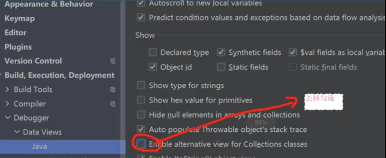
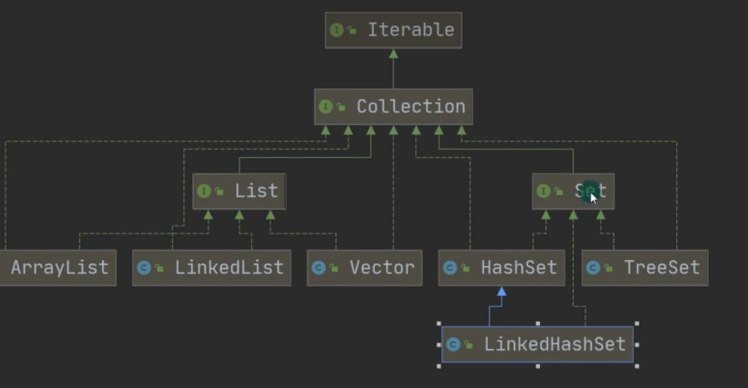
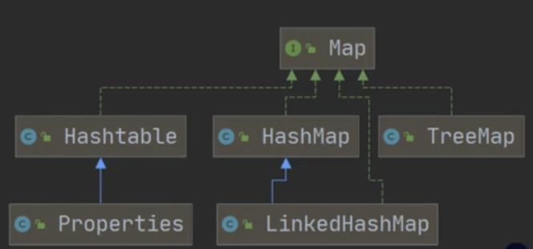

+ 难点： 源码, 不同情况下如何选择

+ idea debug时显示的数据时简化后的（如collection不显示空元素）
+ 

# 类继承关系

+ 数组缺点：长度不可变，元素同类

+ Collection

+ Map

+ Collections 工具类

# 对比
## 不同功能

|      | List                     | Set         | Map (jdk8)                      |
| ---- | ------------------------ | ----------- | ----------------------------- |
|      | 单列数据                 | 单列数据    | 双列数据(key,value)                  |
| 顺序 | 有序（加入顺序）支持索引 |   见后    |   见后                   |
| 重复 | 元素可重复               | 不可重复 | 不可重复                      |
| null | 可多个null               | 见后 | 见后 |
| 遍历 | it，增强for，按索引 | it，增强 | （it，增强） *（keyset，values，entrySet）|

## list  

|                  | arrList         | vector                 | linkList           |
| ---------------- | --------------- | ---------------------- | ------------------ |
| 底层             | 可变数组        | 可变数组               | 双向链表，双端队列 |
| 版本             | jdk1.2         | jdk1.0                 |                    |
| 同步             | 不安全，效率高  | 安全，效率低           | 不安全，效率高     |
| 扩容（无参构造） | 0 -> 10 -> *1.5 | 10 -> *2               |                    |
| 扩容（有参构造） | x -> *1.5       | x -> *2                |                    |
| 选择             | 改查多，单线程  | 改查多，多线程（淘汰） | 增删多，单线程     |

+ 程序80-90%都是改查，大部分情况选择arrList

## set/map 

|      | HashMap        | LinkedHashMap |Hashtable    | TreeMap |
| ---- | -------------- | ------------ | ------------ | ---- |
| 底层 | 数组（单向链表/红黑树) | 数组 + 双向链表 | 数组（单向链表） | todo |
| 版本 | jdk1.2         | |jdk1.0       |      |
| 同步 | 不安全，效率高 | |安全，效率低 |      |
| 顺序 | 无序（但固定） | 有序（加入顺序） | 无序（但固定） | 有序（按大小） |
| null | key至多1个null，value多个null | | key, value都不可 |      |

