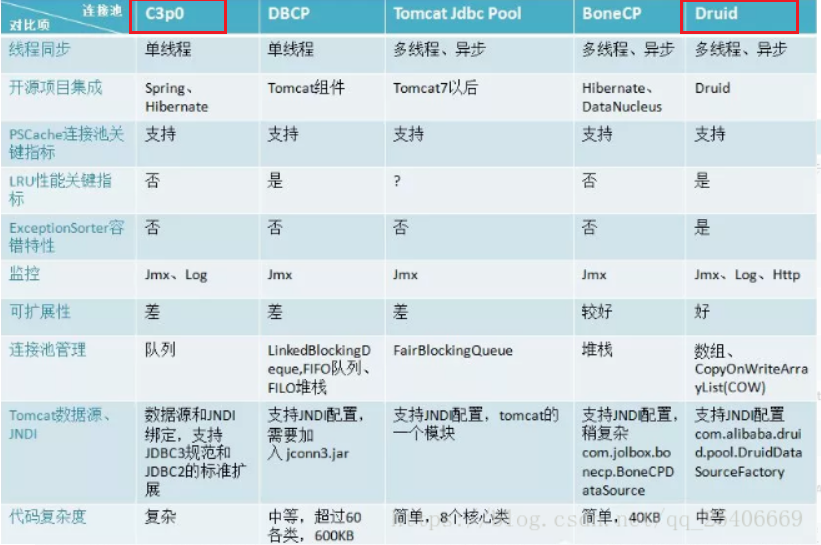

+ 优化了什么？

1. 连接池：复用连接，减少连接的创建和关闭次数，并防止因异常没关闭连接导致的内存泄漏，控制不创建过多连接
2. 预编译：对于某常用语句，只编译一次，每次执行再设置不同值
3. 批处理：对于增改大量记录的语句，成批执行，减少socket发语句次数（常和1一起使用）
4. Utils：cxy易用，只读一次properties文件，close只调用一次
5. Apache-DBUtils：封装步骤，结果集存在 pojo类的ArrayList中
   + 解决问题：
     + ResultSet关闭后不可使用，需要 推迟连接的关闭
     + 不易管理，使用数据：相比于 `getString("name")`, `getName()` 更好
 

## 连接池
  + jdbc的DataSource接口
  + 第三方实现接口，使用他们的jar包，帮助管理数据库（仍需数据库的jar包）
  + 规则：
    + 预先在池中放入一定量连接
    + 分配连接
      + 有空闲连接，程序获取连接
      + 无空闲连接 && 当前连接数<最大连接数，连接池创建新连接，程序获取连接
      + 无空闲连接 && >= max, 进入等待队列
    + 释放连接：使用者调用Connection的close，并不关闭，而是放回池中，被其他程序复用
    + 最小连接数：若长时间不使用，则回收

 
   