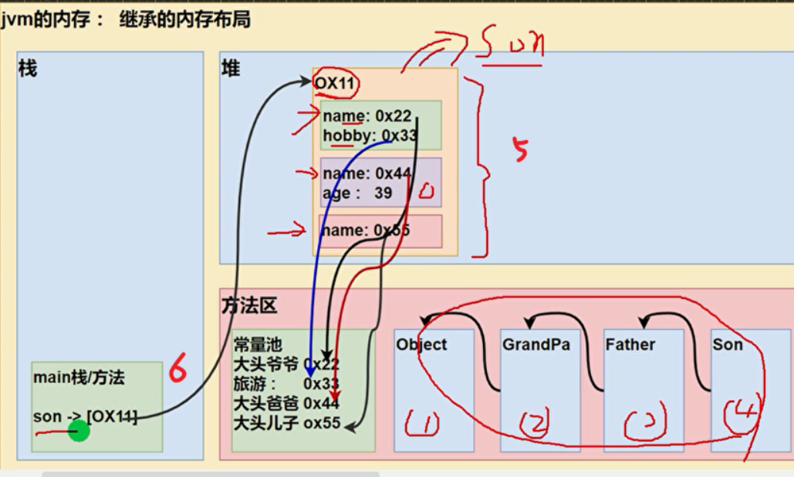

```java
public class ExtendsTheory{
    public static void main(String[] args) {
        Son son = new Son(); 
    }
}

class GrandPa{
    String name = "大头爷爷";
    String hobby = "旅游";
}

class Father extends GrandPa{
    String name = "大头爸爸";
    int age = 39;
}

class Son extends Father{
    String name = "大头儿子";
}
```

+ steps：
    + 加载类: 1-4 先父后子
    + 5 堆中创建对象：（先父后子）成员变量赋值（存 常量池地址），调用ctor
    + 6 栈中存 堆中对象 的地址
    


