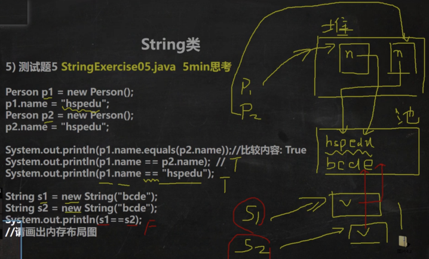
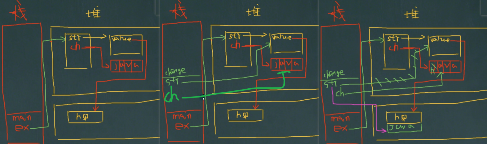
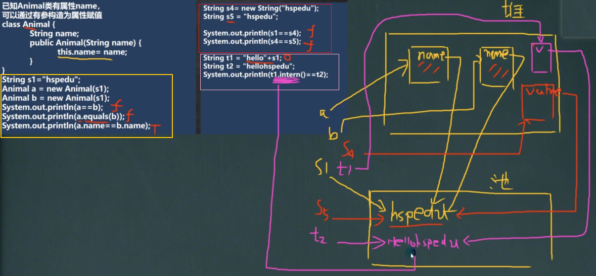

+ eg1
```java
public static void main(String[]args){
        String s1 = "hello";
        String s2 = "abc";

        String a = "hello" + "abc";
        // only 1 obj in const-pool
        // 编译器优化：等价于 String a = "helloabc";
        
        String b = s1 + s2;
        String c = s1 + "abc";
        String d = "hello" + s2;
        
        String e = b.intern();
        
        /* 编译器优化 bcd:
            new StringBuilder(); // 堆中
            sb.append(a2);
            sb.append(b2);
            sb.toString(); // return new String(value, 0, count);
        */        
}
```


+ eg2



+ eg3
```java
public static void main(String[]args){
    String s1 = "abc";
    String s2 = new String("abc");
    System.out.println(s1 == s2); // f
    System.out.println(s1.equals(s2)); // t
    System.out.println(s1 == s2.intern()); // t
    System.out.println(s2 == s2.intern()); // f
    // intern() 返回常量池中的对象
}
```

+ eg4

```java
public class Test1{
    String str = new String("hsp");
    
    final char[] ch = {'j', 'a', 'v', 'a'};
    
    public void change(String str, char[] ch){ // 2
        str  = "java";
        ch[0] = 'h';// 3
    }

    public static void main(String[]args){
        Test1 ex = new Test1(); // 1
        ex.change(ex.str, ex.ch);
        System.out.println(ex.str + " " + ex.ch); // "hsp hava"
    }
}
```



+ eg5

