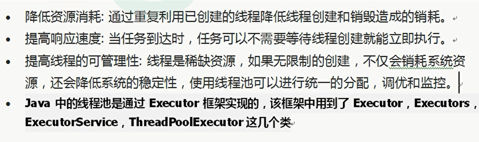

+ pool advantage
  + programmer:  convenient
  + performance: reuse thread for diff runnable
  

+ how to handle execute(runnable)

|condition |how|
|---|---|
|core pool not full|create thread to run|
|queue not full|put runnable in queue|
|max pool not full|create thread to run|
|all full|reject|  

+ 4 reject policy

+ problem of Executors
