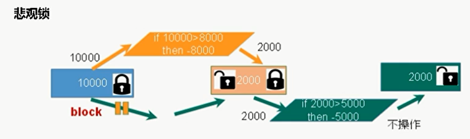
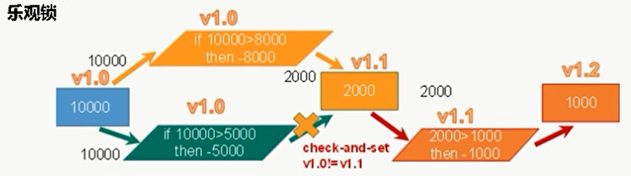

悲观锁：不可同时获取锁，不可并发

乐观锁：可同时获取锁，可并发。提交时更新版本号，后者提交被拒绝

表锁：no ddl

行锁：may ddl

读写锁
   + 写锁，读锁都可能ddl
   + 优：相比reentrantLock性能++
   + 不同thread：读读共享；读写/写写互斥
   + 同一thread： 
     + get读锁后不可get写锁； （不可升级      
     + get写锁后可get读锁；   （
       + 降级：get写锁-get读锁-release写锁（降级为读锁）-release读锁