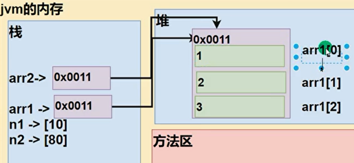
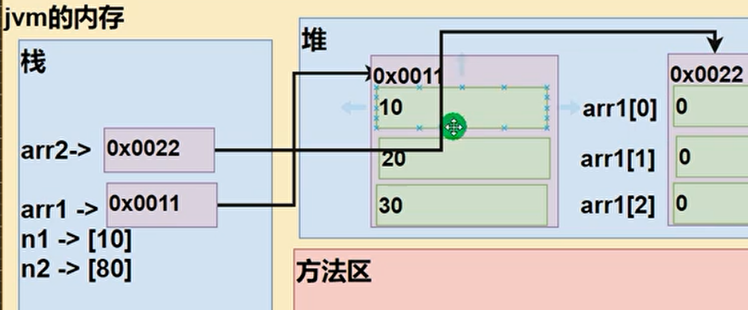
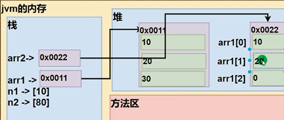

obj 存于heap，

方法中创建的临时变量存于stack。其中，引用变量（arr，obj）存储变量在heap的地址

### arr
1. 
```java
public static void main(String[]args){
    int[] arr1 = {1, 2, 3};
    int[] arr2 = arr1;
    int n1 = 10;
    int n2 = 80;
}
```


2. 
```java
public static void main(String[]args){
    int[] arr1 = {10, 20, 30};
    int[] arr2 = new int[arr1.length]; // step1,2
    // step3
    for(int i = 0; i < arr1.length; i++){
        arr2[i] = arr1[i];
    }
}
```

+ step1: heap 中创建数组，存于0x0022
+ step2: stack 中 变量arr2 指向数组


+ step3: 通过stack中arr2，改变heap中数组的值

