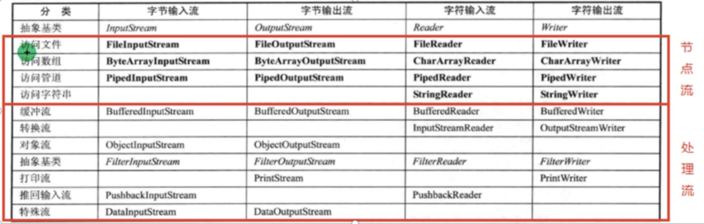

# concepts
+ how many bytes ?

  char    short    int    long    float   double

  2 2 4 4 (base on machine) 4 8

+ system

| system | end Line                             | file Separator         | byte Order |
| ------ | ------------------------------------ | ---------------------- | ---------- |
| win    | \r\n                                 | c:\\\\                 | little     |
| unix   | \n                                   | /                      | various    |
| jvm    | System.getProperty("line.separator") | java.io.File.separator | big        |

+ file: bin & text
  + text: need encode, decode.

  + bin: not need en / decode

      more efficient, portable(no specific de / encode scheme)
    
      eg: xx.class (bin)     xx.java  (text)
 

# io class:

+ pkg import: java.io (except Scanner)

+ Decorator pattern 装饰者

+ 不同分类方式：
  1. I/O 
  2. 字节流读二进制文件，字符流读文本文件
  3. DataSrc
     + 节点流：源为文件、数组等
     + 处理流（包装流）：源为其他流，目的是提供其他读写功能
  4. 是否具有某些功能？
     + Buffer? 
     + Format (PrintWriter has printf())

 
+
