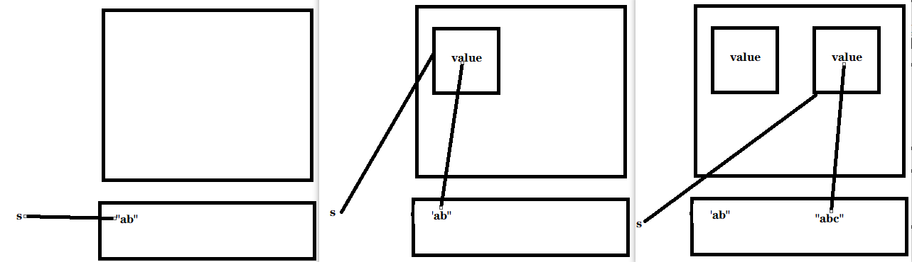
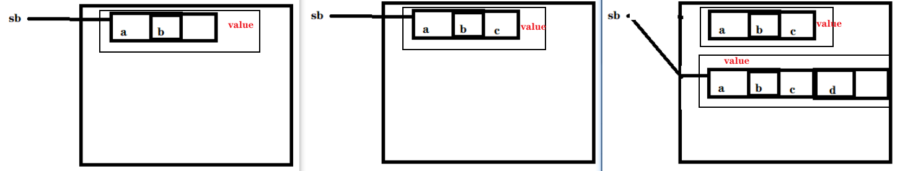

+ str底层是 `private final char value[];`

  + final arr: can't change ref, can change elem

  + 但 str immutable: when change str,  not change arr's elem, ref to another str

+ sb 底层`private char value[];`
  + mutable: change the arr's elem / ref to another arr(when size not enough)
```java
public class Main{
public static void main(String[]args){
    // 常量池中找到或创建“ab”
    // 栈中s指向常量池
    String s = "ab";
    
    // 常量池中找到或创建“ab”
    // 堆中创建String对象，属性value指向常量池
    // 栈中s指向堆    
    s = new String("ab");
    
    s += 'c';
}
}
```


```java
public class Main {
  public static void main(String[] args) {
    // 堆中创建StringBuffer对象，属性value存内容
    // 栈中sb指向堆
    StringBuffer sb = new StringBuffer("ab");

    // 堆中StringBuffer对象的属性value被修改：数组元素 或 数组引用
    sb.append('c');

    sb.append('d');
  }
}
```
