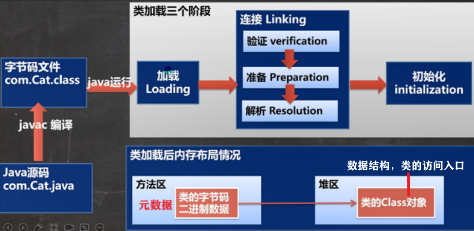

+ 索引：
             cls        field         method          ctor
get           2          35            35             35
msg           4           5             5              5
use           -           3             3              3

+ 作用：
  + 反射是框架的基础：通过外部配置文件，不改源码，来动态控制程序
    (ocp开闭原则：修改关闭，加功能开 
  + 运行时判断一个对象所属的类 
  + 生成动态代理
  
+ 某个类的Class对象只有一个，因为类只加载一次(见_2_get_cls)

# 动态加载，静态加载

判断一个类是：

+ 静态加载：只要出现：new对象，使用类的静态成员，子类被加载

  + 包含：编译时加载+运行时加载
  + 依赖性强，无论运行时是否使用

+ 动态加载：没有出现上述，且使用反射加载 

  + 只有运行时加载
  + 降低依赖性，不用则不报错

## 编译时，加载

+ 对于代码中：new对象，使用类的静态成员，子类被加载

+ 检查类是否存在，没有则报错 NoClassDefFoundError 

## 运行时，加载过程

没有则报错 ClassNotFoundException

1. 加载：ClassLoader完成
   + 字节码（class文件，jar包，网络等）转为二进制字节流加载到内存，

   + 生成代表该类的Class对象
  
2. 连接：将类的二进制数据合并到jre，连接后，为可运行状态
    1. 验证：
       + 目的：Class文件的字节流所含信息，符合jvm要求，不危害安全
       + 文件安全校验（文件格式 以魔数0xcafebabe开头，元数据，字节码，符号引用
       + -Xverify:none 关闭大部分验证，加快

    2. 准备：
        + static变量 分配内存，默认初始化（0，null）
        + static final 常量（特殊，因为一旦赋值就不可变
        
    3. 解析：把常量池 符号引用 替换为 直接引用

3. 初始化：
    + 执行编写的代码: 静态代码块，静态变量的初始化（见 _0_cls_base._3_block
    + 通过调用 `<clinit>()`
      1. 编译器按顺序，收集静态代码块，静态变量的初始化
      2. 进行合并
      3. 在多线程下加锁，保证只有一个线程执行

 