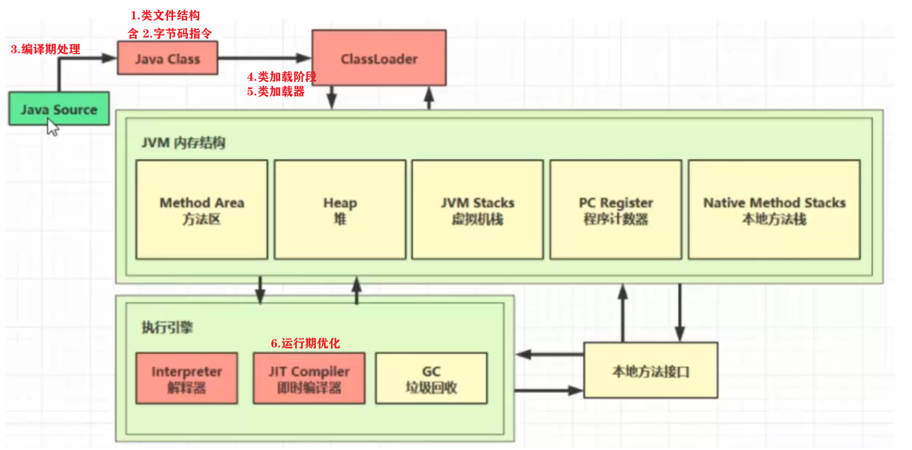
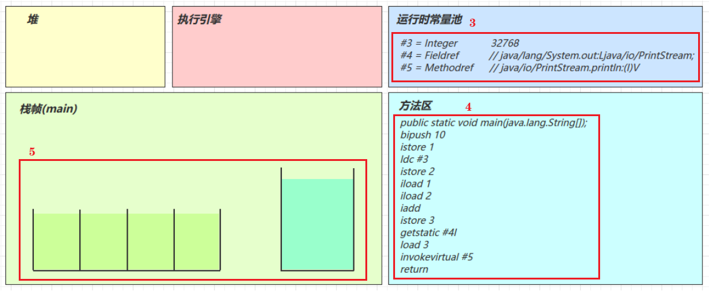
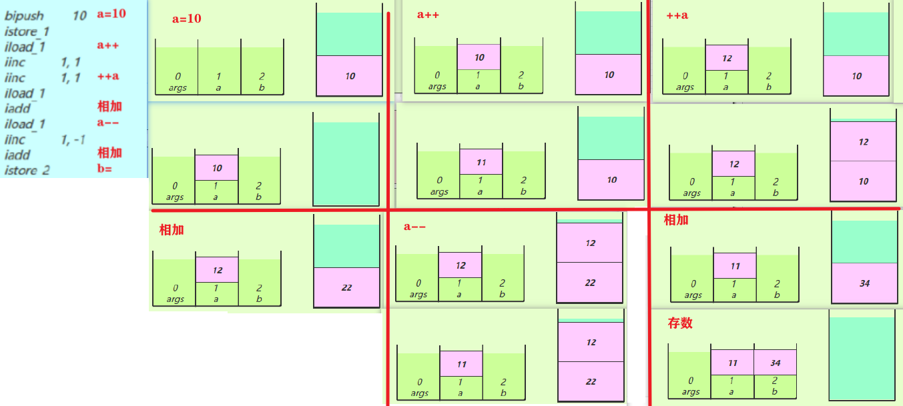
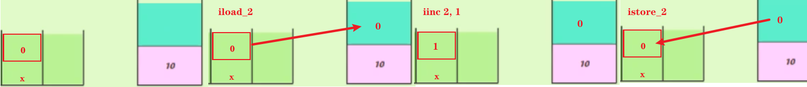
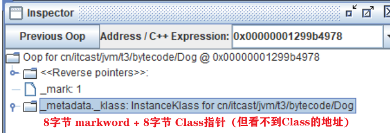
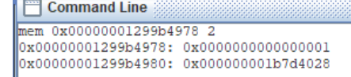
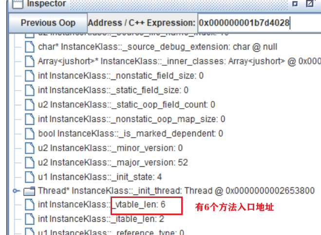
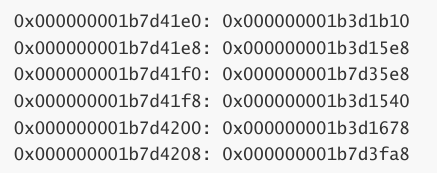
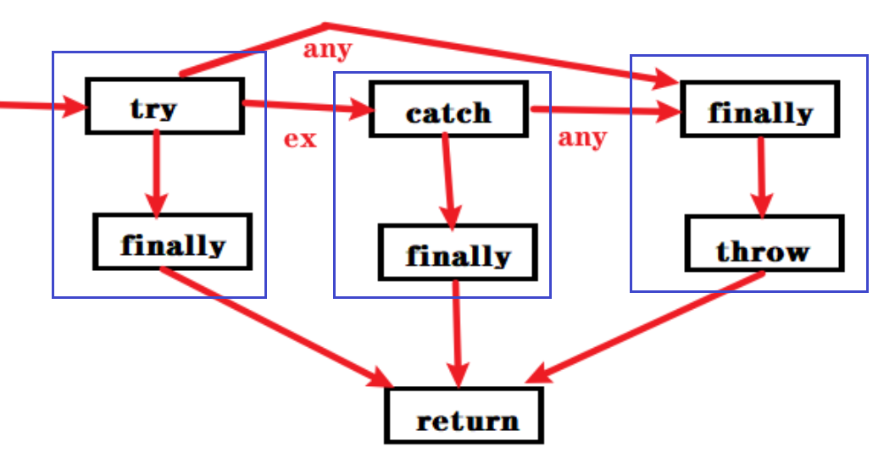

[toc]


## 四、类加载与字节码技术



### 1、类文件结构

+ javac 编译 .java 获得.class字节码文件
+ [Chapter 4. The class File Format (oracle.com)](https://docs.oracle.com/javase/specs/jvms/se8/html/jvms-4.html)

+ 根据 JVM 规范，**类文件结构**

```java
ClassFile { 
    // 魔数 ca fe ba be
    u4 (字节数)     magic              
    // 版本 34H = 52，代表JDK8       
    u2             minor_version;  
    u2             major_version;    
    // 常量池 
    u2             constant_pool_count; 
    cp_info        constant_pool[constant_pool_count-1];   
    // 访问权限
    u2             access_flags;     
    // 类
    u2             this_class;          
    u2             super_class;         // 父类
    u2             interfaces_count;    // 接口
    u2             interfaces[interfaces_count];  
    // 成员变量  
    u2             fields_count;        
    field_info     fields[fields_count];   
    // 方法
    u2             methods_count;       
    method_info    methods[methods_count];   
    // 附加属性
    u2             attributes_count;    
    attribute_info attributes[attributes_count]; 
}
```

+ 访问权限

  0021 = 0020 + 0001

+ 成员变量的类型

  | *FieldType* term    | Type        | Interpretation                                               |
  | ------------------- | ----------- | ------------------------------------------------------------ |
  | `B`                 | `byte`      | signed byte                                                  |
  | `C`                 | `char`      | Unicode character code point in the Basic Multilingual Plane, encoded with UTF-16 |
  | `D`                 | `double`    | double-precision floating-point value                        |
  | `F`                 | `float`     | single-precision floating-point value                        |
  | `I`                 | `int`       | integer                                                      |
  | `J`                 | `long`      | long integer                                                 |
  | `L` *ClassName* `;` | `reference` | an instance of class *ClassName*                             |
  | `S`                 | `short`     | signed short                                                 |
  | `Z`                 | `boolean`   | `true` or `false`                                            |
  | `[`                 | `reference` | one array dimension                                          |
  
  + eg：([Ljava/lang/String;)V
  
    | String      | Ljava/lang/String;    |
    | ----------- | --------------------- |
    | String 数组 | [Ljava/lang/String;   |
    | 函数参数    | ([Ljava/lang/String;) |
    | 函数返回    | V（表示void）         |
  


### 2、字节码指令

https://docs.oracle.com/javase/specs/jvms/se8/html/jvms-6.html#jvms-6.5

#### javap工具

反编译 class 文件

javap -v Main.class（-v显示详细信息）

```java
Classfile /F:/Thread_study/src/com/nyima/JVM/day5/Demo1.class
  Last modified 2020-6-6; size 434 bytes
  MD5 checksum df1dce65bf6fb0b4c1de318051f4a67e
  Compiled from "Demo1.java" 
      
public class com.nyima.JVM.day5.Demo1
// 版本
  minor version: 0
  major version: 52
// 类访问修饰符
  flags: ACC_PUBLIC, ACC_SUPER 
// 常量池，格式：#标号 = 常量类型 引用的标号
// 其中：
//   9 10 11 18 方法属性：字节码，行号表，本地变量表，方法参数arg
//   19 20 类属性：源文件 
Constant pool:
   #1 = Methodref          #6.#15         // java/lang/Object."<init>":()V 
                                          // 所属类.方法名:(参数)返回值    
   #2 = Fieldref           #16.#17        // java/lang/System.out:Ljava/io/PrintStream;
                                          // 所属类.变量名:变量类型 
   #3 = String             #18            // hello world
   #4 = Methodref          #19.#20        // java/io/PrintStream.println:(Ljava/lang/String;)V
   #5 = Class              #21            // 类名   com/nyima/JVM/day5/Demo1
   #6 = Class              #22            // 父类名 java/lang/Object
   #7 = Utf8               <init>
   #8 = Utf8               ()V
   #9 = Utf8               Code
  #10 = Utf8               LineNumberTable
  #11 = Utf8               main
  #12 = Utf8               ([Ljava/lang/String;)V
  #13 = Utf8               SourceFile
  #14 = Utf8               Demo1.java
  #15 = NameAndType        #7:#8          // "<init>":()V 
  #16 = Class              #23            // java/lang/System
  #17 = NameAndType        #24:#25        // out:Ljava/io/PrintStream; 
  #18 = Utf8               hello world
  #19 = Class              #26            // java/io/PrintStream
  #20 = NameAndType        #27:#28        // println:(Ljava/lang/String;)V
  #21 = Utf8               com/nyima/JVM/day5/Demo1
  #22 = Utf8               java/lang/Object
  #23 = Utf8               java/lang/System
  #24 = Utf8               out
  #25 = Utf8               Ljava/io/PrintStream;
  #26 = Utf8               java/io/PrintStream
  #27 = Utf8               println
  #28 = Utf8               (Ljava/lang/String;)V
                             
// 方法:访问修饰符,名称,参数描述,方法属性数,方法属性                             
{
  public com.nyima.JVM.day5.Demo1();
    descriptor: ()V   // 无参 无返回
    flags: ACC_PUBLIC // 访问修饰符
    // 方法属性1 Code字节码
    Code: 
      stack=1, locals=1, args_size=1 // 栈深度，局部变量表长度，参数长度
         // 字节码指令（014是字节码行号
         0: aload_0                  // 局部变量表0号，加载到栈 this
         1: invokespecial #1         // Method java/lang/Object."<init>":()V
         4: return  
      // 行号表：对应 源代码行号:字节码行号 ，用于debug
      LineNumberTable:
        line 7: 0 
	  // 局部变量表
      // Start     生命周期开始 相对于字节码的偏移
      // Length    覆盖的范围长度
      // Slot      占有的槽位(slot)编号
      // Name      名
	  // Signature 类型
      LocalVariableTable:
		Start Length Slot Name Signature
			0 	   5    0 this Lcn/itcast/jvm/t5/HelloWorld;
public static void main(java.lang.String[]);
    descriptor: ([Ljava/lang/String;)V
    flags: ACC_PUBLIC, ACC_STATIC
    Code: // 方法属性1 Code
      stack=2, locals=1, args_size=1
         0: getstatic     #2   // Field java/lang/System.out:Ljava/io/PrintStream; 静态变量 加载到操作数栈
         3: ldc           #3   // String hello world 常量池的常量 加载到操作数栈
         5: invokevirtual #4   // Method java/io/PrintStream.println:(Ljava/lang/String;)V 执行方法 
         8: return 
      LineNumberTable:
        line 9: 0
        line 10: 8 
} 
```

#### 图解方法执行  

1. **java代码**

```java
public class Demo3_1 {    
	public static void main(String[] args) {   
		int a = 10;        
		int b = Short.MAX_VALUE + 1;        
		int c = a + b;        
		System.out.println(c);   
    } 
} 
```

2. **编译为class文件**

3. **常量池 载入 运行时常量池**

   常量池也属于方法区，只不过这里单独提出来 

4. **方法字节码 载入 方法区**

5. main线程开始运行

   分配栈帧内存： （stack=2，locals=4） 

   + 操作数栈有2个空间（每个空间4个字节），

   + 局部变量表中有4个槽位



6. **执行引擎开始执行字节码**

   **bipush 10**

   | 压栈指令     | 数字来源     | 解释                                                        |
   | ------------ | ------------ | ----------------------------------------------------------- |
   | iconst_N     | 指令中       | N为小数字，-1 ~ 5                                           |
   | bipush N     | 和指令存一起 | byte（长度补齐，用0/1补齐栈的宽度= 4 字节）                 |
   | sipush N     | 和指令存一起 | short（长度补齐）                                           |
   | ldc #N       | 常量池       | int（**注意**：小数字和指令存一起，超short范围 存入常量池） |
   | ldc2_w #N    | 常量池       | long（**分两次压入**，因为 long 是 8 个字节）               |
   | getstatic #N | 常量池       | 静态变量                                                    |

[](https://nyimapicture.oss-cn-beijing.aliyuncs.com/img/20200608151336.png)

**istore_1**

将操作数栈栈顶弹出，放入局部变量表的slot 1 

局部变量表每个slot对应的局部变量，是固定的

[](https://nyimapicture.oss-cn-beijing.aliyuncs.com/img/20200608151346.png)

[](https://nyimapicture.oss-cn-beijing.aliyuncs.com/img/20200608151412.png)

**ldc #3**

读取运行时常量池中#3，即32768，入栈

注意：32768 = Short.MAX_VALUE + 1 在编译期计算好的（优化）

[](https://nyimapicture.oss-cn-beijing.aliyuncs.com/img/20200608151421.png)

**istore 2**

将操作数栈中的元素弹出，放到局部变量表的2号位置

[](https://nyimapicture.oss-cn-beijing.aliyuncs.com/img/20200608151432.png)

[](https://nyimapicture.oss-cn-beijing.aliyuncs.com/img/20200608151441.png)

**iload1 iload2**

将局部变量表中1号和2号元素放入操作数栈中

（因为只能在操作数栈中执行运算操作

[](https://nyimapicture.oss-cn-beijing.aliyuncs.com/img/20200608151450.png)

[](https://nyimapicture.oss-cn-beijing.aliyuncs.com/img/20200608151459.png)

**iadd**

栈中的两个元素**弹出栈**并相加，结果入栈

[](https://nyimapicture.oss-cn-beijing.aliyuncs.com/img/20200608151508.png)

[](https://nyimapicture.oss-cn-beijing.aliyuncs.com/img/20200608151523.png)

**istore 3**

将操作数栈中的元素弹出，放入局部变量表的3号位置

[](https://nyimapicture.oss-cn-beijing.aliyuncs.com/img/20200608151547.png)

[](https://nyimapicture.oss-cn-beijing.aliyuncs.com/img/20200608151555.png)

**getstatic #4**

运行时常量池中找到#4，发现是一个**对象引用**（实际存在堆中）

在堆中找到该**对象**，并将**对象引用**入栈

[](https://nyimapicture.oss-cn-beijing.aliyuncs.com/img/20200608151605.png)

[](https://nyimapicture.oss-cn-beijing.aliyuncs.com/img/20200608151613.png)

**iload 3**

将局部变量表中3号位置的元素压栈

[](https://nyimapicture.oss-cn-beijing.aliyuncs.com/img/20200608151624.png)

**invokevirtual #5**

1. 找到常量池 #5 项
2. 定位到方法区 java/io/PrintStream.println:(I)V 方法

3. 生成新栈帧（分配 locals、stack等）

4. 传递参数（32778），执行新栈帧中的字节码

5. 执行完毕，弹出栈帧

   清除 main 操作数栈内容

[](https://nyimapicture.oss-cn-beijing.aliyuncs.com/img/20200608151632.png)


**return**
完成 main 方法调用，弹出 main 栈帧，程序结束


#### 题目

通过 字节码指令 分析

1. 

```java
public class Demo3_2 {
public static void main(String[] args) {
        int a = 10;
        int b = a++ + ++a + a--;
        System.out.println(a); // 11
        System.out.println(b); // 34
	}
}
```

+ iinc 直接操作局部变量表

+ 区别：先增还是先用值

  a++：iload   iinc

  ++a：iinc      iload 

+ 

  

2. 

```java
public class Demo2 {
	public static void main(String[] args) {
		int i=0;
		int x=0;
		while(i<10) {
			x = x++;
			i++;
		}
		System.out.println(x); // 0
	}
}
```

+ x = x++ 字节码指令 

  iload_2

  iinc 2, 1

  istore_2

+ 


#### 条件、循环

ifeq 是否 == 0

if_icmpeq 两个int 是否 ==

if_acmpeq 两个引用是否 ==

 ifnull 是否 == null

+ byte,short,char 都会按 int 比较,因为操作数栈都是 4 字节
+  long,float,double 的比较 
  参考 https://docs.oracle.com/javase/specs/jvms/se7/html/jvms-6.html#jvms-6.5.lcmp

#### 构造方法

##### `<cinit>()V`

```java
public class Demo3 {
	static int i = 10;

	static { i = 20; }

	static { i = 30; }

	public static void main(String[] args){
		System.out.println(i); // 30
	}
} 
```

+ 编译器**从上至下**，收集所有 static代码块 和 static成员赋值
+ **合并**为  < cinit >()V 方法。类加载 的 初始化阶段 调用

```java
stack=1, locals=0, args_size=0
         0: bipush        10  
         2: putstatic     #3                  // Field i:I 
         5: bipush        20  
         7: putstatic     #3                  // Field i:I
        10: bipush        30   
        12: putstatic     #3                  // Field i:I
        15: return
```

**注意**

定义在后面的 static变量，在前面的static 块中**可以赋值，但不能访问**

[](https://nyimapicture.oss-cn-beijing.aliyuncs.com/img/20201118204542.png)

##### `<init>()V`

```java
public class Demo4 {
	private String a = "s1";

	{  b = 20; }

	private int b = 10;

	{  a = "s2"; }

	public Demo4(String a, int b) {
		this.a = a;
		this.b = b;
	}

	public static void main(String[] args){
		Demo4 d = new Demo4("s3", 30);
		System.out.println(d.a); // s3
		System.out.println(d.b); // 30
	}
}
```

+ 编译器 **从上至下**，收集 {} 代码块和成员变量赋值

+ **形成新构造方法**，但**原始ctor**的代码**总在最后**

+ 对象初始化时调用

```java
Code:
     stack=2, locals=3, args_size=3
        0: aload_0
        1: invokespecial #1                  // Super.<init>:()V
        // this.a = "s1"
        4: aload_0							 // this
        5: ldc           #2                  // "s1"
        7: putfield      #3                  // this.a   
        // this.b = 20
       10: aload_0
       11: bipush        20
       13: putfield      #4                  // this.b  
       // this.b = 10
       16: aload_0
       17: bipush        10
       19: putfield      #4                  // this.b  
       // this.a = "s2"
       22: aload_0
       23: ldc           #5                  // "s2"
       25: putfield      #3                  // this.a
       // 原始构造方法在最后 ------------------------------ 
       // this.a = a
       28: aload_0                           // this
       29: aload_1                           // a
       30: putfield      #3                  // this.a 
       // this.b = b
       33: aload_0
       34: iload_2
       35: putfield      #4                  // this.b 
       38: return
LocalVariableTable:
Start Length Slot Name Signature
0         39    0 this Lcn/itcast/jvm/t3/bytecode/Demo3_8_2;
0         39    1 a    Ljava/lang/String;
0         39    2 b    I
```

#### 方法调用

```java
public class Demo5 {
	public Demo5() { }

	private void test1() { }

	private final void test2() { }

	public void test3() { }

	public static void test4() { }

	public static void main(String[] args){
		Demo5 d = new Demo5();
		d.test1();
		d.test2();
		d.test3();
		d.test4();
		Demo5.test4();
	}
}
```


```java
// Demo5 d = new Demo5(); --------------
0: new           #2 
    //  给对象分配堆，对象引用压栈
3: dup			
    // 复制 栈顶内容
	// 1个用于调用ctor，1个用于赋给局部变量
4: invokespecial #3 // <init>()
7: astore_1
// d.test1();-------------------------
8: aload_1
9: invokespecial #4  
// d.test2();-------------------------
12: aload_1
13: invokespecial #5  
// d.test3();-------------------------
16: aload_1
17: invokevirtual #6 
// d.test4();-------------------------
20: aload_1
21: pop
22: invokestatic #7 
    // 静态方法 不需要对象引用，
    // 若通过对象调用，对象引用入栈后 就出栈（不必要的2条指令）
// Demo.test4();----------------------
25: invokestatic #7  
28: return
```

- 不同方法，对应不同指令

  | 方法                 | 指令          |                                    |
  | -------------------- | ------------- | ---------------------------------- |
  | 构造、private、final | invokespecial | 静态绑定，编译期 确定 方法入口地址 |
  | 静态                 | invokestatic  | 同上                               |
  | 普通 public          | invokevirtual | 动态绑定，运行时 确定 方法入口地址 |

- invokevirtual  

  动态绑定，支持多态

  运行时 确定 方法入口地址，是调父类的 还是子类的

  + 指令执行步骤
    + 通过栈帧 对象引用 找到 对象
    + 分析对象头，找到对象的 实际类型 的Class
    + Class结构，有**vtable** 虚方法表（类加载的 链接阶段 生成）
    + 查vtable，找到方法入口地址（有的来自父类，有的是自己的）
    + 执行方法的字节码 

  + 比 另两个 效率低

    jvm对查vtable有优化：1缓存常用方法的入口地址

- 利用工具 查vtable（demo3_10

  ```java
  /**
  * 演示多态原理,注意加上下面的 JVM 参数,禁用指针压缩(为了演示中方便计算地址)
  * -XX:-UseCompressedOops -XX:-UseCompressedClassPointers
  */
  abstract class Animal {
  	public abstract void eat(); 
      public String toString() { return "我是" + this.getClass().getSimpleName();}
  }
  class Dog extends Animal {  
      public void eat() {System.out.println("啃骨头");}
  }
  class Cat extends Animal { 
      public void eat() {System.out.println("吃鱼");}
  }
  ```

  1. 运行 hsdb

     + java -cp ./lib/sa-jdi.jar sun.jvm.hotspot.HSDB

  2. 绑定进程 id 

     + File -> Attach

     + id 由jps获取

  3. 找 Dog 对象

     + Tools -> Find Object By Query

     + select d from cn.itcast.jvm.t3.bytecode.Dog d

       select 对象名 from 对象类型 别名

     

     

  4. 找 Dog 的 Class对象

     + Windows -> Console

     + mem 0x00000001299b4978   2

       mem 对象地址                           查看2行(16字节)

     + 第二行就是Class的地址

       

  5. 查看vtable长度

     + Alt+R 进入 Inspector 工具，输入 Class 内存地址

     

  6. 查看vtable

     + Class偏移0x1B8

       0x000000001b7d4028 + 1B8 = 0x000000001b7d41e0

     + Windows -> Console
     + mem 0x000000001b7d41e0 6

     

  7. 分析vtable

     + Tools -> Class Browser 查看 类及其父类的 方法地址
     + 对比 vtable中 方法地址

     ```
     Object - protected void finalize() @0x000000001b3d1b10;
     Object - public boolean equals(java.lang.Object) @0x000000001b3d15e8;
     Animal - public java.lang.String toString() @0x000000001b7d35e8;
     Object - public native int hashCode() @0x000000001b3d1540;
     Object - protected native java.lang.Object clone() @0x000000001b3d1678;
     Dog - public void eat() @0x000000001b7d3fa8
     ```

#### 异常处理

##### try-catch

+ 单个catch
+ 多个single catch
+ multi catch

**单个catch**

```java
public class Demo1 {
	public static void main(String[] args) {
		int i = 0;
		try {
			i = 10;
		}catch (Exception e) {
			i = 20;
		}
	}
}
```

 

```java
Code:
     stack=1, locals=3, args_size=1 
        0: iconst_0 // i=0
        1: istore_1
        // try -------------------------- 
        2: bipush        10 // i=10		 |
        4: istore_1						 |
        // ------------------------------ 
        5: goto          12 // 未发生异常
        // catch ------------------------
        8: astore_2			// e		 |
        9: bipush        20 // i=20		 |
       11: istore_1						 |
        // ------------------------------
       12: return 
       
     Exception table:
       from   to target type
         2     5   8   Class java/lang/Exception
```

- 如何进入catch块？

  异常表：监测异常 [from, to)，

  出现异常，通过 type 匹配异常类型

  如果一致，进入 target 行号

- 8行指令 astore_2：将异常对象引用，存入局部变量表的2号（为e）

**多个single-catch**

```java
public class Demo1 {
	public static void main(String[] args) {
		int i = 0;
		try {
			i = 10;
		}catch (ArithmeticException e) {
			i = 20;
		}catch (Exception e) {
			i = 30;
		}
	}
}
```

 

```java
Code:
     stack=1, locals=3, args_size=1
        0: iconst_0
        1: istore_1
        // try ------------------------- 
        2: bipush        10				|
        4: istore_1						|
        // ----------------------------- 
        5: goto          19
        // catch -----------------------
        8: astore_2 // e				|
        9: bipush        20				|
       11: istore_1						|
        // -----------------------------
           
       12: goto          19
        // catch -----------------------
       15: astore_2 // e				|
       16: bipush        30				|
       18: istore_1						|
        // -----------------------------
       19: return
     Exception table:
        from    to  target type
            2     5     8   Class java/lang/ArithmeticException
            2     5    15   Class java/lang/Exception 
```

- 监测相同 [from, to)，进入不同target（catch块入口）

- 多个catch块 共用 局部变量表的 slot

  同1个try块 出现异常，**只能进入**一个catch块

  不会执行  多个catch块的代码

  因此：多个catch块，都为astore_2，把异常对象引用 存入同一个slot

   

**multi-catch**

```java
try{...}
catch (NoSuchMethodException | IllegalAccessException |InvocationTargetException e) {
	e.printStackTrace();
}

25: astore_1
26: aload_1
27: invokevirtual #11 // e.printStackTrace:()V
30: return
Exception table:
//  监测相同[from, to)，进入相同target（catch块入口） 
from to target type
0    22   25   Class java/lang/NoSuchMethodException
0    22   25   Class java/lang/IllegalAccessException
0    22   25   Class java/lang/reflect/InvocationTargetException    
```

##### finally

+ finally
+ finally中 return，吞掉异常
+ finally中 不return，但改变了被return变量的值

```java
public class Demo2 {
	public static void main(String[] args) {
		int i = 0;
		try {
			i = 10;
		} catch (Exception e) {
			i = 20;
		} finally {
			i = 30;
		}
	}
}
```

 

```java
Code:
     stack=1, locals=4, args_size=1
        0: iconst_0
        1: istore_1
        //try块 -------------------------
        2: bipush        10				|
        4: istore_1						|
        // 执行finally   				   |
        5: bipush        30				|
        7: istore_1 					|
        // -----------------------------
        8: goto          27  
       //catch块  -----------------------    
       11: astore_2 //异常放入局部变量表	  |     
       12: bipush        20				|
       14: istore_1						|
       // 执行finally 				   |   
       15: bipush        30				|
       17: istore_1						|
        // ------------------------------
       18: goto          27  
       //try出现未捕获异常 或 catch出新异常，也需执行finally 
       21: astore_3 // 异常存局部变量表 无名变量   	|
       22: bipush        30						|
       24: istore_1								|
       // 执行完finally，重抛异常（之前存的无名变量   |
       25: aload_3								|
       26: athrow  								|
        // --------------------------------------
       27: return 
     Exception table:
        from    to  target type
           2     5    11   Class java/lang/Exception
           2     5    21   any // 剩余的异常类型,如 Error
          11    15    21   any
```

+ finally 中的代码被**复制了 3 份**，分别放入 try 流程，catch 流程 及 catch剩余异常流程

  但 finally块的代码 只执行一次 



**finally 中 return**

```java
public class Demo3 {
	public static void main(String[] args) {
		int i = Demo3.test(); 
		System.out.println(i); // 20
        // 由于 finally 被插入了所有可能的流程，因此返回 finally的return
	} 
	public static int test() { 
		try { 
            // int i = i/0; 
            // 抛异常，但finally的return，st异常被吞。
            // 最终：打印20，未抛异常
			return 10;
		} finally { 
			return 20; 
		}
	}
}
```

 

```java
Code:
     stack=1, locals=3, args_size=0
        //try块 -------------------------
        0: bipush        10				|
        2: istore_0 					|
        // 为何暂存返回值？ (见下例)		 |
        // finally						|
        3: bipush        20 			|
        5: ireturn	// 返回：栈顶20		 |
        // -----------------------------
        
       //finally（若try出异常  ------------- 
        6: astore_1
        7: bipush        20 
        9: ireturn	// 返回：栈顶20
       // finally 没重抛异常
	   // 		即：finally有返回。当try块出异常，会吞掉异常
       // 		注意：不要在finally 返回
	   // ---------------------------------
     Exception table:
        from    to  target type
            0     3      6  any
```

**finally 不 return**

但finally改变了 被返回变量的值

最终返回啥？

```java
public class Demo4 {
	public static void main(String[] args) {
		int i = Demo4.test();
		System.out.println(i); // 10
	}

	public static int test() {
		int i = 10;
		try {
			return i;
		} finally {
			i = 20;
		}
	}
}
// 从效果上看，finally 插入 try末尾（即使try有return，也在return后面）
// 因此返回 10 （try的return）

// 但finally的内容，要在真正return前执行    
// 问：如何实现 finally 插入末尾 的效果？
//    为防止finally块 改变了 return变量的值。要暂存try中return变量的值，最后返回该值
```

 

```java
Code:
     stack=1, locals=3, args_size=0
        0: bipush        10 // i=10
        2: istore_0   
        //try块 -------------------------
        3: iload_0	// i暂存 局部变量表（try块return的值）
        4: istore_1  
        // finally
        5: bipush        20 // i=20
        7: istore_0  
        8: iload_1 // 取出暂存的i（10）
        9: ireturn // return 该值 
        // -----------------------------
            
       //finally（若try出异常  -------------
       10: astore_2 // 异常e
       11: bipush        20// i=20
       13: istore_0
       14: aload_2 // 加载异常
       15: athrow // 抛出异常(因为finally中无return)
        // -----------------------------
     Exception table:
        from    to  target type
            3     5    10   any 
```

#### Synchronized

```java
public class Demo5 {
	public static void main(String[] args) { 
		Object lock = new Lock();
		synchronized (lock) {
			System.out.println();
		}
	}
}

class Lock{}
```

+ 对1个对象加锁

  若synchronized代码块出ex，也要解锁（即：保证 加锁解锁成对出现）

+ 如何实现？

  只要在解锁前出ex，就跳到解锁

```java
Code:
     stack=2, locals=5, args_size=1 
        // lock = new Lock()
        3: new           #2                  
        6: dup                      //复制一份，1个用于ctor，1个用于赋值给lock
        7: invokespecial #3         //<init>:()V
       10: astore_2                  
       // 加锁 lock引用
       11: aload_2					//lock入栈
       12: dup 						//两份lock 
       13: astore_3 				//1个lock 暂存三号，之后用于解锁
           							// why解锁用 暂存的 而不直接用2号（lock变量）？
           							// 防lock引用 在代码块中被改变，导致不再指向加锁对象 
       14: monitorenter		 		//1个lock 用于加锁 
       // System.out.println()  
       15: getstatic     #4                  // PrintStream;
       18: iload_1
       19: invokevirtual #5                  // println:(I)V 
       //加载局部变量表中三号，用于解锁    
       22: aload_3    
       23: monitorexit //解锁
       24: goto          34 
       //异常  
       27: astore        4 // 异常放入局部变量
       29: aload_3
       30: monitorexit 	   // 解锁
       31: aload         4 // 加载异常并抛出  
       33: athrow
       34: return
     // 出现异常（synchronized块中，异常处理中）只要没执行 monitorexit 解锁
     // 都会到27行，解锁。确保在解锁过程中，再次出异常，仍能跳转到解锁代码行
     Exception table:
        from    to  target type
           15    24    27   any
           27    31    27   any
```

### 3、编译期处理

语法糖： 编译阶段的优化处理，**自动生成**和**转换**的一些代码，主要为了减轻程序员负担 

（**注意**，为了便于阅读，给出 字节码几乎等价 的 java 源码，并不是编译器转换出中间的 java 源码

#### 默认ctor

对于没任何 ctor 的类

```
public class Candy1 { } 
```


```
public class Candy1 {
   // java编译器帮我们加上 无参ctor
   public Candy1() {
      // 调用父类 Object 的无参构造方法，即调用 java/lang/Object." <init>":()V
      super();
   }
} 
```

#### 自动拆装箱

基本类型和其包装类型的相互转换过程，称为拆装箱

JDK 5，编译期自动完成

```
public class Demo2 {
   public static void main(String[] args) {
      Integer x = 1;
      int y = x;
   }
} 
```

 

```
public class Demo2 {
   public static void main(String[] args) {
      //基本类型赋值给包装类型，称为装箱
      Integer x = Integer.valueOf(1);
      // 对于 -128到127，会重用一些已有的Integer对象. 否则会创建新的Integer对象
      
      //包装类型赋值给基本类型，称谓拆箱
      int y = x.intValue();
   }
}
```

#### 泛型集合取值

 JDK 5 

**泛型擦除** ：在编译为字节码后，泛型信息 就**丢失**了，字节码中 当做 **Object** 来处理 

```java
public class Demo3 {
   public static void main(String[] args) {
      List<Integer> list = new ArrayList<>();
      list.add(10); // 实际调用：List.add(Object e)
       
      Integer x = list.get(0);  // 实际调用： Object obj = List.get(int ); 
      // 并添加类型转换（Object->Integer）
      
       int x = list.get(0);
	   // 实际：int x = ((Integer) list.get(0)).intValue(); 增加了自动拆箱
   }
}
```

 

```java
Code:
    stack=2, locals=3, args_size=1
       // List<Integer> list = new ArrayList<>(); ------------------------
       0: new           #2                  // class java/util/ArrayList
       3: dup
       4: invokespecial #3                  // Method java/util/ArrayList."<init>":()V 
       7: astore_1	
       // list.add(10);     ------------------------------------------------
       8: aload_1		// list
       9: bipush        10
      11: invokestatic  #4                  // int装箱 Integer.valueOf:(I)Ljava/lang/Integer; 
      14: invokeinterface #5,  2            // 泛型擦除 List.add:(Ljava/lang/Object;)  
      19: pop
	  // Integer x = list.get(0); ------------------------------------------------
      20: aload_1
      21: iconst_0   
      22: invokeinterface #6,  2            // 泛型擦除 List.get:(I)Ljava/lang/Object;
	  // 类型转换，Object -> Integer ------------------------------------------------
      27: checkcast     #7                  // class java/lang/Integer
      30: astore_2
      31: return
LocalVariableTable:
Start  Length Slot Name Signature
    0      32    0 args [Ljava/lang/String;
	8      24    1 list Ljava/util/List;
LocalVariableTypeTable:
Start  Length Slot Name Signature
	8      24    1 list Ljava/util/List<Ljava/lang/Integer;>;
```

+ 擦除的是字节码上的泛型信息

+ LocalVariableTypeTable 保留了 局部变量 泛型的信息

  但有限制：此处信息无法通过反射获取。

+ 反射只能获取：方法参数和返回值 的泛型信息

  如下

```java
public Set<Integer> test(List<String> list, Map<Integer, Object> map) {}

// 获取方法，参数不用指明泛型 (test)
Method test = Candy3.class.getMethod("test", List.class, Map.class);
// 获取方法参数 的类型信息   (list | map)
Type[] types = test.getGenericParameterTypes();
for (Type type : types) {
    if (type instanceof ParameterizedType) { // 参数是泛型
        ParameterizedType parameterizedType = (ParameterizedType) type; // List | Map
        System.out.println("原始类型 - " + parameterizedType.getRawType());
        Type[] arguments = parameterizedType.getActualTypeArguments();
        for (int i = 0; i < arguments.length; i++) { // String | Integer,Object
        	System.out.printf("泛型参数[%d] - %s\n", i, arguments[i]);
        }
    }
}
// 输出：
原始类型 - interface java.util.List
泛型参数[0] - class java.lang.String
原始类型 - interface java.util.Map
泛型参数[0] - class java.lang.Integer
泛型参数[1] - class java.lang.Object
```


#### 可变参数

jdk5

```java
public class Demo4 {
   public static void foo(String... args) {
      //将args赋值给arr，可以看出String...实际就是String[] 
      String[] arr = args;
      System.out.println(arr.length);
   }

   public static void main(String[] args) {
      foo("hello", "world");
   }
}
```


```java
public class Demo4 { 
   public static void foo(String[] args) {
      String[] arr = args;
      System.out.println(arr.length);
   }

   public static void main(String[] args) {
      foo(new String[]{"hello", "world"}); // 编译器根据实参数量，创建一个数组
   }
}
```

注意，如果 未传参数，等价代码为foo(new String[]{})，**创建了一个空数组**，而不是foo(null)

泛型擦除：指字节码中的泛型

LocalVariableTypeTable 包含泛型信息

#### foreach

jdk5

```java
public class Demo5 {
	public static void main(String[] args) { 
		int[] arr = {1, 2, 3, 4, 5};//数组赋初值的简化写法也是一种语法糖。
		for(int x : arr) {
			System.out.println(x);
		}
	}
}
```

 

```java
public class Demo5 {
    public Demo5 {}

	public static void main(String[] args) {
		int[] arr = new int[]{1, 2, 3, 4, 5};
		for(int i=0; i<arr.length; ++i) {
			int x = arr[i];
			System.out.println(x);
		}
	}
}
```

**集合使用foreach**

```java
public class Demo5 {
   public static void main(String[] args) {
      List<Integer> list = Arrays.asList(1, 2, 3, 4, 5);
      for (Integer x : list) {
         System.out.println(x);
      }
   }
}
```

集合要使用foreach，需要集合类实现了**Iterable接口**，因为集合的遍历需要用到**迭代器Iterator**

```java
public class Demo5 {
    public Demo5 {}
    
   public static void main(String[] args) {
      List<Integer> list = Arrays.asList(1, 2, 3, 4, 5);
      //获得该集合的迭代器
      Iterator<Integer> iterator = list.iterator();
      while(iterator.hasNext()) {
         Integer x = (Integer)iterator.next();// 泛型擦除。next返回的是Object，因此要强制类型转换为 Integer
         System.out.println(x);
      }
   }
}
```

#### switch字符串

jdk7

+ switch string和enum 都是

  先把对象 映射到 第二个 switch 的 label，再和第二个 switch 匹配

  对象都不可为null

```java
public class Demo6 {
   public static void main(String[] args) {
      String str = "hello";
      switch (str) {
         case "hello":
            System.out.println("h");
            break;
         case "world":
            System.out.println("w");
            break;
         default:
            break;
      }
   }
}
```

 

```java
public class Demo6 {
   public Demo6() {   }

   public static void main(String[] args) {
      String str = "hello";
      int x = -1;
      // 字符串 映射到 整数（在原switch的位置）
      // 	类比：switch enum 的 map
      // 通过 字符串的hashCode + equals 来匹配
      // 	hashCode: 提高比较效率，在编译期就知道
      //    equals:   防止有hashCode冲突（如BM和C.）
      switch (str.hashCode()) {
         case 99162322 : 
            if(str.equals("hello")) { x = 0; }
            break; 
         case 11331880 :
            if(str.equals("world")) { x = 1; }
            break;
         default:
            break;
      }

      // 结构同原switch，但case label不同（是 string在原switch的位置
      switch (x) {
         case 0:
            System.out.println("h");
            break;
         case 1:
            System.out.println("w");
            break;
         default:
            break;
      }
   }
} 
```

```java
// 为何不能合并 只用一个switch？
// 即：在第一个switch匹配后，就执行代码

// 若只有一个switch，需处理特殊情况，以保证正确
// 		特殊情况eg：hash冲突 + switch无break(fallthroughs)
// 		这种情况难以只用一个switch
public class Candy6_2 {
    public static void choose(String str) {
        switch (str) {
            case "BM":  
                System.out.println("h");
            case "D":
                System.out.println("D");
                break; 
            case "C.":  
                System.out.println("w"); 
                break; 
        }
    }
}

public class Candy6_2 { 
    public static void choose(String str) {
        byte x = -1;
        switch(str.hashCode())  {
            case 2123: // "C."和"BM"hashCode值相同
                if (str.equals("C.")) {
                    x = 2;
                } else if (str.equals("BM")) {
                    x = 0;
                } 
        		break;
            case xxxx:
                if (str.equals("D")) {
                    x = 1;
                } 
            default:
                break; 
        }
                
        switch(x){
            case 0:
            	System.out.println("h"); 
            case 1:
            	System.out.println("D");
            	break; 
            case 2:
            	System.out.println("w");
            	break; 
        }
    }
```


#### switch枚举

jdk7

```java
public class Demo7 {
   public static void main(String[] args) {
      SEX sex = SEX.MALE;
      switch (sex) {
         case MALE:
            System.out.println("man");
            break;
         case FEMALE:
            System.out.println("woman");
            break;
         default:
            break;
      }
   }
}

enum SEX {
   MALE, FEMALE;
}
```

 

```java
public class Demo7 {
   /**     
    * 定义一个合成类（静态内部类，仅 jvm 使用，对我们不可见）     
    * 作用：枚举对象的ordinal(序号) 映射到 整数（switch的case label）          
    * 		 (MALE.ordinal()=0，FEMALE. ordinal()=1     
    */ 
   static class $MAP {
      // 数组大小=枚举元素个数，里面存放了case用于比较的数字
      static int[] map = new int[2];
      static {
         //ordinal即枚举元素对应所在的位置，MALE为0，FEMALE为1
         map[SEX.MALE.ordinal()] = 1;
         map[SEX.FEMALE.ordinal()] = 2;
      }
   }
    
   public static void main(String[] args) {
      SEX sex = SEX.MALE;
      // 将对应位置枚举元素的值赋给x，用于case操作
      int x = $MAP.map[sex.ordinal()];
       // 结构同原switch，但case label不同
       switch (x) {
         case 1:
            System.out.println("man");
            break;
         case 2:
            System.out.println("woman");
            break;
         default:
            break;
      }
   }
} 
    
enum SEX {
   MALE, FEMALE;
}
```


#### 枚举类

jdk7后

本质是类，区别：实例个数有限

```java
enum SEX {
   MALE, FEMALE;
}
```

```java
public final class Sex extends Enum<Sex> {   // 不能被继承
   // 对应枚举类中的元素
   public static final Sex MALE;    
   public static final Sex FEMALE;    
   private static final Sex[] $VALUES;
   
   static {       
    	// 调用构造函数，传入 枚举元素的名称 及ordinal编号
    	MALE = new Sex("MALE", 0);    
        FEMALE = new Sex("FEMALE", 1);   
        $VALUES = new Sex[]{MALE, FEMALE}; 
    }
 	 
    private Sex(String name, int ordinal) {     // private 防止创建实例对象
        super(name, ordinal);     // 调用父类中的方法
    }
   
    public static Sex[] values() {  
        return $VALUES.clone();  
    }
    public static Sex valueOf(String name) { 
        return Enum.valueOf(Sex.class, name); 
        // 实现原理：类似hashMap<枚举名称，枚举实例>
    }  
}
```

#### try-with-resource

jdk7

+ 资源对象 需实现 AutoCloseable 接口

+ 作用：不用写 finally, 编译器生成关闭资源代码

```java
public class Candy9 {
    public static void main(String[] args) {
        try(InputStream is = new FileInputStream("d:\\1.txt")) { // 1
        	System.out.println(is); // 2
        } catch (IOException e) {   // 3 
        	e.printStackTrace();
        }
    }
}
```


```java
// 分别思考 无异常、1/2/close出异常，代码的执行
public class Candy9 {
    public Candy9() { }
    public static void main(String[] args) {
        try { // 最外层：捕获 1和2 的异常，及 finally关资源 的异常
            InputStream is = new FileInputStream("d:\\1.txt"); // 1
            Throwable t = null;
            try { // 捕获2的异常，存于变量t
                System.out.println(is);  // 2
            } catch (Throwable e1) { 
                t = e1;
                throw e1;
            } finally { // 关资源
                if (is != null) { // 资源为空，不必关
                    // 如果2有异常
                    if (t != null) {
                        try { // 捕获close 异常,作为被压制异常添加
                            is.close();
                        } catch (Throwable e2) { 
                            t.addSuppressed(e2);
                        }
                    } else {
                        // 如果2没异常, close 的异常就是最后 catch 块的 e
                        is.close();
                    }
                }
            }
        } catch (IOException e) { // 3
            e.printStackTrace();
        }
    }
}
```

 

```java
public class Test6 {
	public static void main(String[] args) {
        try (MyResource resource = new MyResource()) {
            int i = 1/0; // try块内异常
        } catch (Exception e) {
            e.printStackTrace();
        }
    }
}
class MyResource implements AutoCloseable {
    public void close() throws Exception {
    	throw new Exception("close 异常"); // 关资源异常
    }
}
两个异常信息都不丢。
    外层算术异常 内层close异常作为压制异常
java.lang.ArithmeticException: / by zero
    at test.Test6.main(Test6.java:7)
    Suppressed: java.lang.Exception: close 异常
        at test.MyResource.close(Test6.java:18)
        at test.Test6.main(Test6.java:6)
```

#### 方法重写时的桥接方法

Sub重写Super的方法时，

返回类型，可：相同 / 原返回类型的子类 

```java
class A {
    public Number m() { return 1;  }
}
class B extends A {
    @Override 
    public Integer m() { return 2; }
    // 返回类型Integer，是父类 返回值 Number 的子类
}

// java编译器 会做如下处理 -------------------------------
class B extends A {
    public Integer m() { return 2; }
    
    // 合成方法 
    // 此方法才是真正重写了父类 public Number m() 
    // 仅jvm使用，允许与人工定义的方法 同名且参数一致(没有命名冲突)
    public synthetic bridge Number m() {  return m(); } 
}  
```


#### 匿名内部类

```java
public class Demo8 {
   public static void main(String[] args) {
      Runnable runnable = new Runnable() {
         @Override
         public void run() {
            System.out.println("running...");
         }
      };
   }
}
```

 转换后：

```java
public class Demo8 {
   public static void main(String[] args) { 
      Runnable runnable = new Demo8$1();
   }
} 
// 生成的类 
final class Demo8$1 implements Runnable {
   public Demo8$1() {}

   @Override
   public void run() {
      System.out.println("running...");
   }
}
```

+ 如果匿名内部类 引用了 外部类的**局部变量**

```java
public class Demo8 {
   public static void main(String[] args) {
      final int x = 1; // 要求局部变量是final
      Runnable runnable = new Runnable() {
         @Override
         public void run() {
            System.out.println(x);
         }
      };
   }
}
```

 转换后：

```java
public class Demo8 {
   public static void main(String[] args) {
      int x = 1;
      Runnable runnable = new Demo8$1(x); 
   }
}

final class Demo8$1 implements Runnable { 
   int val$x;
    
   // 有参ctor 传入 局部变量
   public Demo8$1(int x) {
      this.val$x = x; // 属性 存储 局部变量
   }

   @Override
   public void run() {
      System.out.println(val$x);
   }
}
```

这同时解释了为什么匿名内部类引用局部变量时,

+ 局部变量必须是 final 的

  因为在创建 Demo8$1 时,将 x 的值赋值给了 Demo8$1 对象的 val$x 属性

  所以 x 不应该再变化了, 否则与 内部类的val$x 属性 不一致