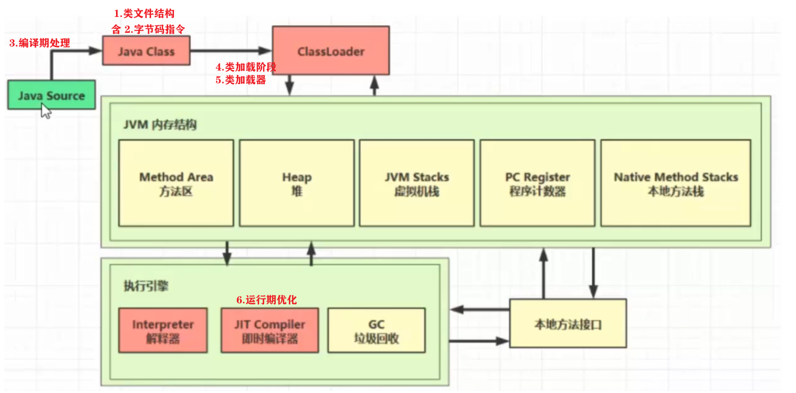

[toc]

## 四、类加载与字节码技术



### 4、类加载阶段

#### 加载

- 将类的字节码 载入方法区

  方法区内部  用C++数据结构 instanceKlass 描述java类

  

  - _java_mirror  类镜像 

    java 访问 instanceKlass信息，通过mirror作为桥梁

    如：String，镜像类 String.class，作用：把klass暴露给java使用 

    - InstanceKlass和 Person.class(JAVA镜像类)互相保存了对方的地址
    
      - InstanceKlass 在 _java_mirror 保存 Person.class 地址
      - Person.class 在对象头中保存 InstanceKlass的地址
    
    - 实例对象 在对象头 保存 *.class的地址
    
       对象可以通过其找到方法区中的instanceKlass，从而获取类的 信息

- 如果这个类还有父类没有加载，**先加载父类**

- 加载和链接 交替运行 

#### 链接

##### 验证

验证类是否符合 JVM规范，安全性检查

##### 准备

为 static 变量分配空间,设置默认值

- static 变量 存储位置：

  JDK 6及以前 存instanceKlass（方法区）末尾

  JDK 7存 _java_mirror（堆）末尾

- 对于static变量：

  流程：1分配空间，2设置默认值，3赋值

  + 12：链接的准备阶段

  + 3赋值：

    + static final **基本类型** / static final  **字符串常量**（c/d）
  
      编译阶段 值就确定了，**赋值 在准备阶段**
  
    + static 非final / static final引用 （ab/e）
  
      **赋值** 在初始化 阶段（cinit）   


##### 解析 

- 常量池中 **符号引用**  解析为  **直接引用**

```java
public class Demo1 {
   public static void main(String[] args) throws IOException, ClassNotFoundException {
      ClassLoader loader = Demo1.class.getClassLoader(); 
      // case1：loadClass 只加载C，不解析、初始化C
      // 因此D 也不 加载 解析 初始化  (加载懒惰，用到才加载
      Class<?> c=loader.loadClass("com.nyima.JVM.day8.C");
      // case2：加载 解析 初始化 C，也会 加载 解析 初始化 D
      new C();
      System.in.read(); // 用于阻塞主线程
   }
}
class C { D d = new D(); }
class D {}
```

- 未解析时，常量池中的看到的对象仅是符号，未真正存于内存中
- 解析：常量池中的 符号引用  解析为  直接引用


#### 初始化

+ **执行类构造器`<cinit>()`**

  （编译器自动收集：类变量赋值 和 static{}块

  虚拟机保证 线程安全

+ 发生时机：

  **类的初始化是懒惰的**，判断是否初始化：是否需要 cinit ？

  | 会初始化                                                     | 不初始化                                                     |
  | ------------------------------------------------------------ | ------------------------------------------------------------ |
  | main 所在类，首先初始化                                      |                                                              |
  | 首次访问类的 静态变量 或静态方法 或静态常量（非primative、String） | 访问类的 static final 静态常量（primative、String）(已在 链接的准备阶段 赋值 |
  | 子类初始化，如果父类还没初始化，会引发                       | 子类访问父类的静态变量，只父类初始化。子类不初始化           |
  | new 会导致初始化                                             | 创建该类对象的数组                                           |
  | Class.forName                                                | 类加载器的.loadClass方法，会加载BA（类及其父类）             |
  |                                                              | Class.forName参数2为false ，会加载BA（类及其父类）           |
  |                                                              | 类对象.class 不会触发初始化 (已经在 加载阶段 确定mirror      |


实验：**验证类是否被初始化，看类的静态代码块是否被执行**

```java
class A {
    static int a = 0;
    static { System.out.println("a init"); }
}

class B extends A {
    final static double b = 5.0;
    static boolean c = false;
    static { System.out.println("b init"); }
}

public class Load3 {
    static { System.out.println("main init"); }
    
    public static void main(String[] args) throws ClassNotFoundException {
        // 验证时 全部注释,每次只执行其一
        // 1. 静态常量(基本类型和字符串)不会触发初始化
        System.out.println(B.b);
        // 2. 类对象.class 不会触发初始化
        System.out.println(B.class);
        // 3. 创建该类的数组不会触发初始化
        System.out.println(new B[0]);
        // 4. 不会初始化类 B,但会加载 B、A
        ClassLoader cl = Thread.currentThread().getContextClassLoader();
            cl.loadClass("cn.itcast.jvm.t3.B");
        // 5. 不会初始化类 B,但会加载 B、A
        ClassLoader c2 = Thread.currentThread().getContextClassLoader();
        Class.forName("cn.itcast.jvm.t3.B", false, c2);
        // 1. 首次访问这个类的静态变量或静态方法时
        System.out.println(A.a);
        // 2. 子类初始化,如果父类还没初始化,会引发
        System.out.println(B.c);
        // 3. 子类访问父类静态变量,只触发父类初始化
        System.out.println(B.a);
        // 4. 会初始化类 B,并先初始化类 A
        Class.forName("cn.itcast.jvm.t3.B");
    }
}
```

+ 应用：懒惰初始化 单例模式

```java
public final class Singleton {
    private Singleton() {} // private 用户无法创建
    // 内部类中保存单例
    private static class LazyHolder {
    	static final Singleton INSTANCE = new Singleton();
    }
    // 用到时才创建实例：第一次调用 getInstance,才会导致内部类LazyHolder加载 和 初始化其静态成员
    public static Singleton getInstance() {
    	return LazyHolder.INSTANCE;
    }
}
```

+ 分析：单例作为 

  + Singleton 的静态常量：那么在Singleton类加载时 (如调用Singleton静态方法)，就会创建实例

  + 静态内部类 的静态常量：Singleton类加载时，由于类加载的懒惰性 ，静态内部类 不会类加载。也就不会创建实例 

    测试：访问Singleton的test()，不会导致 LazyHolder的初始化 和 实例的创建

    

+ 类加载器 保证 静态内部类的 初始化（cinit）线程安全，

  因此 Singleton实例的创建 线程安全

### 5、类加载器

+ ClassLoader：

  **通过 类的全限定名，获取 描述该类的 二进制字节流**

  JVM 外部实现，以便应用程序自己决定如何获取所需类 

+ 类的 唯一性

  对于任意一个类，由它的**类加载器** 和 **类本身**共同确立在JVM的唯一性，每一个类加载器，都拥有一个独立的类名称空间。

  更通俗：**比较两个类是否“相等”，只有在这两个类是由同一个类加载器加载的前提下才有意义**，否则，即使这两个类来源于同一个Class文件，被同一个Java虚拟机加载，只要类加载器不同，两个类就必定不相等

#### 分类

（以JDK 8为例

各司其职 负责加载不同类

层级关系：加载类时，先问上级 是否加载过 （双亲委派 类加载模式）

| 名称                                  | 加载的类              | 说明                          |
| ------------------------------------- | --------------------- | ----------------------------- |
| Bootstrap ClassLoader（启动类加载器） | JAVA_HOME/jre/lib     | c++编写，java代码无法直接访问 |
| Extension ClassLoader (拓展)          | JAVA_HOME/jre/lib/ext | 上级为Bootstrap               |
| Application ClassLoader (应用程序)    | classpath             | 上级为Extension               |
| 自定义类加载器                        | 自定义                | 上级为Application             |

+ Bootstrap 类加载器 

  

  + jvm参数，

    `-Xbootclasspath` 指定 启动 类加载 的路径。

    作用：可让自定义类 被bootstrap类加器 加载 

    替换 java -Xbootclasspath:< new bootclasspath >
    后追加 java -Xbootclasspath/a:<追加路径>
    前追加 java -Xbootclasspath/p:<追加路径>

  + getClassLoader 获取该类的 类加载器

    打印null 表示：由Bootstrap类加载器加载

    （因c++编写，java代码无法访问，因此打印null）

+ Extension 类加载器

  如果classpath 和 JAVA_HOME/jre/lib/ext 下有同名类，

  会由**ext 类加载器**加载  JAVA_HOME/jre/lib/ext 

  当App类加载器发现拓展类加载器已将该同名类加载，则不会再次加载（双亲委派）

  


#### 双亲委派 机制

+ 类加载器 的 loadClass 方法，查找类的规则：委派上级 优先进行 类加载
+ 目标：相同的类 不会 重复加载


ClassLoader.loadClass 源码

```java
protected Class<?> loadClass(String name, boolean resolve) throws ClassNotFoundException{
    synchronized (getClassLoadingLock(name)) {
        // 1.该类是否已被加载
        Class<?> c = findLoadedClass(name);
        // 2.没被加载，委派上级加载
        if (c == null) {
            long t0 = System.nanoTime();
            try { 
                // 2.1上级非Bootstarp
                if (parent != null) { 
                    c = parent.loadClass(name, false);
                } else {
                    // 2.2上级是Bootstarp（parent为null  
                    c = findBootstrapClassOrNull(name);// 本地方法 c++实现 
                }
            } catch (ClassNotFoundException e) { 
                // 3.上级没找到类
                // 捕获异常，但不做任何处理
            }
            // 4.如果上级没找到，findClass方法，自己找类，
            // 5.如果还是没找到，就抛出异常
            if (c == null) {  
                long t1 = System.nanoTime();
                c = findClass(name);                sun.misc.PerfCounter.getParentDelegationTime().addTime(t1 - t0);
                sun.misc.PerfCounter.getFindClassTime().addElapsedTimeFrom(t1);
                sun.misc.PerfCounter.getFindClasses().increment();
            }
        }
        if (resolve) {
            resolveClass(c);
        }
        return c;
    }
} 
```

eg：


#### 全盘负责委托机制

负责加载当前类的类加载器  会加载   当前类引用的其他类

（**前提是引用的类没有被加载过**）

+ 如：ClassA中有个变量 ClassB, 加载ClassA的类加载器会去加载ClassB，

  如果找不到ClassB，则异常。

#### 线程上下文 类加载器

[(88条消息) 真正理解线程上下文类加载器（多案例分析）_小杨Vita的博客-CSDN博客_上下文类加载器](https://blog.csdn.net/yangcheng33/article/details/52631940?adlt=strict)

[(88条消息) JVM--7. 通过JDBC源码来分析线程上下文类加载器以及SPI的使用_独孤小标的博客-CSDN博客](https://blog.csdn.net/duguxiaobiao/article/details/107951925?adlt=strict)

+ 打破 双亲委派

**以下按流程分析，加载 JDBC Driver**

+ 使用 JDBC, 加载 Driver 驱动

  不写 Class.forName("com.mysql.jdbc.Driver")
  也可 正确加载 com.mysql.jdbc.Driver 

```java
//Class.forName("com.mysql.jdbc.Driver").newInstance(); 
String url = "jdbc:mysql://localhost:3306/testdb";    
// 通过java库获取数据库连接
Connection conn = java.sql.DriverManager.getConnection(url, "name", "password");   
```

+ DriverManager    static{} 

  DriverManager  的类加载器 是 Bootstrap ClassLoader,

  而 JAVA_HOME/jre/lib 没有 mysql-connector-java-5.1.47.jar 包

  问：在 DriverManager 的静态代码块,怎么加载com.mysql.jdbc.Driver

```java
public class DriverManager {
    // 注册驱动的集合
    private final static CopyOnWriteArrayList<DriverInfo> registeredDrivers 
        = new CopyOnWriteArrayList<>();
    // 初始化驱动
    static {
        loadInitialDrivers();
        println("JDBC DriverManager initialized");
    }
```

+ DriverManager    loadInitialDrivers() 方法:

  1) 和 2) 打破 双亲委派:  DriverManager 应使用 bootstrap 加载所有相关的类，但此处使用app 类加载器

```java
private static void loadInitialDrivers() {
	String drivers;
    try {
    	drivers = AccessController.doPrivileged(new PrivilegedAction<String>(){
            public String run() {
                return System.getProperty("jdbc.drivers");
            }
        });
    } catch (Exception ex) {
    	drivers = null;
    }
    // 1)使用 ServiceLoader 机制加载驱动,即 SPI
    // 实际使用：线程上下文 类加载器（默认为App类加载器）
    // 分析见后
    AccessController.doPrivileged(new PrivilegedAction<Void>() {
        public Void run() {
            ServiceLoader<Driver> loadedDrivers = ServiceLoader.load(Driver.class); //   
            Iterator<Driver> driversIterator = loadedDrivers.iterator();
            try{
                while(driversIterator.hasNext()) {
                    driversIterator.next();
                }
            } catch(Throwable t) {}  
            return null;
        }
    });
    println("DriverManager.initialize: jdbc.drivers = " + drivers);
    // 2)使用 jdbc.drivers 定义的驱动名加载驱动
    if (drivers == null || drivers.equals("")) {
        return;
    }
    String[] driversList = drivers.split(":");
    println("number of Drivers:" + driversList.length);
    for (String aDriver : driversList) {
        try {
            println("DriverManager.Initialize: loading " + aDriver);
            //ClassLoader.getSystemClassLoader() 就是App类加载器
            Class.forName(aDriver, true,ClassLoader.getSystemClassLoader());
        } catch (Exception ex) {
            println("DriverManager.Initialize: load failed: " + ex);
        }
    }
}
```

1) Service Provider Interface (SPI)
约定如下,在 jar 包的 META-INF/services 包下,以接口全限定名名为文件,文件内容是接口的实现类名称


这样就可以使用

配合ServiceLoader，根据接口 找到实现类，并加以实现化（解耦）

```java
ServiceLoader<接口类型> allImpls = ServiceLoader.load(接口类型.class);
Iterator<接口类型> iter = allImpls.iterator();
while(iter.hasNext()) {
	iter.next();
}
```

来得到实现类,体现的是【面向接口编程+解耦】的思想,在下面一些框架中都运用了SPI思想:

+ JDBC
+ Servlet 初始化器
+ Spring 容器
+ Dubbo(对 SPI 进行了扩展)

ServiceLoader.load 方法:

```java
public static <S> ServiceLoader<S> load(Class<S> service) {
    // 获取线程上下文类加载器
    ClassLoader cl = Thread.currentThread().getContextClassLoader();
    return ServiceLoader.load(service, cl);
}
```

线程上下文类加载器 内部又是由 Class.forName 调用了线程上下文类加载器完成类加载,具体代码在 ServiceLoader 的内部类 LazyIterator 中:

```java
private S nextService() {
    if (!hasNextService())
    	throw new NoSuchElementException();
    String cn = nextName;
    nextName = null;
    Class<?> c = null;
    try {
    	c = Class.forName(cn, false, loader);
    } catch (ClassNotFoundException x) {
    	fail(service,"Provider " + cn + " not found");
    }
    if (!service.isAssignableFrom(c)) {
    	fail(service, "Provider " + cn + " not a subtype");
    }
    try {
        S p = service.cast(c.newInstance());
        providers.put(cn, p);
        return p;
    } catch (Throwable x) {
    	fail(service, "Provider " + cn + " could not be instantiated",x);
    }
    throw new Error(); // This cannot happen
}
```


#### 自定义 类加载器

+ 使用场景
  + 加载 任意路径（非classpath） 的类文件

  + 框架设计：通过接口来使用实现，从而解耦

    如：mybatis，定义mapper接口。类加载器会根据xml文件，生成接口的实现类

  + 一个类有多个版本，希望新旧版本同时工作

    这些类希望予以隔离，不同应用的同名类都可以加载，不冲突

    常见于 tomcat 容器

+ 步骤：定义一个类加载器
  + 继承 ClassLoader 父类

  + 重写 findClass 方法

    findClass指出该类加载器 如何加载类：

    - 读取类文件的字节码
    - 调用父类的 defineClass 方法来加载类

    注意：不重写loadClass方法，因为loadClass会进行双亲委派

  + 使用者 调用 类加载器的 loadClass 

+ **示例**:
  准备好两个类文件放入 E:\myclasspath

```java
public class Load7 {
    public static void main(String[] args) throws Exception {
        // 两次加载，同一个类 只被加载一次
        MyClassLoader classLoader = new MyClassLoader();
        Class<?> c1 = classLoader.loadClass("MapImpl1");
        Class<?> c2 = classLoader.loadClass("MapImpl1");
        System.out.println(c1 == c2);
		// 不同类加载器，加载 完全相同的 两个类
        MyClassLoader classLoader2 = new MyClassLoader();
        Class<?> c3 = classLoader2.loadClass("MapImpl1");
        System.out.println(c1 == c3); 
        c1.newInstance();
    }
} 
class MyClassLoader extends ClassLoader { 
    @Override // name 就是类名 
    protected Class<?> findClass(String name) throws ClassNotFoundException {
        String path = "e:\\myclasspath\\" + name + ".class"; 
        try {
            // 根据路径，拷贝文件内容，存到字节输出流 ByteArrayOutputStream  
            ByteArrayOutputStream os = new ByteArrayOutputStream();
            Files.copy(Paths.get(path), os); 
            // 得到字节数组  
            byte[] bytes = os.toByteArray(); 
            // byte[] -> *.class | 字节数组 得到 类对象 
            return defineClass(name, bytes, 0, bytes.length); 
        } catch (IOException e) {
            e.printStackTrace();
            throw new ClassNotFoundException("类文件未找到", e);
        }
    }
} 
```

#### 破坏双亲委派模式

- 双亲委派模型的第一次“被破坏”其实发生在双亲委派模型出现之前——即JDK1.2面世以前 
  - 建议用户重写findClass()方法，在类加载器中的loadClass()方法中也会调用该方法
- 双亲委派模型的第二次“被破坏”是由这个模型自身的缺陷导致的
  - 如果有基础类型又要调用回用户的代码，此时也会破坏双亲委派模式
- 双亲委派模型的第三次“被破坏”是由于用户对程序动态性的追求而导致的
  - 这里所说的“动态性”指的是一些非常“热”门的名词：代码热替换（Hot Swap）、模块热部署（Hot Deployment）等

