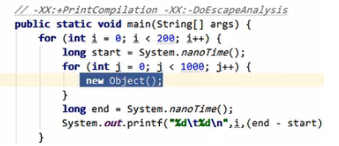
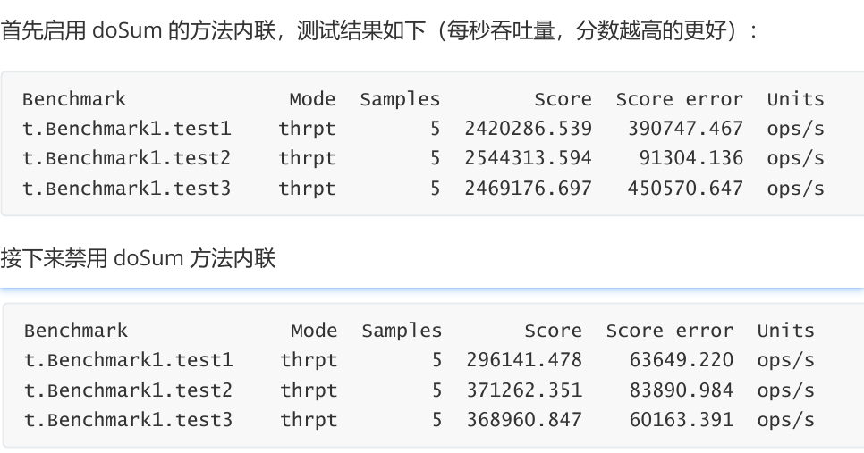
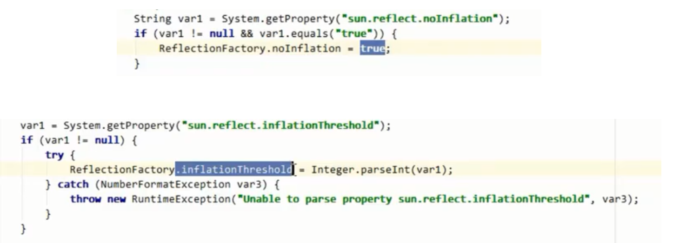

[toc]


## 四、类加载与字节码技术


### 6、运行期优化  

#### 分层编译

+ JVM 将执行状态分成了 5 个层次：
  + 0层：解释执行，用解释器将字节码翻译为机器码
  + 1层：使用 C1 **即时编译器**编译执行（不带 profiling）
  + 2层：使用 C1 即时编译器编译执行（带基本的profiling）
  + 3层：使用 C1 即时编译器编译执行（带完全的profiling）
  + 4层：使用 C2 即时编译器编译执行

  + **profiling**：运行中 收集程序执行状态的数据，如【方法的调用次数】，【循环的 回边次数】等

+ 即时编译器（JIT）与解释器的区别
  + 解释器 interpreter
    - 将字节码**解释**为所有平台通用的机器码
    - 下次遇到相同的字节码，仍会执行重复的解释 

  + 即时编译器 just in time
    - 将一些字节码**编译**为平台特定的机器码，**并存入 Code Cache**

      （会执行更特殊的优化）

    - 下次遇到相同的代码，直接执行，无需再编译 

+ 大部分不常用代码，无需耗时编译成机器码，而是解释执行

  小部分热点代码，编译成机器码，以达到理想的运行速度。

+ 执行效率：Interpreter < C1 < C2

  目标是发现热点代码（hotspot名称的由 来），并优化

#### 逃逸分析

Escape Analysis



+ 发现新建对象使用范围：是否逃逸（是否在 方法/循环外 用	到）

  并决定是否在 Java 堆上分配内存 

+ C2直接不创建对象  

+ JVM 参数：
  + 开启逃逸分析：-XX:+DoEscapeAnalysis
  + 关闭逃逸分析：-XX:-DoEscapeAnalysis
  + 显示分析结果：-XX:+PrintEscapeAnalysis

  + Java SE 6u23+ 开始支持，默认启用

+ 当一个对象**没有逃逸**时，可以得到以下几个虚拟机的优化

  **锁消除**

  线程同步锁牺牲性能，当编译器确定当前对象只有当前线程使用，那么就会移除该对象的同步锁

  例如，StringBuffer 和 Vector 都是用 synchronized 修饰线程安全的，但大部分情况下，它们都只是在当前线程中用到，这样编译器就会优化移除掉这些锁操作

  锁消除的 JVM 参数如下：

  + 开启锁消除：-XX:+EliminateLocks
  + 关闭锁消除：-XX:-EliminateLocks

  锁消除在 JDK8 中都是默认开启的，并且锁消除都要建立在逃逸分析的基础上

  **标量替换**

  首先要明白标量和聚合量，**基础类型**和**对象的引用**可以理解为**标量**，它们不能被进一步分解。

  而能被进一步分解的量就是聚合量，比如：对象

  对象是聚合量，它又可以被进一步分解成标量，将其成员变量分解为分散的变量，这就叫做**标量替换**。

  对象没有发生逃逸，那压根就不用创建它，只会在栈或者寄存器上创建它用到的成员标量，节省了内存空间，也提升了应用程序性能

  标量替换的 JVM 参数如下：

  + 开启标量替换：-XX:+EliminateAllocations
  + 关闭标量替换：-XX:-EliminateAllocations
  + 显示标量替换详情：-XX:+PrintEliminateAllocations

  JDK8 默认开启，并且都要建立在逃逸分析的基础上

  **栈上分配**

  当对象没有发生逃逸时，该**对象**就可以通过标量替换分解成成员标量分配在**栈内存**中，和方法的生命周期一致，随着栈帧出栈时销毁，减少了 GC 压力，提高了应用程序性能

#### 方法内联

+ 编译器：**JVM内联函数**

  Java由**编译器决定**。 不支持直接声明为内联函数 

   向编译器提出请求: 关键字**final修饰**  指明函数希望被JVM内联

  ```java
  public final void doSomething() {}
  ```

+ 运行时优化：**方法内联**

  JVM监测到**小方法被频繁执行**，且长度不太长。

  把方法调用 替换成 方法体本身

  ```java
  private static int square(final int i) {
  	return i * i;
  } 
  System.out.println(square(9));
  ```

  替换后

  ```java
  System.out.println(9 * 9);
  ```

  常量折叠(constant folding)

  ```java
  System.out.println(81);
  ```

  

  ```java
  public class JIT2 {
      // -XX:+UnlockDiagnosticVMOptions -XX:+PrintInlining (解锁隐藏参数)打印  inlining 信息
      // -XX:CompileCommand=dontinline,*JIT2.square 禁止某个方法 inlining
      // -XX:+PrintCompilation 打印编译信息
      public static void main(String[] args) {
          int x = 0;
          for (int i = 0; i < 500; i++) {
              long start = System.nanoTime();
              for (int j = 0; j < 1000; j++) {
                  x = square(9); 
              }
              long end = System.nanoTime();
              System.out.printf("%d\t%d\t%d\n",i,x,(end - start));
          }
      }
      private static int square(final int i) {
          return i * i;
      }
  }
  ```

   

#### 字段优化

针对   成员/静态变量   的读写操作

如：将成员变量 存储于 局部变量 int[] locals

1. maven 工程

   ```java
   <dependency>
       <groupId>org.openjdk.jmh</groupId>
       <artifactId>jmh-core</artifactId>
       <version>${jmh.version}</version>
   </dependency>
   <dependency>
       <groupId>org.openjdk.jmh</groupId>
       <artifactId>jmh-generator-annprocess</artifactId>
       <version>${jmh.version}</version>
       <scope>provided</scope>
   </dependency>
   ```

2. 基准测试代码

   ```java
   @Warmup(iterations = 2, time = 1) 
   // 运行时优化，st 监测数据不准。预热程序，充分优化 
   @Measurement(iterations = 5, time = 1)
   // 进行几轮测试，取平均值
   @State(Scope.Benchmark)
   public class Benchmark1 {
       int[] elements = randomInts(1_000);
       private static int[] randomInts(int size) {
           Random random = ThreadLocalRandom.current();
           int[] values = new int[size];
           for (int i = 0; i < size; i++) {
               values[i] = random.nextInt();
           }
           return values;
       }
       @Benchmark
       public void test1() {
           for (int i = 0; i < elements.length; i++) {
               doSum(elements[i]);
           }
       }
       @Benchmark
       public void test2() {
       	int[] local = this.elements;
           for (int i = 0; i < local.length; i++) {
               doSum(local[i]);
           }
       }
       
       @Benchmark
       public void test3() {
           for (int element : elements) {
               doSum(element);
           }
       }
       static int sum = 0;
       
       @CompilerControl(CompilerControl.Mode.INLINE)
       // 控制是否进行方法内联 
       static void doSum(int x) {
           sum += x;
       }
       
       public static void main(String[] args) throws RunnerException {
           Options opt = new OptionsBuilder()
               .include(Benchmark1.class.getSimpleName())
               .forks(1)
               .build();
           new Runner(opt).run();
       }
   }
   ```

3. 测试

   ops/s 每秒调用的次数，越大越好

   score 吞吐量得分

   score error 误差 

   

4. 分析

   字段优化：针对   成员/静态变量 的读写操作 优化 

   + 开启 inline 优化后， 三种差别不大 

     ```java
     // test1 方法会被优化成:
     @Benchmark
     public void test1() {
         // elements.length 首次读取会缓存起来 -> int[] local
         for (int i = 0; i < elements.length; i++) { 
             // 后续 999 次 求长度 <- local
         	sum += elements[i]; // 1000 次取下标 i 的元素 <- local
     	}
     }
     ```

     test1 方法内联优化后，

     会对成员变量进行 字段优化 (运行时优化) 

     elements 存到局部变量 int[]

     test2 手动优化  int[] 

     test3 编译器优化 效果和2等价  

   + 禁用 dont inline 吞吐量下降 

     1吞吐量最低。后两种相差不大 

     因：1没有方法内联，无法进行字段优化（elements 存到局部变量）
   
     结论：方法内联 影响 成员变量读取的优化

#### 反射优化

+ eg:

```java
public class Reflect1 {
   public static void foo() {  System.out.println("foo..."); }

   public static void main(String[] args) throws NoSuchMethodException, InvocationTargetException, IllegalAccessException {
      Method foo = Demo3.class.getMethod("foo");
      for(int i = 0; i<=16; i++) {
         foo.invoke(null);
      }
   }
}
```


+ invoke方法源码

```java
@CallerSensitive
public Object invoke(Object obj, Object... args)
    throws IllegalAccessException, IllegalArgumentException, InvocationTargetException
{
    if (!override) {
        if (!Reflection.quickCheckMemberAccess(clazz, modifiers)) {
            Class<?> caller = Reflection.getCallerClass();
            checkAccess(caller, clazz, obj, modifiers);
        }
    }
    //MethodAccessor是一个接口，有3个实现类，其中有一个是抽象类
    MethodAccessor ma = methodAccessor;             // read volatile
    if (ma == null) {
        ma = acquireMethodAccessor();
    }
    return ma.invoke(obj, args);
}
```


[](https://nyimapicture.oss-cn-beijing.aliyuncs.com/img/20200614133554.png)

会由 DelegatingMehodAccessorImpl 调用 NativeMethodAccessorImpl

```java
// NativeMethodAccessorImpl源码
class NativeMethodAccessorImpl extends MethodAccessorImpl {
    private final Method method;
    private DelegatingMethodAccessorImpl parent;
    private int numInvocations;

    NativeMethodAccessorImpl(Method var1) {
        this.method = var1;
    }
	
	//每次进行反射调用，会让numInvocation与ReflectionFactory.inflationThreshold （膨胀阈值 默认15）进行比较，并使使得numInvocation的值加一
    public Object invoke(Object var1, Object[] var2) throws IllegalArgumentException, InvocationTargetException {
        // 如果numInvocation 小于等于 15，则会调用本地方法invoke0方法 
        // 否则 本地方法访问器 替换为 运行期间动态生成的新的方法访问器.效率提升  
        if (++this.numInvocations > ReflectionFactory.inflationThreshold() && !ReflectUtil.isVMAnonymousClass(this.method.getDeclaringClass())) {
            // 使用 ASM 动态生成的新实现代替本地实现,速度较本地实现快 20 倍左右
            MethodAccessorImpl var3 = (MethodAccessorImpl)(new 	MethodAccessorGenerator()).generateMethod(this.method.getDeclaringClass(), this.method.getName(), this.method.getParameterTypes(), this.method.getReturnType(), this.method.getExceptionTypes(), this.method.getModifiers());
            this.parent.setDelegate(var3); // 替换
        } 
        // 调用本地实现
	    return invoke0(this.method, var1, var2);
    }

    void setParent(DelegatingMethodAccessorImpl var1) {
        this.parent = var1;
    }

    private static native Object invoke0(Method var0, Object var1, Object[] var2);
}
//ReflectionFactory.inflationThreshold()方法的返回值
private static int inflationThreshold = 15;
```

- foo.invoke 前0 ~ 15 次调用效率低，之后效率高

- 前面

   使用 MethodAccessor 的 NativeMethodAccessorImpl 实现 

  调用本地方法 invoke0，效率低

+ 之后

  随着 方法调用次数 numInvocation的增大，当它大于ReflectionFactory.inflationThreshold的值16时

  本地方法访问器  替换为  运行时动态生成的访问器（根据当前方法运行时生成），来提高效率

  

  arthas 观测：反射方法调用  变为  **正常方法调用**，即直接调用 Reflect1.foo()

  [](https://nyimapicture.oss-cn-beijing.aliyuncs.com/img/20200614135011.png)

+ sun.reflect.noInflation 可以用来禁用膨胀(直接生成 GeneratedMethodAccessor1,但首
  次生成比较耗时,如果仅反射调用一次,不划算)

+ sun.reflect.inflationThreshold 可以修改膨胀阈值（多少次后，反射调用 改为 直接调用foo）

  