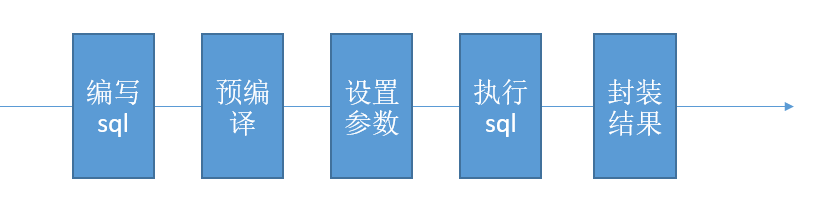
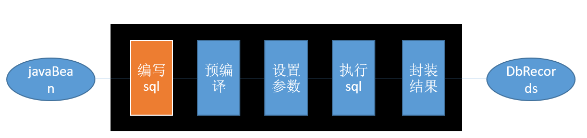
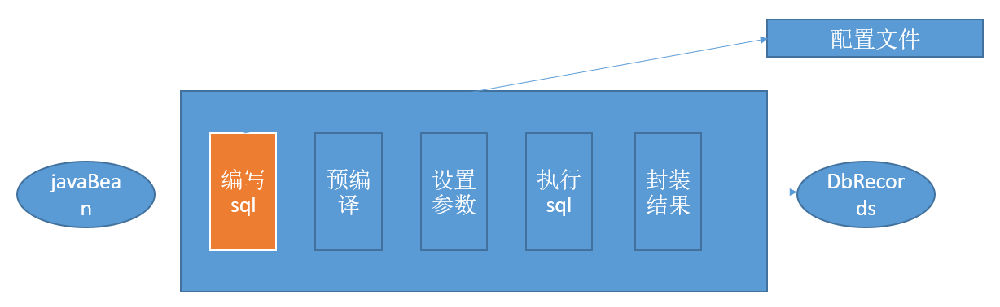

# 对比
## 工具

+ JDBC
+ Dbutils(QueryRunner)
+ JdbcTemplate

功能简单； SQL夹在Java代码；硬编码高耦合。

改sql，需要改代码+重新打包部署运行

## 持久化层框架（整体解决方案

+ Hibernate：
  + 全自动全映射ORM（Object Relation Mapping）框架

  + 旨在消除sql， 内部自动生产的SQL,不容易做特殊优化。

  + 全黑箱：sql无法优化，无法定制（需要学**HQL**）

  + 希望：sql语句由开发人员编写，sql不失灵活性

+ MyBatis 
  + 半自动，轻量级框架
  
  + 只有sql语句通过配置文件编写，其他mybatis自动完成
    + 定制化：SQL、存储过程以及高级映射

  + 下载：https://github.com/mybatis/mybatis-3/
  
