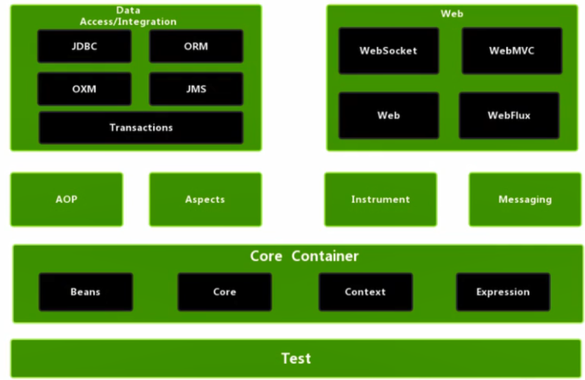

+ Spring: 轻量级（体积小,引入jar包少）开源 JavaEE 框架
  + IOC 容器。控制反转。创建对象过程 交给 Spring管理，不用new
  + Aop：面向切面，不改代码，进行功能增强
  + JdbcTemplate（事务管理）
  + Spring5 新特性

+ 优点：
  + ioc 解耦
  + aop 开闭规则
  + 降低 API 开发难度（eg，封装jdbc，易用
  + 方便事务操作
  + 方便整合其他框架
  + 整合了junit，方便测试

+ 下载地址 https://repo.spring.io/release/org/springframework/spring 