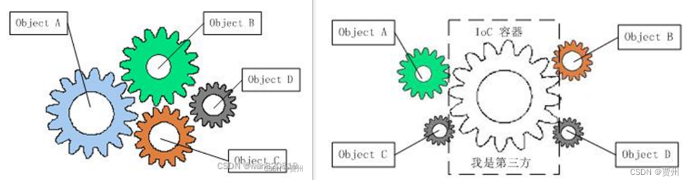
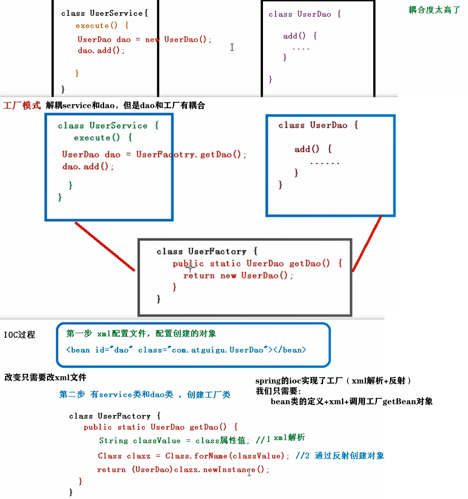

# ioc 控制反转 Inversion of Control

+ 把对象创建和对象间的调用过程, 交给Spring管理 

+ 目的：降低 耦合度

+ 把复杂系统分解成相互合作的对象，封装这些对象类，st 内部实现 对外部透明，
从而降低 解决问题的复杂度，且 可以灵活地被重用和扩展。

引进了 中间位置的“第三方”(IOC容器)，使得A、B、C、D没有了耦合关系，齿轮间的传动全部依靠“第三方”了
IOC容器 把系统中的所有对象粘合在一起发挥作用

对象之间已经没有了耦合关系，彼此毫无联系，在实现A的时候，无须再去考虑B、C和D
对象之间的依赖关系已经降低到了最低程度。

+ 控制反转：对象A 获得依赖对象B的过程, 由主动行为 变为 被动行为，控制权颠倒过来（由IOC容器主动） 
+ 也叫 依赖注入 Dependency Injection：IOC容器在运行期间，动态地将某种依赖关系注入到对象之中 
+ 依赖注入(DI)和控制反转(IOC)是从不同角度描述，指通过引入IOC容器，注入 依赖关系，实现对象之间的解耦。

# 原理

+ 原理：xml解析、工厂模式、反射

+ IOC容器 2种实现(两个接口)

  + BeanFactory
    + IOC 容器基本实现
    + Spring 内部使用的接口,不提供开发人员使用
    + 加载配置文件时，不创建对象,在获取对象(getBean)才创建对象

  + ApplicationContext：BeanFactory 接口的子接口
    + 更多更强大功能
    + 开发人员进行使用
    + 加载配置文件时，就创建对象
      + 更快（服务器启动就创建，而不是等用户使用再创建）

  + ApplicationContext 接口的 实现类
  
# 使用流程 

+ 注意: 有些步骤有多种实现方式: xml / 注解 / config类注解

+ 引入jar包：
  + 基本jar包必引入（见 spring 架构图的core container）
  + commons-logging 用于日志
  + 基于注解：额外jar包 aop
  
+ 基于xml：
  + java 定义 bean（类）
  + xml 描述：创建的对象 + 注入属性 
  + java 获取对象 （使用bean）

+ 基于注解：
  + java 定义 bean（类）
  + 注解 描述：创建的对象 + 注入属性 
    + 区别于xml：需设置组件扫描（告知Spring哪用了注解，来使用IOC容器）
      + by xml/config类注解
  + java 获取对象 （使用bean）
  
+ 注意：自定义的类两种方式都可；若创建的对象非自定义，只可xml