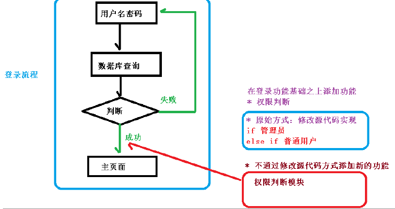
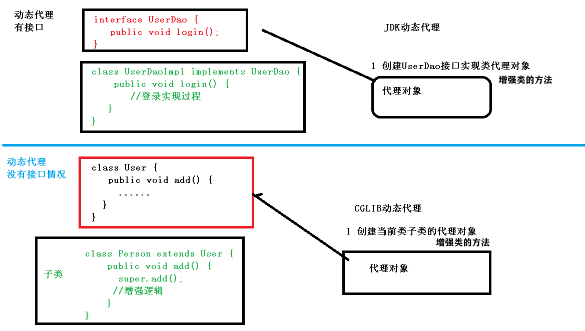

# AOP 面向切面(方面) 编程  

+ 对业务逻辑的各部分隔离, 降低各部分耦合度, 

+ 不改代码，进行功能增强

+ 提高程序可重用性, 提高开发效率。

+ 应用：jdbcTemplate 的 transaction manager



# 底层原理: 动态代理

+ 两种情况：
    + 有接口：使用JDK动态代理
    + 无接口：使用CGLIB动态代理
      
  
+ 多种方式实现AOP，Spring 基于 AspectJ(不是 Spring 组成部分,独立 AOP 框架)

# 概念

+ 连接点：可被增强的方法

+ 切入点：被增强的方法

+ 通知(增强)：实际增强的逻辑部分

+ 切面：把增强应用到切入点的过程（是动作）

+ 四种增强
``` java 
  try{ 
        	// 环绕前

        	// 前置增强 before

        	fun() // 切入点

        	// 环绕后 
  
    } catch(e) { 
        	// 异常增强 afterThrowing 
    } finally { 
        	// 最终增强 after 
    }
    // 后置增强 afterReturn 
```  
 
# 使用流程
 
+ 引入jar包：
   + 基本jar包必须引入（见架构图的core container）
   + commons-logging 用于日志
   + aop包

+ 基于xml: （少用）
   + java 定义 bean（增强类，被增强类）
   + xml 描述：创建的对象 + 注入属性 (ioc)
   + xml 描述：增强类，增强方法，增强到哪里，增强哪个方法 (aop)
   + java 获取对象 （使用bean）

+ 基于注解： 
   + java 定义 bean（增强类，被增强类）
   + 注解 描述：创建的对象 + 注入属性 (ioc)
      + **区别于xml**：需设置 组件扫描（告知Spring哪用了注解，来使用IOC容器）
         + by xml/config类注解
   + 注解 描述：增强类，增强方法，增强到哪里，增强哪个方法 (aop)
      + **区别于xml**：需开启 Aspect 生成代理对象-
        + by xml/config类注解
   + java 获取对象 （使用bean）
  