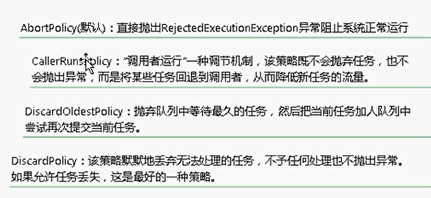

# 1.创建

1. runnable + thread
2. callable + futureTask + thread
3. 线程池

## 1.runnable

+ 类的关系 runnable。 thread

  + thread 实现 runnable

    thread 可有 runnable 作为成员

  + runnable：方法 run()

    thread：方法 run()、start()

+ 两种方式：

1. runnable + thread 
2. thread 

```java
// 1.
class R1 implements Runnable{
  @Override
  public void run() {
    System.out.println("runnable 1");
  }
}

public class _1_runnable_thread {
  public static void main(String[] args) {
    Thread a = new Thread(new R1()); // 1
    a.start(); // "runnable 1" 
  }
}
// 2.
class T1 extends Thread{
  @Override 
  public void run() {    
    System.out.println("thread 2");
  }
}

public class _1_runnable_thread {
  public static void main(String[] args) { 
    Thread b = new T1(); // 2
    b.start(); // "thread 2"
  }
} 
```

+ 推荐runnable  

+ 1解耦：runnable定义task，thread执行

  2实现了thread的run，混淆 task & thread。既包含 task定义，又是执行单位

+ runnable： 可 multi-inherit
+ runnable： flexible & 适用 high-level thread-manage-API


## 2.callable

```java
public class _3_callable {
    public static void main(String[] args) {
        //diff: runnable    callable
        //      run()       call()
        //      no ret      have ret
        //      no ex       ex if can't calc result
        
        // runnable ------------------------------------
        Runnable runnable = new Runnable() {
            @Override
            public void run() {
                System.out.println("run");
            }
        };

        new Thread(runnable).start();
        // callable ------------------------------------
        // 泛型：T = return type
        Callable<Integer> callable = new Callable<Integer>() {
            @Override
            public Integer call() throws Exception {
                System.out.println("call");
                return 1024;
            }
        };

        FutureTask<Integer> futureTask = new FutureTask<>(callable);
        // FutureTask implement runnable && can pass callable to ctor

        new Thread(futureTask).start();
        //------------------------------------
        // get result of the end thread
        try {
            while (!futureTask.isDone()){
                Thread.sleep(200);
                System.out.println("wait...");
            }
            System.out.println(futureTask.get());
        } catch (InterruptedException e) {
            e.printStackTrace();
        } catch (ExecutionException e) {
            e.printStackTrace();
        }
    }
}
```

## 3.线程池

+ advantage
  + programmer:  convenient
  + performance: reuse thread for diff runnable
    + 


+ 策略 execute(runnable)

| condition          | how                   |
| ------------------ | --------------------- |
| core pool not full | create thread to run  |
| queue not full     | put runnable in queue |
| max pool not full  | create thread to run  |
| all full           | reject                |


+ 4 reject policy



+ 回收：

  核心线程回收：由allowCoreThreadTimeOut参数控制，默认false。

  若开启为true，则此时线程池中不论核心线程还是非核心线程，只要其空闲时间达到keepAliveTime都会被回收。但如果这样就违背了线程池的初衷（减少线程创建和开销），所以默认该参数为false。
  

### 自定义

```java
public class _4_3_pool_define {
    public static void main(String[] args) {
        BlockingQueue<Runnable> workQueue = new ArrayBlockingQueue<>(3);
        ThreadFactory threadFactory = Executors.defaultThreadFactory();
        RejectedExecutionHandler handler = new ThreadPoolExecutor.DiscardOldestPolicy();

        new ThreadPoolExecutor(2, 5,   // core、max线程池
                  2, TimeUnit.SECONDS, // 超时回收：thread in maxPool
                workQueue, threadFactory, handler); // 队列、工厂、拒绝策略
    }
}
```


### 使用

+ 3个类的关系：

  ExecutorService：interface，线程池，提供 管理线程池的方法    

  Executor：interface，ExecutorService 的父类，提供 execute() 接口

  Executors：class，用于创建 ExecutorService 的工厂

  

  

```java
public class _4_1_create_pool {
    public static void main(String[] args) { 
        
        ExecutorService es3 = Executors.newSingleThreadExecutor(); 
        ExecutorService es1 = Executors.newCachedThreadPool();
        ExecutorService es2 = Executors.newFixedThreadPool(1);
        // single: 1 thread in pool
        // cache:
        //      not enough -> create
        //      idle 60s -> terminate Thread
        // fixed: para == max num of Thread
        //      Thread complete -> reuse
        //      Thread fail     -> terminate -> not enough && (< size_
        //            -> new one (if enough, not create)
        //      task wait in queue

        //how to choose ?
        // cache for many short tasks
        try {
            //how to use func in ES ?
            es1.execute(()->{}); // pass Runnable to execute()
        } finally {
            es1.shutdown();     //seldom call
            es1.shutdownNow();
            //what's diff ?
            //  both stop accept new task
            //  shutdownNow() not allow task to complete,
        }
        es1.isShutdown();
        es1.isTerminated(); //all task
    }
}
```

+ problem of Executors
  

## 匿名内部类

```java
public class _1_runnable_thread {
  public static void main(String[] args) { 
    // thread 的匿名子类:
    new Thread() {
      public void run() { System.out.println("thread 3"); }
    }.start();

    // thread + runnable:
    new Thread(()-> System.out.println("runnable 4")).start();

    // thread + runnable:
    new Thread(new Runnable() {
      public void run() { System.out.println("runnable 5"); }
    }).start();
  }
}
```

## 问题

+ 执行两次相同任务 

```java
public class _2_thread {
  public static void main(String args[]) throws IOException {
    Thread thread = new Thread(()->{});
    thread.start();
    thread.start();
  }
}
// 问题：start a thread twice -> IllegalThreadState
// 解决：use 2 thread, passing same Runnable
```


# todo


# 2.方法

## 常用方法

```java
public class _2_ctrl {

  static class R3 implements Runnable{
    public void run() {System.out.println("runnable 3");}
  }

  public static void main(String[] args) {


    Thread aThread = new Thread(new R3());

    //----------------------------------------------------------------
    //what schedule policy ?
    //    diff prior -> h to l;
    //    same prior -> RR

    //how to avoid starve ?
    //  higher_thread call sleep/yield

    //how num present priority in linux & java ?
    //  num++, pr-- | num++, pr--; 
    aThread.setPriority(0); 
    aThread.getPriority();    
    //what's the const of priority ?
    //  MAX_PRIORITY | MIN_PRIORITY | NORM_PRIORITY (10, 1, 5)

    //why recommend use const ?
    //  num maybe change

    //what's default prior ?
    //  inherit which spawn it,
    //  main thread is NORM_PRIORITY

    //----------------------------------------------------------------
    // 2 type:     daemon thread      |   user thread
    //              (守护线程)eg. gc   | main thread, user defined thread
    // when end?   no user threads    | finish all tasks / be notified
    Thread daemon = new Thread(
      ()-> {
        while (true) {
          System.out.println("hello");
          try {
            Thread.sleep(100);
          } catch (InterruptedException e) {
            e.printStackTrace();
          }
        }
      });
    daemon.setDaemon(true); // must set bf start
    daemon.start();
    //----------------------------------------------------------------
    //sth outdated:
    //a. group - replaced by pool
    ThreadGroup tg = new ThreadGroup("group name");
    Thread tInG = new Thread(tg, "thread name");
    tg.activeCount();   //estimate how many in group
    //b.
    aThread.stop();
    aThread.suspend();
    aThread.resume(); 
  }
}
```


## sleep vs yield

```
package _0_2_methods;

//what yield & sleep in common ?
//  both static, call by current Thread

//what's diff ?
//  after yield() may still run

//print 20 * _
class PrintRun implements Runnable{
  public void run() {    
    for(int i = 0; i < 200; i++)
      System.out.print("_");
  }
}

//create thread(PrintRun) && print 50 -, yield each 5 times
class YThread extends Thread{
  public void run() {
    new Thread(new PrintRun()).start();

    for(int i = 0; i < 10; i++) {
      for(int j = 0; j < 5; j++) {
        System.out.print("-");        
      }
      Thread.yield();
    }
    System.out.println();
  }
}

//create thread(PrintRun) && print 50 -, sleep each 5 times
class SThread extends Thread{
  public void run() {
    new Thread(new PrintRun()).start();

    for(int i = 0; i < 10; i++) {
      for(int j = 0; j < 5; j++) {
        System.out.print("-");        
      }
      try {
        Thread.sleep(1);
      } catch (InterruptedException e) { }
    }
    System.out.println();
  }
}
public class _3_eg_sleep_yield {
  public static void main(String[] args) throws InterruptedException {
    // test 1
    YThread yThread = new YThread();
    yThread.start();
    yThread.join();
    // test 2
    new SThread().start();
  }
}
```

## 状态变化 


```java
public class _1_status {
    public static void main(String[] args) throws InterruptedException {
        //here, we 're in the main Thread ( 1st start, last terminate )

        //! 1. t's state ? --------------------------------------
        // what's needed to ctrl a thread in another ?
        // the ref, how get ?
        //  a. get self thread
        Thread.currentThread();
        //  b. others (by: create / pass to methods)
        Thread t = new Thread();    // status: new

        t.start();                  // runnable(ready)

        // jvm invoke: t.run();     // runnable(running)

        t.interrupt();
        //  ready, running         ->  (set interrupt flag)
        //  blocked (sleep, wait)  -> ready (throws InterruptedEx)

        //! 2. current(main) state ? ------------------------------
        Thread.yield();             // running -> ready
        //  telling scheduler tmp release cpu (but scheduler can ignore)
        //  to avoid over-use CPU

        Thread.sleep(1);      // running -> time-wait

        // 线程插队：先执行完 t
        t.join();                   // running -> wait
        t.join(1);            // running -> time-wait

        // lock is similar as synchronized
        Object obj = new Object();
        synchronized (_1_status.class){ // running -> block (if lock not available)
            obj.wait();                 // running -> wait  (tmp release lock on _1_status.class
//            obj.wait(1);              // running -> time-wait
            // ......
            obj.notify();               // other threads wait for obj: (time)wait -> ready
        }

        t.isAlive();
        // not in state: new / terminated
    }
}
```

```
//what happen after call start() ?
//  start() tell JVM the thread's ready
//  after scheduled, JVM invoke thread's run()
//  in thread's run() may:
//        a. invoke Runnable's run() [default, eg 1]
//        b. do sth defined in Override run()  [if customize Thread, eg 2]

//what happen if call Runnable's run() ?
//    run in the thread where call it, not run in new Thread
//    so, we just override run(), and call thread.start(). not call Runnable's run()
```

## ex

```
//what methods may throw Interrupted ex ?
//  sleep, join


public class _4_ex {
  //which is problem ?
  static class Loop1 implements Runnable{
    public void run() {
      for(int i = 0; i < 3; i++) {
        try {
          System.out.println("loop1: " + i);
          Thread.sleep(10);
        } catch (InterruptedException e) {
          System.out.println("interrupt ");
        }
      }
    }
  }
//  diff: try in loop | loop in try
//  if 1 throw ex, continue the loop after handle the ex

  //how solve ?
  static class Loop2 implements Runnable{
    public void run() {
      try {
        for(int i = 0; i < 3; i++) {
          System.out.println("loop2: " + i);
          Thread.sleep(10);
        }
      }catch (InterruptedException e) {
        System.out.println("interrupt ");
      }
    }
  }

  public static void main(String []args) throws InterruptedException {

    Thread t1 = new Thread(new Loop1());
    t1.start();
    t1.interrupt();
    t1.join();
    System.out.println();
    Thread t2 = new Thread(new Loop2());
    t2.start();
    t2.interrupt();
  }
}
```