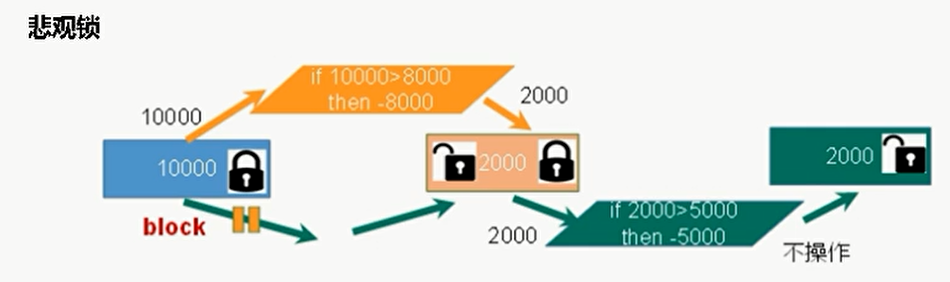
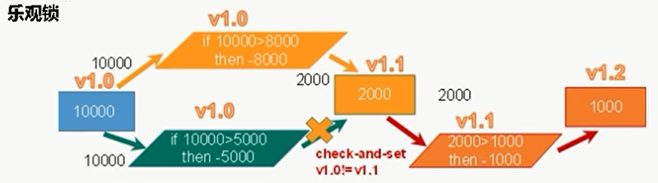

# 可重入锁

## sync

```
// both synchronized, lock are ReentrantLock， 递归锁

public class _1_reentrant_sync {
    public static synchronized void func(){
        func();
    }

    public static void main(String[] args) {
        Object o = new Object();
        new Thread(()->{
           synchronized (o){  // after acquire lock
               System.out.println("1");
               synchronized (o){ // acquire same lock, can enter directly
                   System.out.println("2");
               }
           }
        }).start();
    }
}
```

## lock

```java
public class _2_reentrant_lock {
    public static void main(String[] args) {
        Lock lock = new ReentrantLock();
        new Thread(()->{
            try {
                lock.lock();// after acquire lock
                System.out.println("1");
                try {
                    lock.lock(); // acquire same lock, can enter directly
                    System.out.println("2");
                }finally {
                    lock.unlock(); // must
                }
            }finally {
                lock.unlock();
            }
        }).start();
    }
}
```

# 死锁

```java
import java.util.concurrent.locks.Lock;
import java.util.concurrent.locks.ReentrantLock;

//when can cause deadlock ?
//  2 thread wait for the other
//how to avoid ?
//  acquire resource in order
public class _3_ddl {
    public static void main(String[] args) {
        // check ddl ?
        // in terminal:
        //      1. jps: get java process
        //      2. jstack pid: jvm get stack info of threads
        Lock a = new ReentrantLock(),
                b = new ReentrantLock();

        new Thread(new Runnable() {
            @Override
            public void run() {
                try {
                    a.lock();
                    System.out.println("t1 get a");
                    Thread.sleep(1000);
                    b.lock();
                    System.out.println("t1 get b");
                } catch (InterruptedException e) {
                    e.printStackTrace();
                } finally {
                    b.unlock();
                    a.unlock();
                }
            }
        }).start();

        new Thread(new Runnable() {
            @Override
            public void run() {
                try {
                    b.lock();
                    System.out.println("t2 get b");
                    Thread.sleep(1000);
                    a.lock();
                    System.out.println("t2 get a");
                } catch (InterruptedException e) {
                    e.printStackTrace();
                } finally {
                    a.unlock();
                    b.unlock();
                }
            }
        }).start();
    }
}
```

# 乐观、悲观锁

悲观锁：不可同时获取锁，不可并发

乐观锁：可同时获取锁，可并发。提交时更新版本号，后者提交被拒绝



# 表锁、行锁

```
表锁：no ddl

行锁：may ddl
```

# 读锁、写锁

+ 写锁，读锁都可能ddl
+ 优：相比reentrantLock性能++
+ 不同thread：读读共享；读写/写写互斥
+ 同一thread： 
  + get读锁后不可get写锁； （不可升级      
  + get写锁后可get读锁；   （
    + 降级：get写锁-get读锁-release写锁（降级为读锁）-release读锁

## 使用

```java
import java.util.HashMap;
import java.util.concurrent.locks.ReadWriteLock;
import java.util.concurrent.locks.ReentrantReadWriteLock;

class MyHashMap{
    HashMap<String, String> hashMap = new HashMap<>();

    // rw lock
    //      to avoid: write --  read -- write finish
    ReadWriteLock lock = new ReentrantReadWriteLock();

    // read
    String get(String key){
        String res = null;
        try {
            lock.readLock().lock();

            System.out.println("read " + key);
            res = hashMap.get(key);
            Thread.sleep(1000);
            System.out.println("finish read " + key);

        } catch (InterruptedException e) {
            e.printStackTrace();
        } finally {
            lock.readLock().unlock();
        }
        return res;
    }

    // write
    void put(String key, String value){
        try {
            lock.writeLock().lock();

            System.out.println("write " + key);
            hashMap.put(key, value);
            Thread.sleep(1000);
            System.out.println("finish write " + key);

        } catch (InterruptedException e) {
            e.printStackTrace();
        } finally {
            lock.writeLock().unlock();
        }
    }
}

public class _1_use_rwLock {
    public static void main(String[] args) throws InterruptedException {
        MyHashMap hashMap = new MyHashMap();

        // write
        for (int i = 0; i < 5; i++) {
            int finalI = i;
            new Thread(()->{
                hashMap.put("k" + finalI, "v" + finalI);
            }).start();
        }

        // read
        for (int i = 0; i < 5; i++) {
            int finalI = i;
            new Thread(()->{
                hashMap.get("k" + finalI);
            }).start();
        }
    }
}
```

## 降级 degrade

```java
package _4_RWlock;

import java.util.concurrent.locks.ReadWriteLock;
import java.util.concurrent.locks.ReentrantReadWriteLock;

public class _2_degrade {
    public static void main(String[] args) {
        ReadWriteLock lock = new ReentrantReadWriteLock();
        lock.writeLock().lock();
        System.out.println("write");

        lock.readLock().lock();
        System.out.println("read");

        lock.writeLock().unlock();// 降级
    }
}
```

