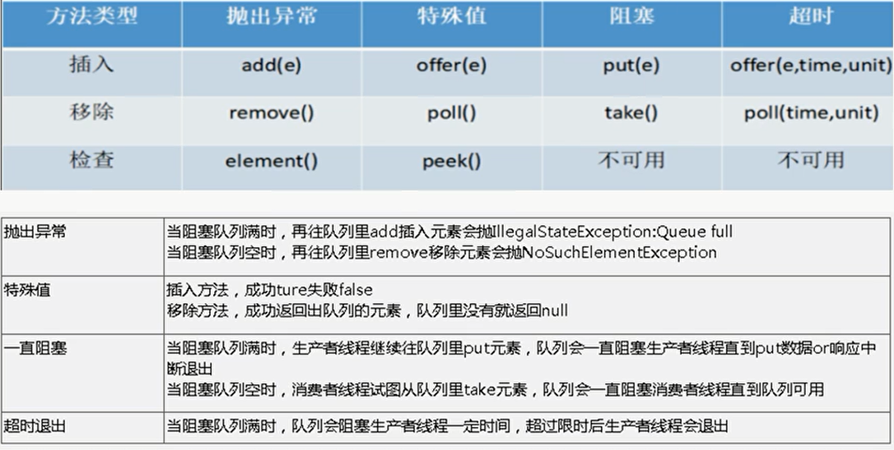

# collection

+ problem

```java
public class _0_problem {
    public static void main(String[] args) {
        // eg: 创建10个线程，每个向collection中，添加一个元素
        List<Integer> list = list1; // 可替换
        ExecutorService es = Executors.newCachedThreadPool();
        for(int i = 0; i < 10; i++){
            es.execute(()->{
                int a = (int)(Math.random() * 100);
                list.add(a);
            });
        }
        es.shutdown();
        System.out.println(list);
    }
}
```


## old

```java
public class _0_problem {
    public static void main(String[] args) {
        //1. unsafe: may add when the list is changing
        //           => err: not 10 elements
        ArrayList<Integer> list1 = new ArrayList<>();

        //2. Vector, Stack, Hashtable: old
        //      not recommend: should self decide need safe or not
        Vector<Integer> list2 = new Vector<>();
        // replace:
        //  Vector      ->  ArrayList
        //  Stack       ->  LinkedList
        //  Hashtable   ->  Map 
    }
    
    
}
```

## wrap

old

```java
public class _0_problem {
    public static void main(String[] args) { 
        //3. synchronization wrapper: old
        // what can be wrapped ? List, Map, Set, SortedMap, SortedSet
        List<Integer> list3 = Collections.synchronizedList(new ArrayList());
    } 
}
```

### fail

```java
public class _1_wrap_collections {

    public static void main(String[] args) {

        Set<Integer> hSet = Collections.synchronizedSet(new HashSet());

        //what's special that can cause fail ?
        //  can't use iterator + modify by other thread

        //how to solve ? -> add synchronized
        synchronized (hSet){    //other methods already sync
            Iterator<Integer> it = hSet.iterator();
            while (it.hasNext()){
                System.out.println(it.next());
            }
        }
    }
}
```


## juc collection

```java
public class _0_problem {
    public static void main(String[] args) { 
        // eg: 创建10个线程，每个向collection中，添加一个元素
        List<Integer> list = list1; // 可替换
        ExecutorService es = Executors.newCachedThreadPool();
        for(int i = 0; i < 10; i++){
            es.execute(()->{
                int a = (int)(Math.random() * 100);
                list.add(a);
            });
        }
        es.shutdown();
        System.out.println(list);
        
        //4. juc
        // CopyOnWriteArrayList, CopyOnWriteHashMap, ConcurentHashSet
        List<Integer> list4 = new CopyOnWriteArrayList<>();
        // read concurently;
        // write: a.copy b.write c.save back
    }
}
```


## block queue




```java
public class _2_block_queue {
    public static void main(String[] args) {

        //cls: ArrayBlockingQueue, LinkedBlockingQueue, PriorityBlockingQueue

        //para when create ?
        //  Array    capacity    (fairness)
        //  Linked  (capacity)
        //  Prior   (capacity)  [if no cap -> unbounded]
        PriorityBlockingQueue<Integer> bq = new PriorityBlockingQueue<>();

        ExecutorService es = Executors.newCachedThreadPool();
        for(int i = 0; i < 10; i++){
            es.execute(()->{
                int a = (int)(Math.random() * 100);
                bq.put(a);  //  op of queue: implement lock & condition
//                bq.take();

                // method: (see img
                //  put/take: block if
                //              put to full / take from empty
            });
        }

        es.shutdown();
        System.out.println(bq);
    }
}
```


# 并发工具

## countDownLatch

```java
package _5_helper_cls;


import java.util.concurrent.CountDownLatch;

public class _1_countDownLatch {
    public static void main(String[] args) {
        // 3人离开后，关门
        CountDownLatch countDownLatch = new CountDownLatch(3);

        new Thread(()->{
            try {
                countDownLatch.await();  // 2.block until count == 0
                System.out.println("close");
            } catch (InterruptedException e) {
                e.printStackTrace();
            }
        }).start();

        for (int i = 0; i < 3; i++) {
            new Thread(()->{
                System.out.println("leave");
                countDownLatch.countDown();  // 1.count --
                // min = 0, even cnt > 3 times
            }).start();
        }
    }
}
```

## cyclicBarrier

```java
package _5_helper_cls;

import java.util.concurrent.BrokenBarrierException;
import java.util.concurrent.CyclicBarrier;

public class _2_cyclicBarrier {
    public static void main(String[] args) {
        // 每3人准备好后，出发

        CyclicBarrier cyclicBarrier = new CyclicBarrier(3, ()->{
            //2. after 3 ready, execute by last thread ready
            System.out.println("take off");
        });

        for (int i = 0; i < 6; i++) {
            new Thread(()->{
                try {
                    System.out.println("ready");
                    cyclicBarrier.await(); //1. ready, wait for others
                } catch (InterruptedException e) {
                    e.printStackTrace();
                } catch (BrokenBarrierException e) {
                    e.printStackTrace();
                }
            }).start();
        }
    }
}
```

## semaphore

```java
package _5_helper_cls;

import java.util.concurrent.Semaphore;

public class _3_semaphore {
    // see eg in _1_1, _1_2
    public static void main(String[] args) {
        // 多人使用3根笔
        Semaphore semaphore = new Semaphore(3);
        for (int i = 0; i < 5; i++) {
            new Thread(()->{
                try {
                    semaphore.acquire();
                    Thread.sleep(2000);
                    System.out.println("take: " + Thread.currentThread().getName());
                } catch (InterruptedException e) {
                    e.printStackTrace();
                }finally {
                    System.out.println("release: " + Thread.currentThread().getName());
                    semaphore.release();
                }
            }, "t" + String.valueOf(i)).start();
        }
    }
}
```


## forkJoin

```java
import java.util.Date;
import java.util.concurrent.*;


// fork: 拆分任务
// join: 合并结果
public class _6_fork_join {
    public static void main(String[] args) throws ExecutionException, InterruptedException {
        int times = 10000;
        int begin = 0, end = 1000;
        long t0 = 0, t1 = 0;

        ForkJoinPool pool = new ForkJoinPool();

        t0 = System.currentTimeMillis();
        for (int i = 0; i < times; i++) {
            MyRecursiveTask task0 = new MyRecursiveTask(begin, end);
            ForkJoinTask<Integer> forkJoinTask = pool.submit(task0);
//            System.out.println(forkJoinTask.get());
        }
        t1 = System.currentTimeMillis();
        System.out.println(t1 - t0);

        pool.shutdown();

        // --------------------------------------------

        ExecutorService es = Executors.newSingleThreadExecutor();

        t0 = System.currentTimeMillis();
        for (int i = 0; i < times; i++) {
            MyTask task1 = new MyTask(begin, end);
            es.execute(task1);
        }
        t1 = System.currentTimeMillis();
        System.out.println(t1 - t0);

        es.shutdown();
    }
}

// sum, need (end - begin) < 10
class MyRecursiveTask extends RecursiveTask<Integer> { // result is an Integer

    int begin, end, result = 0;

    MyRecursiveTask(int begin, int end){this.begin = begin; this.end = end;}

    @Override
    protected Integer compute() {
        if (end - begin >= 10){ // fork
            int mid = (begin + end)/2;
            MyRecursiveTask left = new MyRecursiveTask(begin, mid);
            MyRecursiveTask right = new MyRecursiveTask(mid + 1, end);

            left.fork();
            right.fork();

            result = left.join() + right.join();
        }else { //compute
            for (int i = begin; i <= end; i++) {
                result += i;
            }
        }
        return result;
    }
}


class MyTask implements Runnable{
    int begin, end;

    public MyTask(int begin, int end){this.begin = begin; this.end = end;}

    @Override
    public void run() {
        sum(begin, end);
//        System.out.println();
    }

    Integer sum(int begin, int end){
        int result = 0;
        if (end - begin >= 10) { // recur
            int mid = (begin + end)/2;
            result = sum(begin, mid) + sum(mid + 1, end);
        }else {  //compute
            for (int i = begin; i <= end; i++) {
                result += i;
            }
        }
        return result;
    }
}
```

## asyn

```java
import java.util.concurrent.CompletableFuture;
import java.util.concurrent.ExecutionException;

public class _7_asyn {
    public static void main(String[] args) throws ExecutionException, InterruptedException {
        // asyn, no return
        CompletableFuture<Void> completableFuture1 = CompletableFuture.runAsync(()->{
            System.out.println("1");
        });

        completableFuture1.get();

        // asyn, with return
        CompletableFuture<Integer> completableFuture2 = CompletableFuture.supplyAsync(()->{
            System.out.println("2");
            return 1024;
        });

        completableFuture2.whenComplete((t, u)->{
            System.out.println("t: " + t);  // result
            System.out.println("u: " + u);  // ex
        }).get();
    }
}
```