[toc]

 

+ 以下讲解 基于hotspot 

## 一、什么是JVM

### 定义

程序虚拟机：为执行单个计算程序而产生

Java Virtual Machine，JAVA程序的**运行环境**（JAVA二进制字节码的运行环境）

### 好处

- (*.java / *.kt /...)  --> *.class --> os(win / linux /...)
  - 平台无关：一次编写，到处运行
  - 语言无关：只要能编译成class文件
- 自动内存管理，垃圾回收机制
- 数组下标越界检查 （java能抛异常，而c直接覆盖）
-  多态

### 比较

JVM JRE JDK 

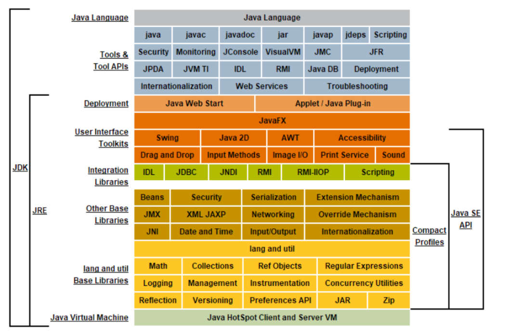

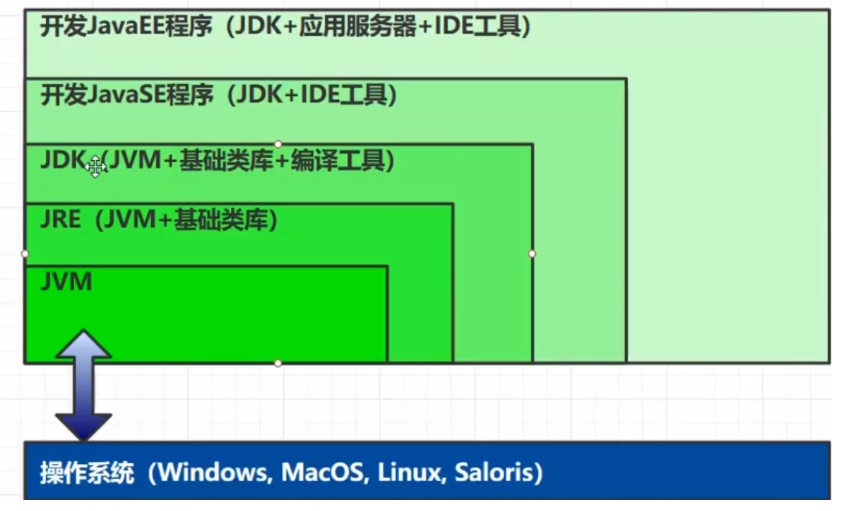

+ 学习顺序（红色标注）

  

1. java文件，javac编译成，字节码文件（class文件）

2. ClassLoader：将java类加载到jvm

3. 执行引擎 运行：

   GC：回收堆中垃圾

   解释器：字节码 逐行解释为 机器码，CPU执行

   优化：热点代码(字节码)，被JIT编译器 编译(成机器码)执行

+ 加载完到执行过程中，

  用到的数据  存于  运行时数据区（Runtime Data Area，即JVM内存结构）

  类存方法区，实例obj存堆，obj调用方法时使用pc和栈（pc记录下一条执行的字节码）

+ 本地方法接口，调用os提供的接口

## 二、内存结构

其中，方法区和堆 线程公有

[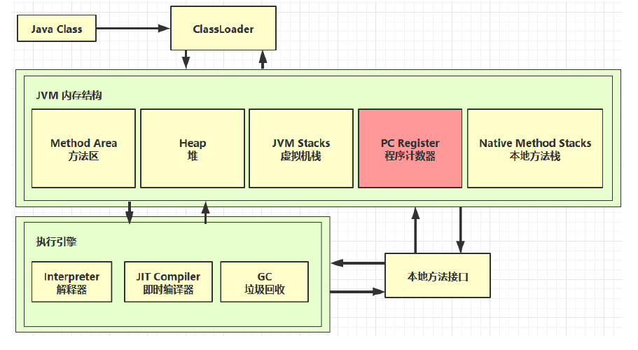](https://nyimapicture.oss-cn-beijing.aliyuncs.com/img/20200608150440.png)


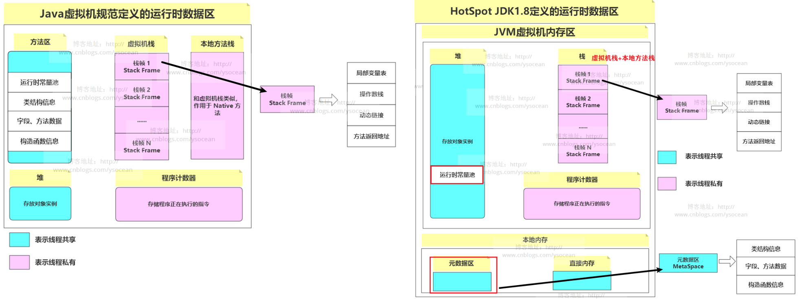

分配大小 VMOptions 

|            参数名            |        含义         |       默认值        |                             解释                             |
| :--------------------------: | :-----------------: | :-----------------: | :----------------------------------------------------------: |
|             -Xss             |      线程空间       | 1.4是256k，1.5+是1M |                                                              |
| -Xms（-XX:InitialHeapSize=） |       初始堆        | 物理内存的1/64(<1G) |  默认空余堆内存小于40%时，JVM就会增大堆直到-Xmx的最大限制.   |
|   -Xmx（-XX:MaxHeapSize=）   |       最大堆        | 物理内存的1/4(<1G)  |   默认空余堆内存大于70%时，JVM会减少堆直到 -Xms的最小限制    |
|             -Xmn             | 年轻代(1.4or lator) |                     | **注意**：此处的大小是（eden+ 2 survivor space).与jmap -heap中显示的New gen是不同的。 整个堆大小=年轻代大小 + 年老代大小 + 持久代大小. 增大年轻代后,将会减小年老代大小.此值对系统性能影响较大,Sun官方推荐配置为整个堆的3/8 |
|         -XX:NewSize          |       年轻代        |                     |                                                              |
|        -XX:MaxNewSize        |     年轻代最大      |                     |                                                              |
|         -XX:PermSize         |     持久代大小      |   物理内存的1/64    |                                                              |
|       -XX:MaxPermSize        |     持久代最大      |    物理内存的1/4    |                                                              |
|      -XX:MetaspaceSize       | 元空间（1.8+版本）  |                     | 达到后，触发gc进行类型卸载，同时gc调整该值：若释放大量空间就降低，施放少量则提高（不超MaxMetaspaceSize） |
|     -XX:MaxMetaspaceSize     |                     |        无限         |                                                              |

注：heap初始和最大设置一样，提高性能（不用反复申请释放堆）

### 1、程序计数器

Program Counter Register 

存：JVM中，下一条要执行的字节码指令的地址

若执行Native 方法，计数器值为空（Undefined）

- 线程私有
  - 任一时刻只执行一条线程，需线程间切换， PC记录线程执行到哪条指令
- 不存在内存溢出 OOM
  - JVM规范规定，厂商不用考虑溢出
  - 大小确定，不变

### 2、虚拟机栈

- 线程私有

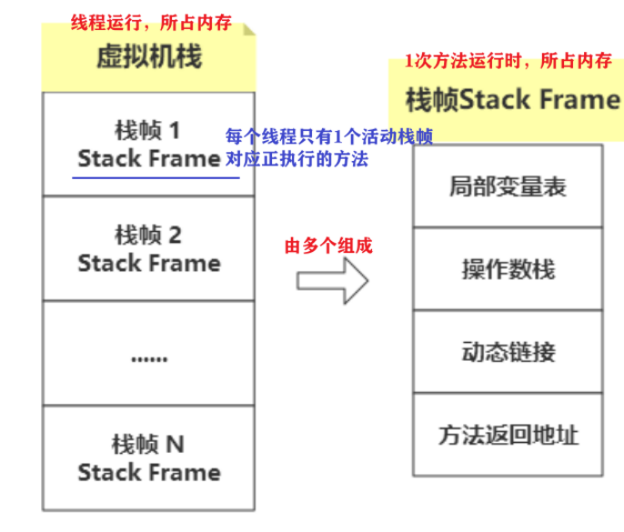

+ 演示 

```java
public class Main {
	public static void main(String[] args) {
		method1();
	}

	private static void method1() {
		method2(1, 2);
	}

	private static int method2(int a, int b){
		int c = a + b;
		return c;
	}
} 
```

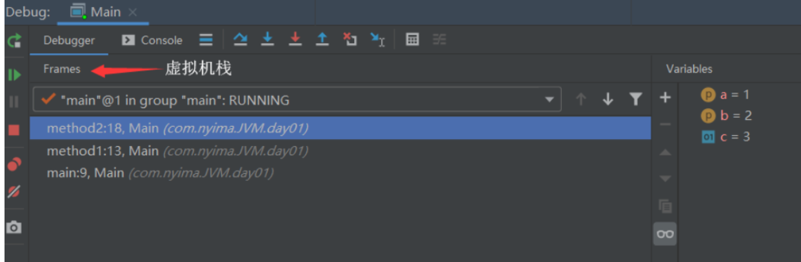

 Main类中的方法（3个栈帧）进入虚拟机栈。

method2 为 活动栈帧


#### 问题辨析

- gc是否涉及栈内存？
  
  - **不需要**。方法执行完 ，对应栈帧pop 。 无需通过gc 
  
- 栈内存的分配越大越好吗？

  - 不是。因为**物理内存是一定的**，栈内存越大，每个线程支持更多方法调用，但可执行线程数越少

- 变量是否线程安全？

  how 判断？

  - 静态变量不安全
- 局部变量：取决于  线程私有 or 共享
      - 基本类型：安全 
      - 对象：作用范围 方法内or逃离了方法
        - 1 方法内创建，且不返回（不逃离），线程私有，安全
        - 2 方法的参数，不是，可能多个线程得到obj引用
        - 3 方法的返回值，不是，同上
    -  如果**局部变量引用了对象**，并**逃离了方法的作用范围**（多个线程有同一obj的引用），则需要考虑线程安全问题
  
  + ```java
    /** 局部变量的线程安全问题  */
    public class Demo1_17 {
        static void m0() {
            int x = 0;
            for (int i = 0; i < 5000; i++) {
                x++;
            }
            System.out.println(x);
        }
        // if 多个线程同时执行此方法
        // 局部，基本类型，非参数 && 未被返回 （前两点即可确定安全）
        
        public static void main(String[] args) {
            StringBuilder sb = new StringBuilder();
            sb.append(4);
            sb.append(5);
            sb.append(6);
            new Thread(()->{
                m2(sb); // 替换此处的函数，判断是否 线程安全
            }).start();
        }
    
        public static void m1() {
            StringBuilder sb = new StringBuilder();
            sb.append(1);
            sb.append(2);
            sb.append(3);
            System.out.println(sb.toString());
        }
        // 安全：局部，对象，非参数&&未被返回
    
        public static void m2(StringBuilder sb) {
            sb.append(1);
            sb.append(2);
            sb.append(3);
            System.out.println(sb.toString());
        }
        // 不安全：局部，对象，参数
    
        public static StringBuilder m3() {
            StringBuilder sb = new StringBuilder();
            sb.append(1);
            sb.append(2);
            sb.append(3);
            return sb;
        }
        // 不安全：局部，对象，被返回
    } 
    ```


#### 异常

1. **OutOfMemoryError** 
   
   如果虚拟机栈可动态扩展，当扩展时无法申请到足够内存时
   
2. **Java.lang.StackOverflowError**

   线程请求的栈深度大于虚拟机所允许的深度

   **发生原因**

   + 栈帧**过大**（少见）
   + 栈帧过多（无限递归） 
   
   ```java
   /**
    * 演示栈内存溢出  -Xss256k
    */
   public class Demo1_2 {
       private static int count;
   
       public static void main(String[] args) {
           try {
               method1();
           } catch (Throwable e) {
               e.printStackTrace();
               System.out.println(count);
           }
       } 
       private static void method1() {
           count++;
           method1();
       }
   }
   ```
   
   
#### 线程运行诊断

1. CPU占用过高 **空转**

   定位占CPU过高的线程（因为线程独占栈）

   1. 定位CPU过高的进程 

      `top `

   2. 定位线程

      `ps H -eo pid, tid（线程id）, %cpu | grep 进程id`

      + H 展示进程树
      + -eo  xxx：xxx为显示的内容
      + grep 过滤进程

   3. 定位 问题代码的 源码行号

      `jstack 进程id`：显示进程的所有线程的调用栈

      第2步中 线程id 转为 16进制，对比jstack中线程的nid

      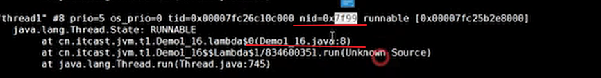

   ```java
   /** 演示 cpu 占用过高 */
   public class Demo1_16 {
   
       public static void main(String[] args) {
           new Thread(null, () -> {
               System.out.println("1...");
               while(true) {} // !
           }, "thread1").start();
   
   
           new Thread(null, () -> {
               System.out.println("2...");
               try {
                   Thread.sleep(1000000L);
               } catch (InterruptedException e) {
                   e.printStackTrace();
               }
           }, "thread2").start();
   
           new Thread(null, () -> {
               System.out.println("3...");
               try {
                   Thread.sleep(1000000L);
               } catch (InterruptedException e) {
                   e.printStackTrace();
               }
           }, "thread3").start();
       }
   } 
   ```

   

2. 运行长时间没结果  

   **jstack 进程id** 

   结尾处：显示出现死锁和等待的资源，出现问题的代码行
   
   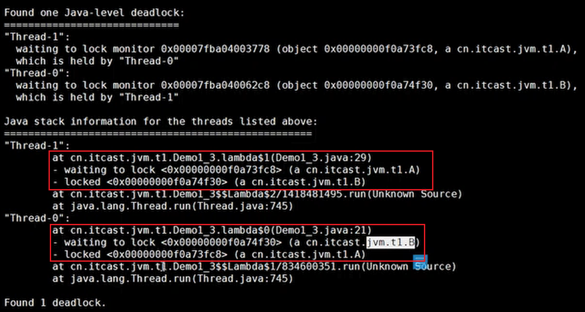
   
   ```java
   /** 演示线程死锁 */
   class A{};
   class B{};
   public class Demo1_3 {
       static A a = new A();
       static B b = new B();
   
       public static void main(String[] args) throws InterruptedException {
           new Thread(()->{
               synchronized (a) {
                   try {
                       Thread.sleep(2000);
                   } catch (InterruptedException e) {
                       e.printStackTrace();
                   }
                   synchronized (b) {
                       System.out.println("我获得了 a 和 b");
                   }
               }
           }).start();
           Thread.sleep(1000);
           new Thread(()->{
               synchronized (b) {
                   synchronized (a) {
                       System.out.println("我获得了 a 和 b");
                   }
               }
           }).start();
       } 
   }
   ```
   
   

### 3、本地方法栈

JAVA有时没法和os交互

**native方法**，调用本地C或C++方法 ，运行时使用本地方法栈

(HotSpot 虚拟机中，本地方法栈和虚拟机栈合为一体 

### 4、堆 Heap

存：new的对象

- **所有线程共享**
  - +省空间
  - -堆对象都需**考虑线程安全问题**
- 有 gc（垃圾回收机制
- 底层：可处于物理上不连续的内存空间中，只要逻辑上连续

#### 内存溢出 

**java.lang.OutofMemoryError** ：java heap space 

+ eg：堆中对象一直被引用，无法回收。达一定数量后溢出

  堆不足用于实例分配，且无法扩展

+ 排查时，将堆内存设置较小，st尽早暴露问题

```java
/** 演示堆内存溢出 -Xmx8m */
public class Demo1_5 { 
    public static void main(String[] args) {
        int i = 0;
        try {
            List<String> list = new ArrayList<>();
            String a = "hello";
            while (true) {
                list.add(a); // hello, hellohello, hellohellohellohello ...
                a = a + a;
                i++;
            }
        } catch (Throwable e) {
            e.printStackTrace();
            System.out.println(i);
        }
    }
}
```


#### 堆内存诊断

```java
/** 演示堆内存 jmap, jconsole */
public class Demo1_4 { 
    public static void main(String[] args) throws InterruptedException {
        System.out.println("1...");
        Thread.sleep(30000);
        // jmap -heap 打印堆（看Eden区变化）

        byte[] array = new byte[1024 * 1024 * 10]; // 10 Mb
        System.out.println("2...");
        Thread.sleep(20000);
        // jmap -heap 打印堆

        array = null;
        System.gc(); // 垃圾回收
        System.out.println("3...");
        Thread.sleep(1000000L);
        // jmap -heap 打印堆
    }
}
```


工具：

+ **jps**：查看当前系统中， java 进程id

+ **jmap** -heap 进程id

  查看（某时刻）堆内存占用情况  

  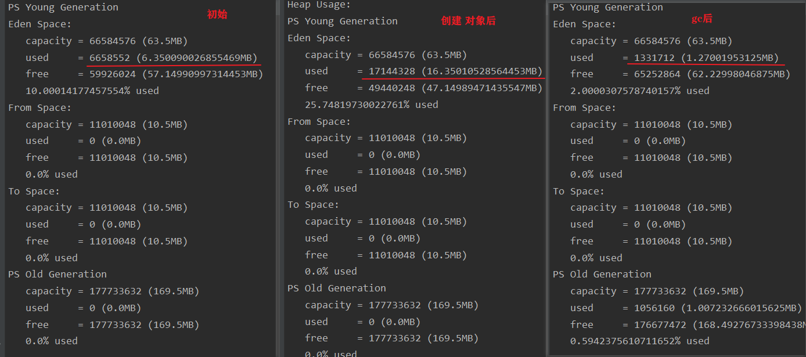

+ **jconsole**

  图形界面, 多功能监测工具,

  可以连续监测堆内存占用情况  

+ **jvisualvm**

  案例：gc后,内存占用仍然很高  

  堆Dump：抓取堆快照，可详细分析里面的内容（对象的类型和个数）

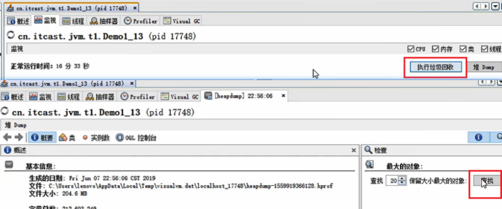

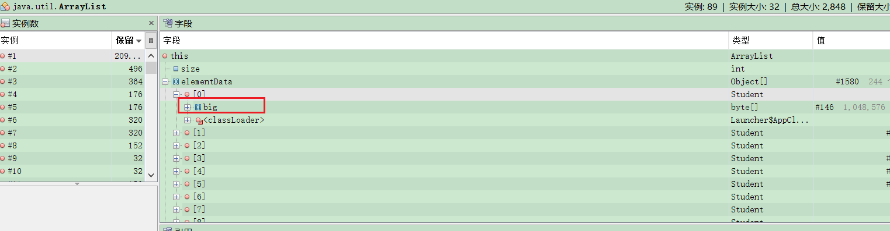

```java
/** jvisualvm 查看对象个数 堆转储 dump  */
public class Demo1_13 {

    public static void main(String[] args) throws InterruptedException {
        List<Student> students = new ArrayList<>();
        for (int i = 0; i < 200; i++) {
            students.add(new Student()); 
        }
        Thread.sleep(1000000000L);
    }
}
class Student {
    private byte[] big = new byte[1024*1024];
} 
```


### 6、直接内存 

Direct Memory

+ 属于os内存
+ 不属于 JVM数据区，但逻辑上有牵连
+ 性能：分配回收成本高，但读写性能高（见下）

#### 作为 读写的 数据缓冲区

+ 常见于NIO操作时，**作为数据缓冲区**

+ 读写流程：

  1. 不使用直接内存：需 2块缓冲区，st 不必要的 数据复制

  [](https://nyimapicture.oss-cn-beijing.aliyuncs.com/img/20200608150715.png)


2. **nio，DirectBuffer作为缓冲区**

   DirectBuffer：从os分配的缓冲区。os和Java代码**都可访问**，

   无需：从系统内存复制到Java堆内存，st 提高效率

   [](https://nyimapicture.oss-cn-beijing.aliyuncs.com/img/20200608150736.png)

+ 案例：对比使用，2种数据缓冲区：byte数组/直接内存，

  ```java
  /** 文件拷贝：in文件 -> 缓冲区 -> out文件 */
  public class Demo1_9 {
      static final String FROM = "E:\\编程资料\\第三方教学视频\\youtube\\Getting Started with Spring Boot-sbPSjI4tt10.mp4";
      static final String TO = "E:\\a.mp4";
      static final int _1Mb = 1024 * 1024;
  
      public static void main(String[] args) {
          io();           // 用时：1535.586957 1766.963399 1359.240226
          directBuffer(); // 用时：479.295165 702.291454 562.56592
      }
  
      private static void directBuffer() {
          long start = System.nanoTime();
          try (FileChannel from = new FileInputStream(FROM).getChannel();
              FileChannel to = new FileOutputStream(TO).getChannel();
          ) {
              // 数据缓冲区，使用：直接内存（属于os）
              ByteBuffer bb = ByteBuffer.allocateDirect(_1Mb); 
              while (true) {
                  int len = from.read(bb);
                  if (len == -1) 
                      break; 
                  bb.flip();
                  to.write(bb);
                  bb.clear();
              }
          } catch (IOException e) {
              e.printStackTrace();
          }
          long end = System.nanoTime();
          System.out.println("directBuffer 用时：" + (end - start) / 1000_000.0);
      }
  
      private static void io() {
          long start = System.nanoTime();
          try (FileInputStream from = new FileInputStream(FROM);
              FileOutputStream to = new FileOutputStream(TO);
          ) {
              // 数据缓冲区，使用：java创建的 byte数组
              byte[] buf = new byte[_1Mb]; 
              while (true) {
                  int len = from.read(buf);
                  if (len == -1) 
                      break; 
                  to.write(buf, 0, len);
              }
          } catch (IOException e) {
              e.printStackTrace();
          }
          long end = System.nanoTime();
          System.out.println("io 用时：" + (end - start) / 1000_000.0);
      }
  }
  ```

  

####  分配 回收 

- 不受JVM内存回收管理。但可能内存溢出 

  OutOfMemoryError： Direct buffer memory

  ```java
  public class Demo1_10 { 
      static int _100Mb = 1024 * 1024 * 100; 
      public static void main(String[] args) {
          List<ByteBuffer> list = new ArrayList<>();
          int i = 0;
          try {
              while (true) { // 不停申请ByteBuffer
                  ByteBuffer byteBuffer = ByteBuffer.allocateDirect(_100Mb);
                  list.add(byteBuffer);
                  i++;
              }
          } finally {
              System.out.println(i);
          }
          // 方法区是jvm规范， jdk6 中对方法区的实现称为永久代
          //                 jdk8 对方法区的实现称为元空间
      }
  }
  ```
  
  


+ **原理**

  底层：用 Unsafe类 分配回收内存 (需主动调用)

  jdk内部调用，cxy不直接使用 

```java
// 构造 ByteBuffer的源码：（只显示关键代码
DirectByteBuffer(int cap) { 
    try {
        base = unsafe.allocateMemory(size); // 分配内存
    } catch (OutOfMemoryError x) {
    }
    unsafe.setMemory(base, size, (byte) 0); 
    cleaner = Cleaner.create(this, new Deallocator(base, size, cap)); 
}
// 使用 Cleaner类（虚引用类型）
// 后台监测虚引用类。若被引用对象（DirectByteBuffer）被垃圾回收（但直接内存未真正释放）
// 虚引用Cleaner入队，
// ReferenceHandler守护线程，调用虚引用Cleaner的clean() -> 调用Deallocator的run() -> 调用unsafe.freeMemory释放直接内存 
```

+ 禁用显式回收对直接内存的影响

  + ```java
public class Demo1_26 {
        static int _1Gb = 1024 * 1024 * 1024;
    public static void main(String[] args) throws IOException {
            ByteBuffer byteBuffer = ByteBuffer.allocateDirect(_1Gb);
        System.out.println("分配完毕...");
            System.in.read();

            System.out.println("开始释放...");
        byteBuffer = null;
            System.gc(); // 显式 Full GC
          System.in.read();
        }
    } 
    ```
    
  + 若可显式回收
  
    调用gc后，直接内存也被回收（观察任务管理器）
  
    并非jvm回收，原因如上（DirectBuffer对象被jvm回收，导致直接内存被回收）
  
  + 若关闭显式gc（-XX:+DisableExplicitGC）
  
    -> System.gc()无效 -> 无法及时回收直接内存
  
    解决：用Unsafe手动管理直接内存
  
  

### 5、方法区

​	[Chapter 2. The Structure of the Java Virtual Machine (oracle.com)](https://docs.oracle.com/javase/specs/jvms/se8/html/jvms-2.html)

+ when创建

  jvm启动时

+ who共享

  jvm所有线程

+ 存what

  类相关信息 + 运行时常量池

+ how实现

  逻辑上属于heap，具体实现不一定


#### 结构（字节码）

字节码含：类的基本信息、类的常量池、类的方法定义（含虚拟机指令）

**反编译 查看字节码（HelloWorld程序）**

- 编译：生成类的.class文件

  ```
javac F:\Thread_study\src\com\nyima\JVM\day01\Main.java
  ```
  
- 反编译： 

  ```
  javap -v F:\Thread_study\src\com\nyima\JVM\day01\Main.class 
  ```

- 反编译后，控制台看到 类的信息 

  - 类的基本信息

    [](https://nyimapicture.oss-cn-beijing.aliyuncs.com/img/20200608150618.png)

  - 类的常量池（一张表）

    格式：地址 = 类型  内容

    [](https://nyimapicture.oss-cn-beijing.aliyuncs.com/img/20200608150630.png)

    [](https://nyimapicture.oss-cn-beijing.aliyuncs.com/img/20200608150641.png)

  - 类的方法定义

    （框内是 真正编译执行 的内容  **#号  在常量池中查找**）

    [](https://nyimapicture.oss-cn-beijing.aliyuncs.com/img/20200608150653.png)


#### 对比：常量池

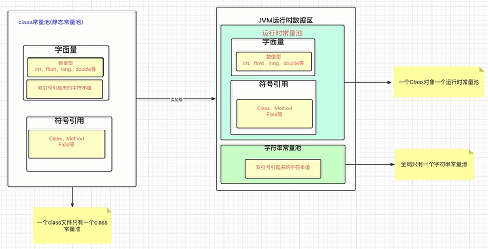

- （静态）常量池

  class文件中 一张表  

  作用：虚拟机指令根据表，找 要执行的类名、方法名、参数类型、字面量等信息 

- 运行时常量池

  **类加载后**，类的常量池 **放入 内存中的运行时常量池**，并把**符号地址（#）变为真实内存地址**

  包含： 所有类对应的运行时常量池 + 1个字符串常量池 (含StringTable)

- 字符串常量池

  全局 只有1个 字符串常量池， 所有类共用

  目标：复用字符串

  存储：并非字符串对象，只是存同class文件中的表一样的一些信息

  (而堆中和StringTable记录的，是对象)

#### 结构（运行时）

hotspot（注：图中常量池为 运行时常量池）

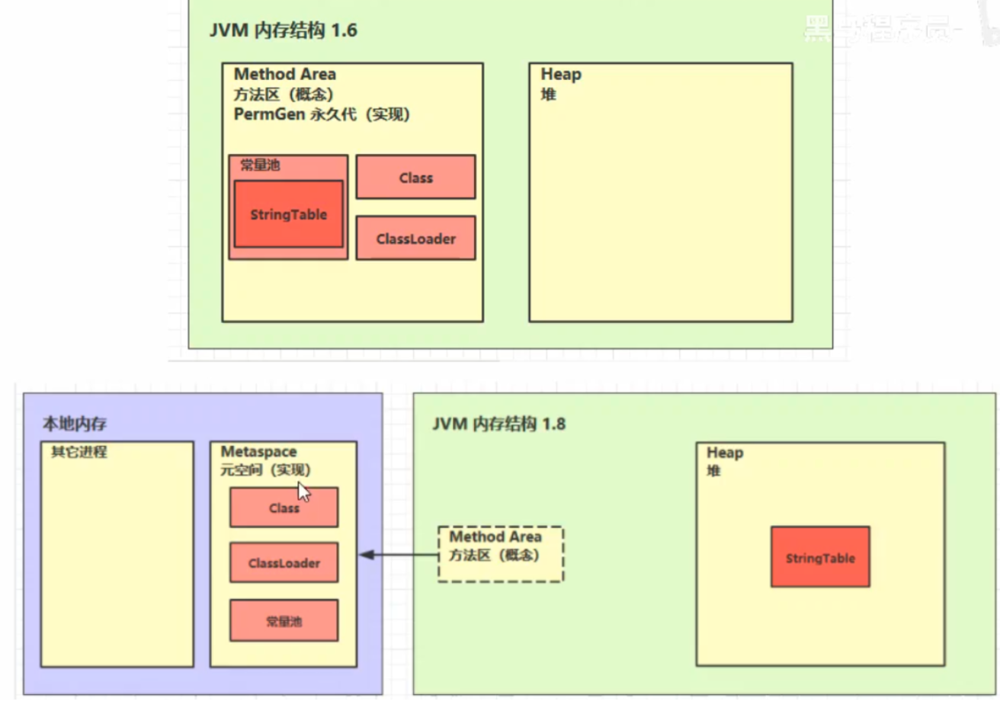

+ 永久代 vs 元空间：jdk版本，位置，存储内容

  （元空间：只存类的元信息，静态变量和运行时常量池移到堆中。不占heap，不由jvm管理）

+ why改变：

  + 永久代 位于jvm内存结构，对大小有限制，但所需大小难预测（类信息） 

  + 永久代 gc复杂度高，回收晚，回收率低

    存字符串，may性能问题、溢出
  
  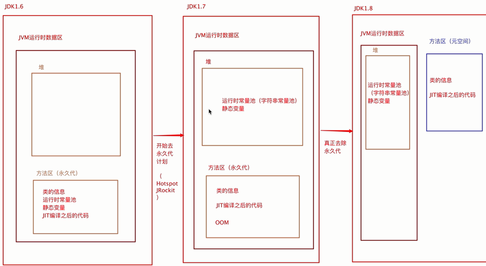


#### 内存溢出 

1. **加载过多类**  
   
   + ```java
     public class Demo1_8 extends ClassLoader { // 类加载器：加载类的二进制字节码
         public static void main(String[] args) {
             int j = 0;
             try {
                 Demo1_8 test = new Demo1_8(); // 类加载器
                 // 循环：创建新类，加载类
                 for (int i = 0; i < 10000; i++, j++) {
                     // 生成类的二进制字节码
                     // 版本号， public， 类名, 包名, 父类， 接口
                     ClassWriter cw = new ClassWriter(0);
                     cw.visit(Opcodes.V1_8, Opcodes.ACC_PUBLIC, "Class" + i, null, "java/lang/Object", null);
                     byte[] code = cw.toByteArray(); // 返回字节码 byte[]
                     // 类加载器test 加载类
                     test.defineClass("Class" + i, code, 0, code.length); // Class 对象
                 }
             } finally {
                 System.out.println(j);
             }
         }
     }
     ```
   
   + 1.6、1.7 **永久代**内存溢出
     + java.lang.OutOfMemoryError: PermGen space
     + -XX:MaxPermSize=8m
   + 1.8  **元空间**内存溢出
     + java.lang.OutOfMemoryError: Metaspace
     + 使用os内存，默认无上限（无内存溢出），需要自己设置上限
     + -XX:MaxMetaspaceSize=8m
   + eg：实际中，动态产生类 并加载类 的场景：SSM
   
2. 运行时常量池 内存不足 

   + ```java
     // 不停创建字符串，加入StringTable
     public class Demo1_6 { 
         public static void main(String[] args) throws InterruptedException {
             List<String> list = new ArrayList<String>();
             int i = 0;
             try {
                 for (int j = 0; j < 260000; j++) {
                     list.add(String.valueOf(j).intern());//
                     i++;
                 }
             } catch (Throwable e) {
                 e.printStackTrace();
             } finally {
                 System.out.println(i);
             }
         }
     } 
     ```

   + 

   + 1.6 **永久代**内存溢出

   + 1.7、1.8 **堆**内存溢出

     若未设置 -XX:-UseGCOverheadLimit 

     报错：GC overhead limit exceeded，表示 98%时间用于gc，但不到2%的heap被回收

#### StringTable 

+ 垃圾回收

  StringTable在内存紧张时，发生垃圾回收

  + stringtable存了1w个string，但统计信息中并没那么多

    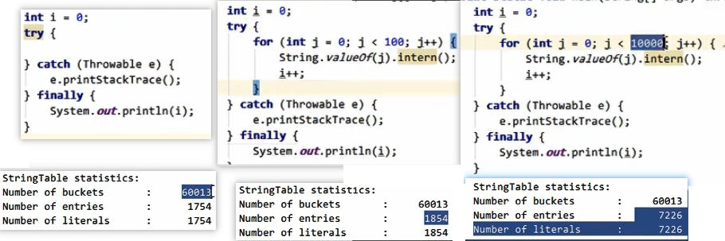

##### 性能调优

+ 适当增加 StringTable 大小

  + hash碰撞减少

  + 字符串入串池所需时间减少

  + eg：不同StringTable大小，string加入串池花费的时间

    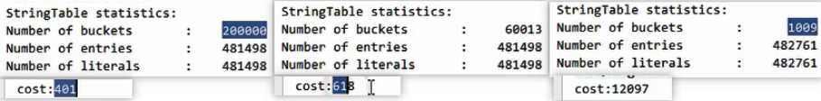
    
    ```java
    /**
     * 演示串池大小对性能的影响
     * -Xms500m -Xmx500m -XX:+PrintStringTableStatistics -XX:StringTableSize=1009
     */
    public class Demo1_24 { 
        public static void main(String[] args) throws IOException {
            try (BufferedReader reader = new BufferedReader(new InputStreamReader(
                    new FileInputStream("linux.words"), "utf-8"))) {
                String line = null;
                long start = System.nanoTime();
                while (true) {
                    line = reader.readLine();
                    if (line == null)  
                        break; 
                    line.intern();
                }
                System.out.println((System.nanoTime() - start) / 1000000);
            } 
        }
    }
    ```
    
    

+ 考虑是否 字符串对象 入池StringTable

  intern() ，使用串池中的对象，减少 重复创建对象（只留一份，其他被回收）

  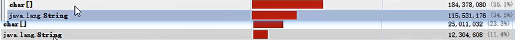

## 字符串

默认 jdk 1.8

面试题 

```java
String s1 = "a";
String s2 = "b";
String s3 = "a" + "b";
String s4 = s1 + s2;
String s5 = "ab";
String s6 = s4.intern();
System.out.println(s3 == s4); // F
System.out.println(s3 == s5); // T
System.out.println(s3 == s6); // T

String x2 = new String("c") + new String("d");
x2.intern();
String x1 = "cd";
// 问，如果调换了【最后两行代码】的位置呢，如果是jdk1.6呢
 
System.out.println(x1 == x2);
// 1.6:F | 1.7:T | 调换：F（="cd"在stringTable创建
```

### 用字面量创建

（不用new）

```java
String s1 = "abc"; 
// 反编译：
 0: ldc           #2 // String abc
 2: astore_1
```

+ 非对象："abc" 是字面量，非字符串对象

+ 懒加载：

  加载：“abc” 被加载到 运行时常量池。仅是符号，还未成对象

  运行：运行到 ldc ，jvm才在heap创建对象 

  

  

+ 不重复：

  + 全局（所有class文件共用）：1个 字符串常量池，含1个串池（StringTable）

    StringTable：c++实现hash 表，字符串对象作为 hash 表中的 key（key不重复，快速找String

  1. 在同一个类中

     ```java
     String s1 = "abc"; 
     String s2 = "abc";
     // s1 == s2
     ```

     + 用同1个字面量（常量池中，两处都用 #2）

     

     + 只创建1个String对象：

       首次以字面量创建string，会计入StringTable

       下次再以字面量创建string，查询StringTable，直接返回StringTable中记录的对象

       作用：复用字符串对象

     

  

  

  2. 不同类中：

     + 不同class文件对应不同常量池，两处"abc"为不同的字面量

     + 但全局共用StringTable，so以字面量创建 String 对象时，两处 实际用同1个字符串对象

       （print结果为true）

     

   

  

### 用new创建  

在堆中创建新的字符串对象，不放入StringTable（不考虑字符串重复）

```java
String s1 = new String(new char[]{'a', 'b', 'c'});

String s2 = new String(new byte[]{97, 98, 99}); 
// 网络或IO读数据时，将byte[]转为串

String s3 = new String(new int[]{0x1F602}, 0, 1); 
// 有字符超char范围（此处need 2个char表示）
// 用int[]构造，0表示从arr第几个元素开始，1表示转换为几个字符
 
String s4 = new String(s1); // 属性value引用同一个char[]
/* s4 源码
public String(String original) {
    this.value = original.value;
    this.hash = original.hash;
} */

String s5 = new String("abc"); 
// 创建2个String对象
//（首次出现"abc"字面量,放入StringTable; new创建一个）

// 注意：
// s1 != s4 (虽然value引用相同数组，但 非同一个String对象)
// s5 != "abc"
```


### 拼接

```java
// 编译器优化： = "ab";
final String a1 = "a";

String s1 = "a" + "b"; // 创建对象，放入串池
String s2 =  a1 + "b"; // 直接从串池取对象
// s1 == s2 == "ab"

// 编译器优化：
// = StringBuffer().append(xxx).append(xxx).toString();
// 本质上，同new String方式 创建字符串对象 
String a2 = "a";
String b = "b";

String s3 =  a2 + "b"; // 创建对象，不放入串池
String s4 =  a2 +  b;  // 创建对象，不放入串池
// s3 != s4 != "ab"
```

### intern

`public native String intern();`

+ 尝试将调用者（字符串对象）放入 StringTable：
  + 如果 StringTable 中已有，放入失败
  + 如果 StringTable 没有
    + 1.6：复制一份，放入串池
    + 1.7：放入成功
  + 最终都：返回StringTable记录的字符串对象

+ why有差别：

  + 1.6：StringTable 在永久代（不在堆中，so堆中字符串需要在StringTable重新复制一份）

  + 1.7：StringTable 在堆中

+ StringTable 作用：减少重复创建相同对象，提高效率

```java
// StringTable 中已有
String x = new String(new char[]{'a', 'b', 'c'});  // 堆中创建
String y = "abc"; // 查StringTable不存在。堆中创建，加入StringTable
String z = x.intern(); // 加入失败。返回 StringTable 已有的"abc"，即 y
// x != y == z 
```


 ```java
// 1.7：放入串池
String x = new String(new char[]{'a', 'b', 'c'}); // 堆中创建
String z = x.intern(); // x 加入 StringTable，返回x
String y = "abc"; // 用的是 StringTable 中 "abc"
// x == y == z
 ```


 

```java
// 1.6：复制一份，放入串池
String x = new String(new char[]{'a', 'b', 'c'}); // 堆中创建
String z = x.intern(); // x 被复制后加入 StringTable，返回StringTable 中"abc"（新复制的）
String y = "abc"; // 用的是 StringTable 中 "abc"
// x != z == y  
```


 

 