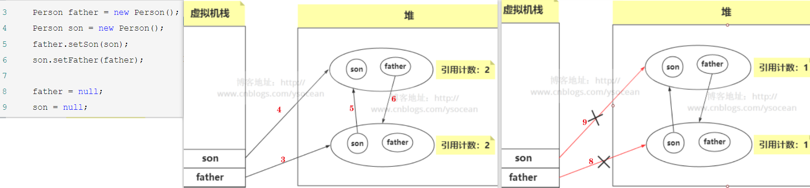
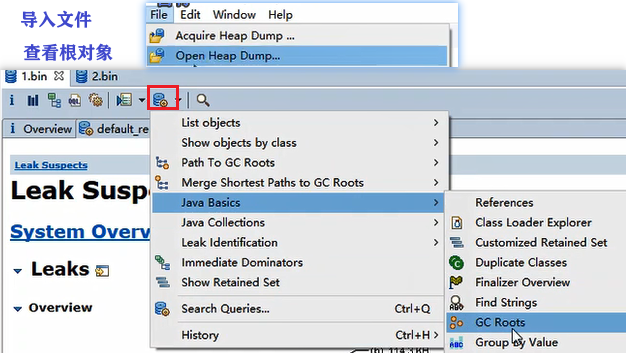
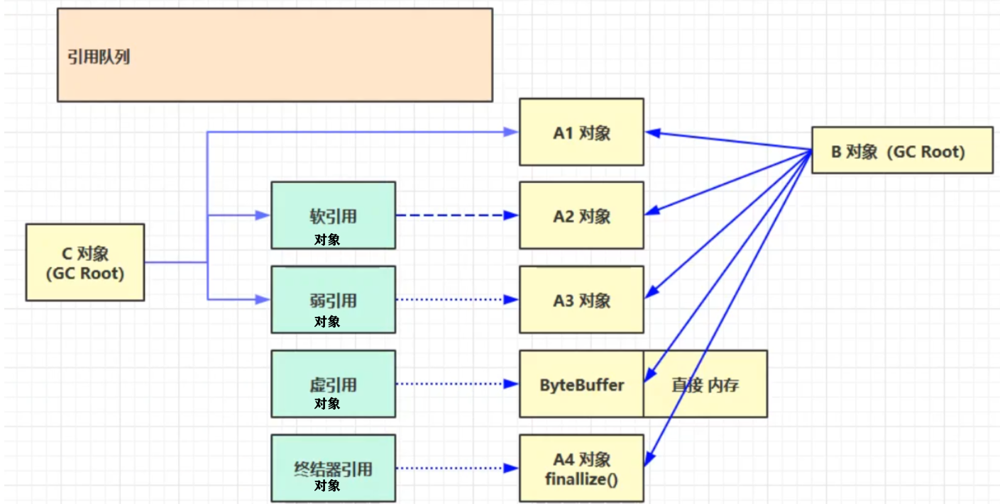
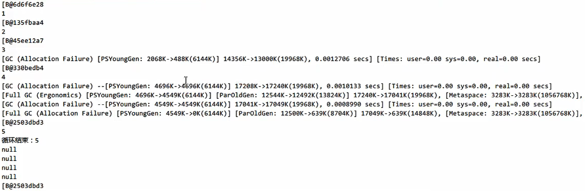
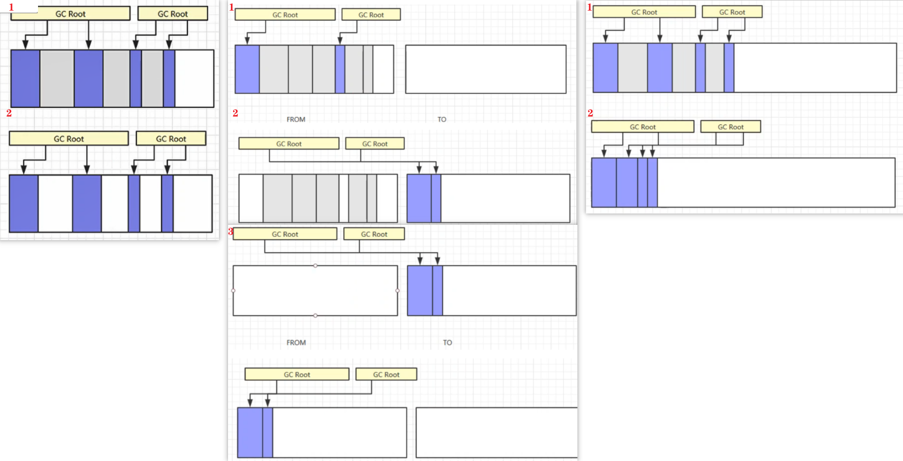
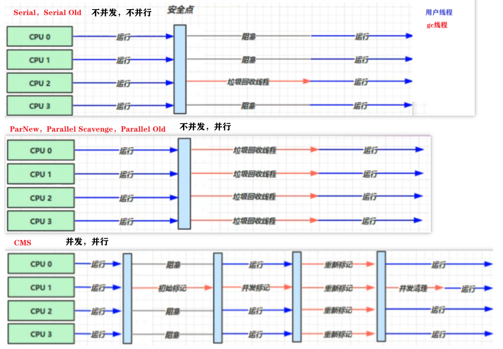

[toc]

# 三、垃圾回收

+ 为了清理无用对象，节省空间
+ 学习目的：排查OOM，有限资源更好的分配内存
+ 作用于java堆，方法区（而PC和栈线程私有，随线程销毁


## 1、算法：判断可回收

when：对象不可达

2种算法

### 引用计数法

每个对象有个引用计数器，被引用时计数++，引用失效时--。为0时可回收

弊端：循环引用时，两对象的计数都为1，但都无法被释放



### 可达性分析算法

也称：根搜索算法

- java 使用该算法

- how：扫描堆中对象，看能否沿 GC Root 对象（堆中）为起点的引用链找到该对象

  **找不到，则可回收**

- 可作为 GC Root：
  - System Class：java核心类（如Object String）的Class对象 
  - Native Stack：本地方法栈中JNI引用的java对象
  - Busy Monitor：被Syncronize加锁的对象
  - Thread：活动线程 正使用的对象
    - 虚拟机栈（栈帧中的本地变量表）中引用的对象。　
    - 方法区中类静态属性引用的对象
    - 方法区中常量引用的对象

+ 查看GC Root（  MAT工具）
  + 抓取内存快照 `jmap -dump:format=b,live,file=1.bin 线程id`

    format转储文件格式 b二进制 live只关心存活对象 file存文件

  + 

```java
public class Demo2_2 { 
    public static void main(String[] args) throws InterruptedException, IOException {
        List<Object> list1 = new ArrayList<>();
        list1.add("a");
        list1.add("b");
        System.out.println(1);
        System.in.read();

        list1 = null;
        System.out.println(2);
        System.in.read();
        System.out.println("end...");
    }
}
```


### 五种引用



（图中，实线都为强引用。虚线分别为其他四种引用）

| 类型    | when回收                                                     | eg                                                           | 引用队列 |
| ---------- | ------------------------------------------------------------ | ------------------------------------------------------------ | ---- |
| 强引用   | 无GC Root**强引用**该对象时   | B、C对象都不引用A1，A1才被回收                               |  |
| 软引用   | 只被软引用对象引用，gc后**内存仍不足**，再次触发gc，回收被软引用对象引用的对象 | B不再引用A2，且内存不足时，软引用所引用的A2就会被回收 | 可选择（引用的对象被回收，将 软/弱引用对象 入队，方便回收 这些软/弱引用对象） |
| 弱引用 | 只被弱引用对象引用，gc时，**无论内存充足**，都会回收 | B不再引用A3，则A3被回收                        | 可选择 |
| 虚引用 | 虚引用对象 引用的对象 被回收，虚引用对象 入队，调用虚引用对象的方法。 | 释放直接内存：B不再引用ByteBuffer，ByteBuffer被回收。但直接内存还未被回收。虚引用对象Cleaner入队，调用其clean释放直接内存 | 必须配合 |
| 终结器引用 | 所有类 继承Object 的finalize方法。某对象不再被引用时，终结器引用对象 入队。根据终结器引用对象 找到 它所引用的对象，调用该对象的finalize。第二次gc时，回收该对象 | B不再引用A4后 | 必须配合 |

+ 不推荐：finallize释放资源。要先入队，且在队列中被处理的优先级低，迟迟不调用finallize

-  使用软引用  

  **弱引用类似**，只是将 **SoftReference 换为了 WeakReference**（

```java
public class Demo2_3 {
	final int _4M = 4*1024*1024;
    
    public static void main(String[] args) {
        /* 强引用
        List<byte[]> list = new ArrayList<>();
        for (int i = 0; i < 5; i++) {
            list.add(new byte[_4MB]);
        } 
        System.in.read();*/
        
        // (GC Root) List --强引用--> SoftReference --软引用--> byte[]
		List<SoftReference<byte[]>> list = new ArrayList<>();
        for (int i = 0; i < 5; i++) {
            SoftReference<byte[]> ref = new SoftReference<>(new byte[_4MB]); 
            System.out.println(ref.get());// 获取引用的对象 
            list.add(ref);
            System.out.println(list.size());//
        }
        System.out.println("=====循环结束：" + list.size());
        for (SoftReference<byte[]> ref : list) {
            System.out.println(ref.get());//前4个 byte[]被回收
        } 
	}
} ..
    
    
```

分析：

创建第4个byte[]后，内存不足分配 第5个 byte[] -- minor GC -- 不足 -- full GC -- 不足

再次GC，回收软引用引用的对象 （前4个 byte[]）




+ 清理 软引用对象 本身，需 **引用队列**  

```java
public class Demo2_4 { 
	private static final int _4MB = 4 * 1024 * 1024;

    public static void main(String[] args) {
        List<SoftReference<byte[]>> list = new ArrayList<>();

        // 引用队列 
        ReferenceQueue<byte[]> queue = new ReferenceQueue<>();

        for (int i = 0; i < 5; i++) {
            // 软引用对象 关联 引用队列
            // 当软引用所关联的 byte[]被回收，软引用对象自身 入队
            SoftReference<byte[]> ref = new SoftReference<>(new byte[_4MB], queue);
            System.out.println(ref.get());
            list.add(ref);
            System.out.println(list.size());
        }
		// 遍历引用队列，如有 软引用对象(说明他引用的对象已被回收)
        // 则将软引用从存放它的集合中移除(st软引用对象自身可被回收)
        Reference<? extends byte[]> poll = queue.poll();
        while( poll != null) {
            list.remove(poll);
            poll = queue.poll();
        }  
        System.out.println("===========================");
        for (SoftReference<byte[]> reference : list) {
            System.out.println(reference.get());
        } 
    }
}
```

+ 终结器引用

  宣告一个对象死亡，至少经历两次标记。

  1：标记不可达对象并进行一次筛选，筛选此对象是否有必要执行 finalize() ，当对象没有覆盖 finalize()，或者该方法已经执行了一次，那么虚拟机都将视为不必执行finalize()。

  2：如果这个对象有必要执行 finalize() 方法，将被放置在一个虚拟机自动建立、低优先级，名为 F-Queue 队列。GC 对F-Queue进行第二次标记，如果对象在finalize() 方法中成功拯救了自己（比如重新与GC Roots建立连接），那么第二次标记时，就会将该对象移除即将回收的集合，否则就会被回收。

## 2、算法：回收 

|              | 标记-清除                                                    | 复制                                                         | 标记-整理                                          |
| ------------ | ------------------------------------------------------------ | ------------------------------------------------------------ | -------------------------------------------------- |
|              | Mark Sweep                                                   | Copy                                                         | Mark Compact                                       |
| step1        | 标记所有可回收对象                                           | 标记 FROM 所有存活对象（内存分为两个等大区，FROM和TO。每次只用FROM） | 标记所有存活对象                                   |
| step2        | gc 根据标记清除（清除：不将字节清0，而是记下这段空闲内存的起止地址，下次被分配时，直接**覆盖**） | 活着的对象复制到 TO                                          | 存活对象向一端移动                                 |
| step3        |                                                              | 清空 FROM。然后交换 FROM 和 TO                               | 直接清理到端边界以外的内存                         |
| 内存利用率   | 有内存碎片（空闲的总量够，但无法为大对象分配内存。导致jvm启动gc，gc时应用暂停，st响应速度慢） | 占双倍内存                                                   |                                                    |
| gc 速度      | 快，无其他附加处理                                           |                                                              | 整理耗时（对象地址改变，引用该对象的变量也需更新） |
| 分配内存速度 | 需遍历，找可用的空间                                         | 只需要移动堆顶指针，按顺序分配，简单高效                     | -                                                  |
| 适合         | 对象存活率高，否则经常分配释放，st 内存碎片多                | 对象存活率低，st 每次gc复制少量对象                          | 对象存活率高，移动的对象少                         |




## 3、算法：分代回收

+ 不同存活周期的对象，存于不同区域，采用不同回收算法 

+ 商业JVM

   [](https://nyimapicture.oss-cn-beijing.aliyuncs.com/img/20200608150931.png)

  对于 HotSpot 虚拟机 新生代：
  
  Eden：From ：To = 8：1：1

| 区域   | 存什么                     | gc频率 | gc算法                              |
| ------ | -------------------------- | ------ | ----------------------------------- |
| 新生代 | 存活周期短，常大批对象死亡 | 频繁   | 复制（因：只需复制 少量存活的对象） |
| 老年代 | 存活周期长                 | 不频繁 | 标记-清除 / 标记-整理               |

### 回收流程

+ 新对象 放在了**新生代的伊甸园**

  [](https://nyimapicture.oss-cn-beijing.aliyuncs.com/img/20200608150939.png)

+ 当伊甸园中不足，进行一次垃圾回收（新生代回收叫 **Minor GC**）

  + Minor GC：将**伊甸园 和 FROM**存活对象，复制到 **TO**，再**交换FROM 和 TO**。存活对象**寿命加1**，

  + 触发**stop the world**： 暂停其他用户线程，只让gc线程工作 

    因：copy算法，会导致对象地址改变，用户线程无法访问对象

    时间短，因为新生代大部分对象是垃圾，复制量很少，很快

  [](https://nyimapicture.oss-cn-beijing.aliyuncs.com/img/20200608150946.png)

  [](https://nyimapicture.oss-cn-beijing.aliyuncs.com/img/20200608150955.png)

  [](https://nyimapicture.oss-cn-beijing.aliyuncs.com/img/20200608151002.png)

+ 对象，晋升**老年代**

  + **寿命超阈值**：该对象存活周期长，放入老年代，被gc频率低

    阈值：取决于具体gc

    最大可设为15，因只占4bit

  + 新生代空间紧张，没达阈值 提前放入老年代  

  + 大对象：伊甸园**为空**，也无法容纳，**直接晋升为老年代**

  [](https://nyimapicture.oss-cn-beijing.aliyuncs.com/img/20200608151018.png)

+ 如果新生代老年代内存都满了，内存不够

  先触发Minor GC

  空间仍不足，触发**Full GC**，回收**新生代和老年代中**所有垃圾

  （stop the world 时间更长：老年代采用其他算法，存活率高，整理慢
  
  空间仍不足，触发OOM异常


### GC 演示

todo

## 4、实际：gc器

+ 以上讨论了 如何gc 

+ 实际，需考虑 gc线程 和 用户线程 在CPU的运行

  + **Concurrent 并发**： 

    用户 与 gc线程 **并发**（不一定并行不同CPU，可能交替执行）

    若不并发，用户线程阻塞，称为STW时间（Stop the world）

  + **Parallel  并行**：多条gc线程并行（不同cpu），但此时**用户线程may等待**

  + **吞吐量**：CPU运行用户代码时间 / ( 运行用户代码时间 + 垃圾收集时间 )   
  
    如：虚拟机共运行100分钟，垃圾收集器花1分钟，吞吐量=99%
  

### 收集器(原理,参数)

|                               | 区域 | gc algo                             | gc与用户并发 | gc并行 |
| ----------------------------- | ---- | ----------------------------------- | ------------ | ------ |
| 1.Serial                      | 新   | 复制                                | 0            | 单线程 |
| 2.ParNew (Serial的多线程版本) | 新   | 复制                                | 0            | 多     |
| 3.Serial Old                  | 老   | 标记-整理                           | 0            | 单     |
| 4.Parallel Scavenge           | 新   | 复制                                | 0            | 多     |
| 5.Parallel Old                | 老   | 标记-整理                           | 0            | 多     |
| 6.CMS (Concurrent Mark Sweep) | 老   | **标记-清除**                       | 1            | 多     |
| 7.G1 (Garbage First)          | both | 整体上**标记-整理**，区域间**复制** | 1            | 多     |

**使用：**

+ 2456，多线程gc

  -XX:ParallelGCThreads

  限制 gc 线程数，默认=CPU数 

+ 45

  + 目标：可控 吞吐量

  + 4Parallel Scavenge **GC自适应调节策略**（与2ParNew 最大区别）

    + 开启：

      -XX:+UseAdptiveSizePolicy 

    + 设置目标：

      -XX:MaxGCPauseMillis 最大的垃圾收集停顿时间

      -XX:GCRatio 吞吐量的大小，gc时间占比=1/(1+ratio)

      两目标冲突：堆大，内存不足频率低，gc次数少，吞吐量高，但每次gc停顿长

    + 作用：
    
      不手动指定新生代的大小（-Xmn）、Eden与Survivor区比例（-XX:SurvivorRation）、晋升老年代阈值（-XX:PretenureSizeThreshold）等
      
      虚拟机收集监控信息，动态设置以上值，以达到目标

+ 图解

  （**安全点**：其他线程都在这个点停，以免gc时移动对象地址，st 其他线程找不到被移动的对象

  

#### CMS

Concurrent Mark Sweep

+ 步骤：

  13不可并发，但很快完成，so低停顿 STW，但内存碎片

  1. **初始标记**：标记GC Roots能直接到的对象。速度快  
  2. **并发标记**：进行GC Roots Tracing，找出存活对象，用户线程可并发
  3. **重新标记**：为了**修正2并发**，用户线程导致标记变动的那部分对象的标记记录。 
  4. **并发清除**：对标记的对象进行清除回收 

+ 可并发 的原理：

  mark sweep，不改obj地址，因此 用户线程 可并发

+ 目标：最短 STW（用户线程 响应时间低）

+ -XX:ParallelGCThreads=n ~ -XX:ConcGCThreads=threads

  Conc是总线程，Para是gc线程数

  线程数 Para 常设置为 Conc 1/4  

+ 老年代 占堆比例 阈值

  -XX:CMSInitiatingOccupancyFraction=percent

  问题：若 并发清除过程，有新垃圾，但此时未完成本次 gc。若内存不足，退化为Full GC（Serial Old）

  解决：提前CMS回收老年代。内存占用达percent就gc，为浮动垃圾预留空间

+ CMS的 重新标记前 先清理新生代

  -XX:+CMSScavengeBeforeRemark

  why：

  并发标记中，新生代 很多对象 成为垃圾（新生代 may 引用 老年代
  
  重新标记时，不必分析 这些对象的 可达性 
  
  so先 减少新生代对象数，扫描对象数减少

#### G1（替代CMS）

Garbage First

1. **分区算法 region**

   分代：按对象的生命周期划分

   分区：将堆分 连续几个不同小区间，每个独立回收，可以控制一次回收多少个小区间，方便控制STW

   E：伊甸园 S：幸存区 O：老年代

2. **老年代回收 4个步骤**，分散在**3个阶段**

   只有步骤2并发标记 可并发

   [](https://nyimapicture.oss-cn-beijing.aliyuncs.com/img/20200909201212.png)

3. **三阶段循环**

   整体上**标记-整理**，区域间**复制**

|        | 1. Young Collection | 2. Young Collection + CM                    | 3. Mixed Collection |
| ------ | ------------------- | ------------------------------------------- | ------------------- |
| 做什么 | (STW) 回收新生代    | (STW) 回收新生代，同时 **初始标记** GC Root | (STW) **最终标记**  |
|        |                     | (不STW) **并发标记**                        | (STW) **拷贝存活**  |


- 设置区域大小

  -XX:G1HeapRegionSize=size

  越小 单次gc 越快

- 老年代 占堆比例 阈值

  -XX:InitiatingHeapOccupancyPercent=(默认45%)

  达到后开始 阶段2 （开始标记，代表开始回收老年代） 

- GC自适应调节策略，设置目标（借鉴Para）

  -XX:MaxGCPauseMills:xxx 最大停顿时间

  + 动态调整堆大小 。达到低延迟

  + 老年代，存活率高，copy算法时间长

    指定了最大停顿时间，如果回收所有老年代，耗时高

    so **回收最有价值的老年代**（最有价值：回收后，能得更多内存）

    （G1：优先回收垃圾最多的区） 


### 4种垃圾回收器(场景,辨析)

实际的垃圾回收器，在新老区 用 不同收集器，共四种策略


|              | 串行                                                         | 吞吐量优先（8默认）                                          | 响应时间优先                                                 | G1（9默认）                                                  |
| ------------ | ------------------------------------------------------------ | ------------------------------------------------------------ | ------------------------------------------------------------ | ------------------------------------------------------------ |
| 开启         | -XX:+UseSerialGC = Serial + SerialOld                        | -XX:+UseParallelGC ~ -XX:+UseParallelOldGC                   | -XX:+UseConcMarkSweepGC ~ -XX:+UseParNewGC ~ SerialOld       | -XX:+UseG1GC                                                 |
| Minor GC(新) | Serial                                                       | Parallel Scavenge                                            | ParNew                                                       | G1 阶段 123                                                  |
| Minor GC(老) |                                                              |                                                              | CMS                                                          | G1 阶段 23                                                   |
| Full GC(老)  | Serial Old                                                   | Parallel Old                                                 | Serial Old                                                   | 类似 Parallel Old                                            |
| 场景         | 堆小，核少（PC）                                             | 堆大，多核（服务器）                                         | 堆大，多核（服务器）                                         | 超大堆（堆小，效果同CMS）                                    |
| 目标         | 简单高效（没 上下文切换，与其他gc的单条线程比，单线程收集效率最高） | 单位时间，STW最短（gc 在 程序运行时间的占比 低，用户程序吞吐量高） | 单次STW短（用户线程每次被暂停短）                            | 同时注重吞吐量和响应时间。CMS优点：并行，低响应时间，小区域gc快 |
|              | （若并发，多线程抢一CPU，不如串行                            | GC自适应调节（吞吐量可控）                                   | CMS内存碎片/并发清理出现新垃圾。st内存不足。 触发FullGC STW时间长 | Para优点：GC自适应调节，无内存碎片                           |

#### 辨析

+ 工作线程 想吞吐量高，需gc时间占比短，so，让gc线程集中完成 

  工作线程 想响应时间低，需 工作和gc 并发，但 st 每次gc占比多 

+ Full GC  
  + 新生代内存不足，都称为Minor GC

  + 老年代内存不足（老年代占堆 超阈值）

    CMS 和 G1 分类讨论：

    + 垃圾产生 **慢于** 回收

      CMS / G1的23阶段 

      不 Full GC，而是 并发清理（有短暂 STW）

    + 垃圾产生 **快于** 回收

      并发收集失败，触发Full GC。退化为 Serial Old

      只对老年代gc，且 线程只gc不并发，长STW，长响应时间

    + **判断依据**：GC日志（Full GC / GC）

#### Young Collection 跨代引用

**问题：**

- 老年代 may 引用新生代 
- G1  回收新生代，进行可达性分析，需遍历老年代GC Root，效率低

**解决：**

+ 卡表 与 Remembered Set 

  [](https://nyimapicture.oss-cn-beijing.aliyuncs.com/img/20200608151222.png)

+ 老年代O 分为多个区域（512K）

+ 脏卡：该区域引用了新生代对象，则标记为脏卡

+ Remembered Set：E中，记录新生代对象 对应的脏卡

  

+ 回收E：Remembered Set找对应脏卡，在脏卡区遍历GC Root 进行可达性分析

+ 引用变更：通过post-write barried + dirty card queue

  异步操作，concurrent refinement threads 更新 Remembered Set

#### Remark

重新标记阶段 (CMS,G1)

+ 在垃圾回收时，收集器处理对象的过程中

  黑色：已处理，需保留

  灰色：处理中 

  白色：未处理 / 未被引用

  [](https://nyimapicture.oss-cn-beijing.aliyuncs.com/img/20200608151229.png)

+ **并发标记中**，可能：

  1. gc线程：处理完AC（此时未引用C） 

  2. 用户线程：A引用C

     

  3. 给C加一个写屏障（pre-write barrier）

     执行写屏障指令，C入队列（satb_mark_queue），变为 处理中状态（灰）

+ **重新标记** 

  4. STW，重新处理队列中对象，发现有强引用引用它，就被标记为黑色


### G1 优化

#### JDK 8u20 字符串去重 

-XX:+UseStringDeduplication（默认开）

+ 原理

  所有 新分配字符串 入队列

  新生代回收时，G1并发检查是否有重复字符串

  如果值一样，就让他们底层**引用同一个**char[]

+ 注意：区别 String.intern

  + intern：复用StringTable的字符串对象
  + 字符串去重：复用char[]
  + 在JVM内部，使用了不同的字符串表

+ 优点：节省大量内存

  缺点：多占用CPU，新生代回收时间略增 

+ 例子：

```java
new String(new char[]{'a', 'b'});
new String(new char[]{'a', 'b'}); 
// 图1
System.gc(); 					 
// 图2
```


区别：若new String("ab")创建2个

底层把StringTable中"ab"的char[]赋给它们，因此相同

#### JDK 8u40 并发标记类卸载

-XX:+ClassUnloadingWithConcurrentMark（默认开）

+ 过去：类被加载后，不回收，一直占内存

+ 原理：并发标记 后，知道 哪些类不再用。

  如果类加载器及其加载的类  都不再用，则卸载它加载的所有类

+ eg：框架，大量自定义类加载器，加载的类may只用一次

  而jdk的类加载器不会被卸载

#### JDK 8u60 回收巨型对象

- 巨型对象：一个对象大于region的一半。放在巨型对象区 

- 优化：

  - G1不对巨型对象 拷贝

  - 回收时 优先考虑

    巨型对象记录引用自己的老年代脏卡个数（incoming引用）。

    当引用为0，在新生代gc时，回收巨型对象

  [](https://nyimapicture.oss-cn-beijing.aliyuncs.com/img/20200608151249.png)

#### JDK 9 并发标记起始时间 

-XX:InitiatingHeapOccupancyPercent 老年代占比阈值，决定 并发标记起始时间（第2阶段）

+ 9之前

  过小：频繁并发回收老年代

  过大：发生Full GC

+ 9之后 只用于设置初始值，数据采样并动态调整阈值

## 5、GC 调优

+ 应用调优领域：

  + GC（STW影响网络延迟）

    https://docs.oracle.com/en/java/javase/11/gctuning

  + 锁竞争

  + CPU占用

  + IO 

+ gc调优 预备知识：

  + java参数

    + [java 命令](https://docs.oracle.com/en/java/javase/11/tools/java.html#GUID-3B1CE181-CD30-4178-9602-230B800D4FAE)

    + 查看虚拟机参数，再根据参数查询具体信息

      java.exe -XX:+PrintFlagsFinal -version | findstr "GC" 

    + 打印GC日志

      -XX:+PrintGC 

      -XX:+PrintGCDetails
    
      -XX:+PrintGCDetails -verbose:gc
  
  +  相关工具（jmap，jconsle，jvisualvm）


### 确定调优目标

低延迟/高吞吐量？ 选合适的GC

+ 互联网：低延迟（响应时间）

  CMS G1  ZGC

+ 科学运算：高吞吐量

  ParallelGC

- 以上是Hotspot的。可选其他（Zing：0STW 可管理超大内存）

### 不GC最快

若频繁GC，首先排除 代码自身 引发的内存问题

查看Full GC前后内存占用，考虑以下问题：

- 数据是不是太多？
  - eg：resultSet = stat.executeQuerry("Select * from 大表")
  - 解决：limit n
- 数据表示 是否 太臃肿
  - 对象图：查询了不必要的列 
  - 对象大小 普通对象16 Integer24 int4字节
- 是否 内存泄漏
  - static Map map 不断往常存活对象中，放入对象
    - 软弱引用
    - 第三方缓存：redis（不用java堆内存）


### 新生代 

- 新生代 特点

  - new分配内存很快

    TLAB thread-local allocation buffer

    每个线程有块区域。new操作优先在此分配，解决并发安全

  - 死亡对象回收零代价，因copy算法

  - 大部分对象 用过即死

  + MInor GC 所用时间远小于Full GC，优化空间大

- 新生代 size：

  - 太小：频繁Minor GC，会STW，吞吐量下降
  - 太大：老年代占比低，触发Full GC。且Minor GC 时间更长（但影响不大，大部分obj死亡，只copy存活的）

  - 实践 

    + oracle 建议1/4-1/2

    + 能 容纳所有[并发量*(1次请求-响应)]的数据 

      st 在请求-响应过程中，不触发 gc

- 幸存区 大到能保存： 

  **当前活跃对象**：寿命短但还没死

  **需晋升对象**：寿命长但还没晋升

- 晋升阈值调整

  -XX:MaxTenuringThreshold=threshold

  - 幸存区过小 / 晋升阈值小，st寿命短的进入老年代，full GC时才被回收
  - 晋升阈值大，长存活对象 晋升晚，在新生代gc时 多次复制
  
  - 打印不同年龄的对象，决定晋升阈值，让长时间存活对象 早点晋升
  
    -XX:+PrintTenuringDistribution

### 老年代 

CMS为例

+ 看日志，无 Full 则不用调，有 Full 也应先调优新生代

+ 若仍不可解决，观察Full GC时老年代内存占用，老年代内存预设调大 1/4-1/3

  -XX:CMSInitiatingOccupancyFraction=percent

### 案例

1. 案例1 Full GC 和 Minor GC频繁
2. 案例2 请求高峰期发生 Full GC,单次暂停时间特别长 (CMS)
3. 案例3 老年代充裕情况下,发生 Full GC (CMS jdk1.7)


