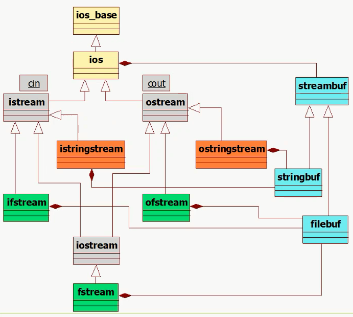
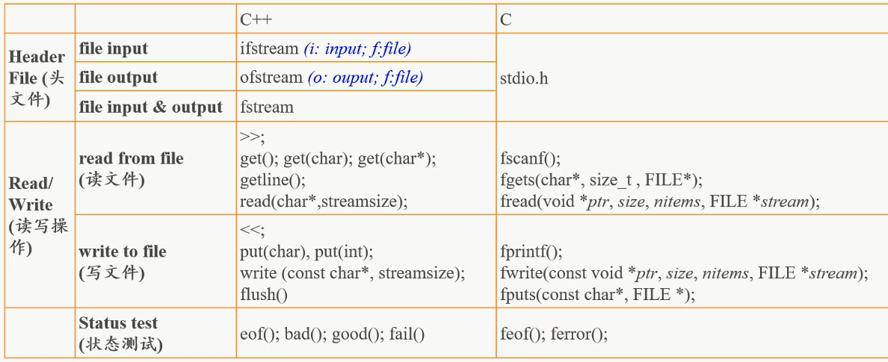
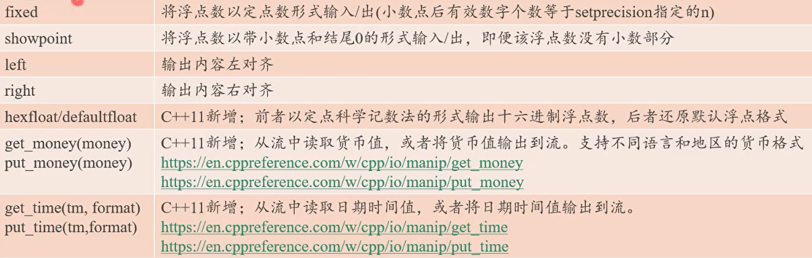
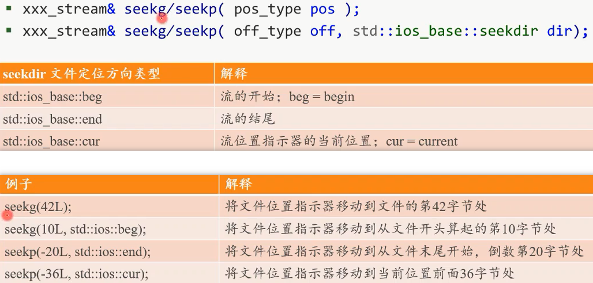

<!--
 * @Author: your name
 * @Date: 2020-10-12 09:56:15
 * @LastEditTime: 2021-06-28 12:16:38
 * @LastEditors: Please set LastEditors
 * @Description: In User Settings Edit
 * @FilePath: \cpp\LearnCpp\4_0_io.md
-->

+ eof:
    unix: C - D
    MS:   C - Z

# stream
stream -> generated / consumed, sequentially over time
## stream cls


yello: base cls   ( ios has static const )

gray: stdio

orange: string

green: file

blue: buf

## std stream

+ eg  `std::cout << 1 << std::endl;`

    op:  << (binary op)

    opd: cout and a value, cout is an obj of ostream

    result: ostream, become left opd of 2nd <<, so, can chain output requests.

    endl : special value: manipulator.
    
    effect : end line,
    flush buf, ensure all output generated so far written to output stream,

+ cout, cerr, clog write to same window.
    
    cerr for warning and error 
    
    clog for general info about the exe of the program


+ cin:
    read until hit EOF or invalid input, such as wrong type
    
## file stream


## flush

buf full -> then, write to output 

solve: 
```
cout.flush()
cout << "Hello" << std::flush;
```

## form
`# include <iomanip>`



## raf
+ file positioner: point to 1 byte of file's all bytes

    eg. read/write at positioner, then move to the next data item

    notice: diff with file ptr in C

+ func about positioner:
     tellg: get  read positioner

     tellp: get write positioner

     seekg: set  read positioner

     seekp: set write positioner

     tell - getter, seek - setter

     p    - write,  g    - read


+ seek

