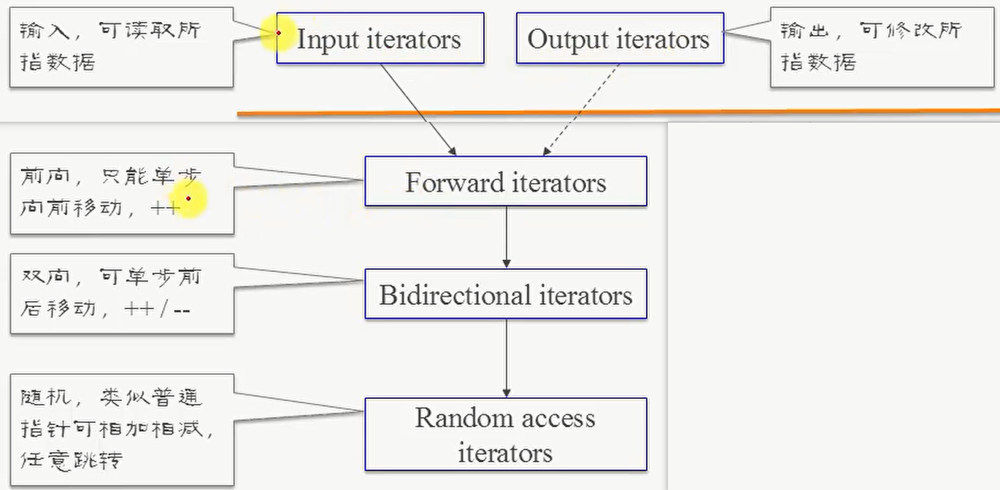
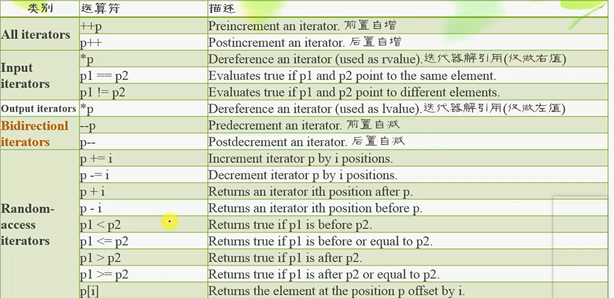
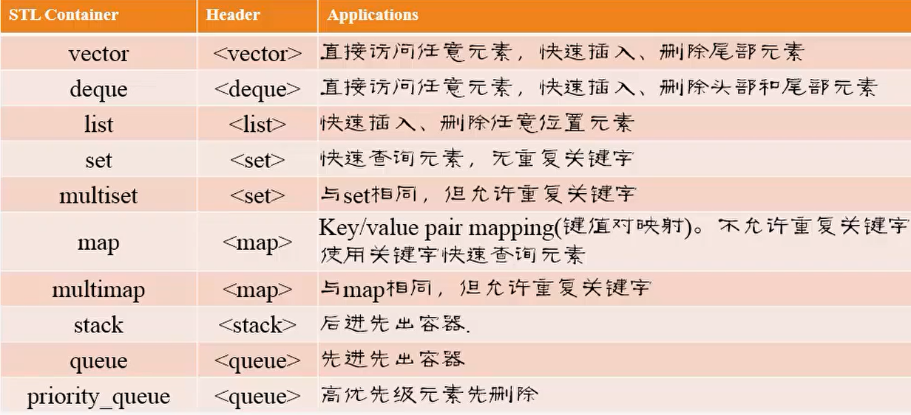
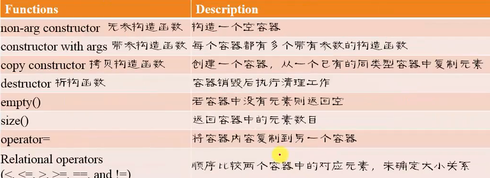
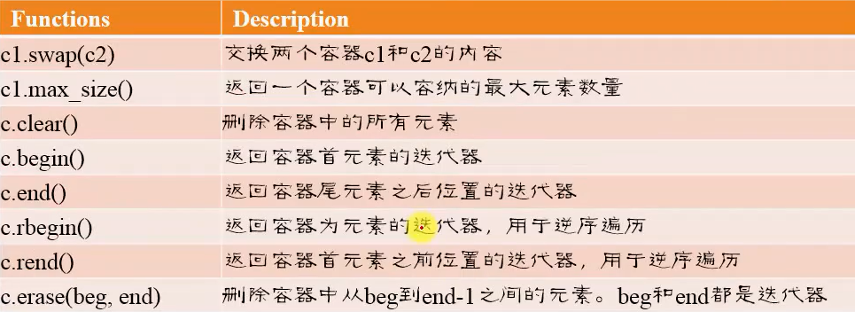
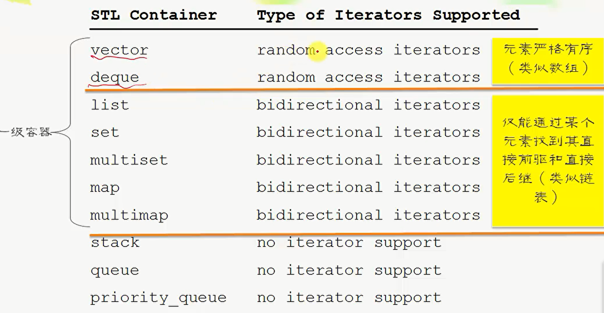
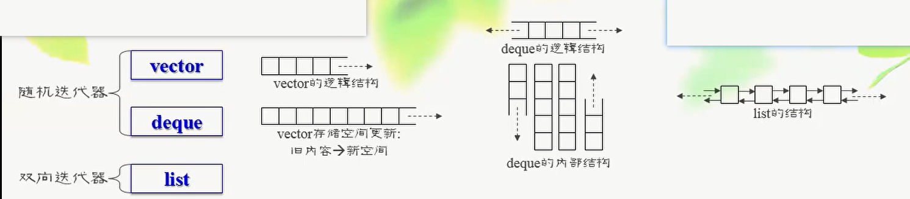
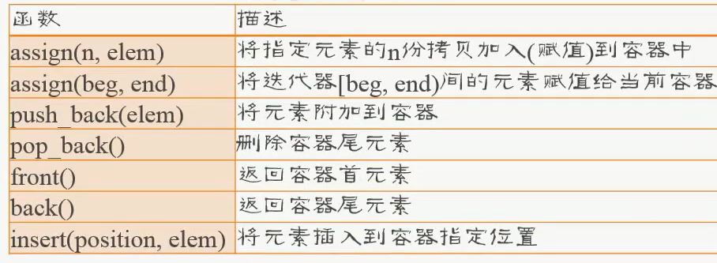
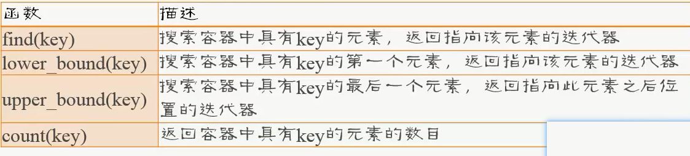

<!--
 * @Author: your name
 * @Date: 2021-06-26 18:05:12
 * @LastEditTime: 2021-06-26 22:29:13
 * @LastEditors: Please set LastEditors
 * @Description: In User Settings Edit
 * @FilePath: \cpp\LearnCpp\6_0_stl.md
-->
[toc]
# Iterator
a generalization of ptr, used to traverse elements

+ type of itr and their functions
    *-> 被指向的itr类型一定含有指向者的功能， --> 可能含有*
    
    
    

# Container
1. type
+ Sequence Container

    elem has order of insert order, sequencial access

    vector, list, deque

+ Associative Container

    elem no order, can fast locate elem 

    set, multiset, map, multimap

+ Container adapter

    sequence container's constrained version

    stack, queue, priority_queue

2. func of all Container

3. func of 1-class-container(Sequence / Associative)

## diff container support diff type itr

## seq container
+ structure

+ func

+ 不同容器的实现方式对遍历、搜索、删除、插入容器元素的影响。

    容器插或删元素后，大部分情况，迭代器失效。so重新创建itr

    insert()后，vector，deque 的itr 失效； list 的itr 指向原elem

## Associative Container
logi: elem no order, 

physical: store from low to high => can fast search

+ func

# Algo
not depend on concrete elem type

# Function obj

# Mem Allocation 