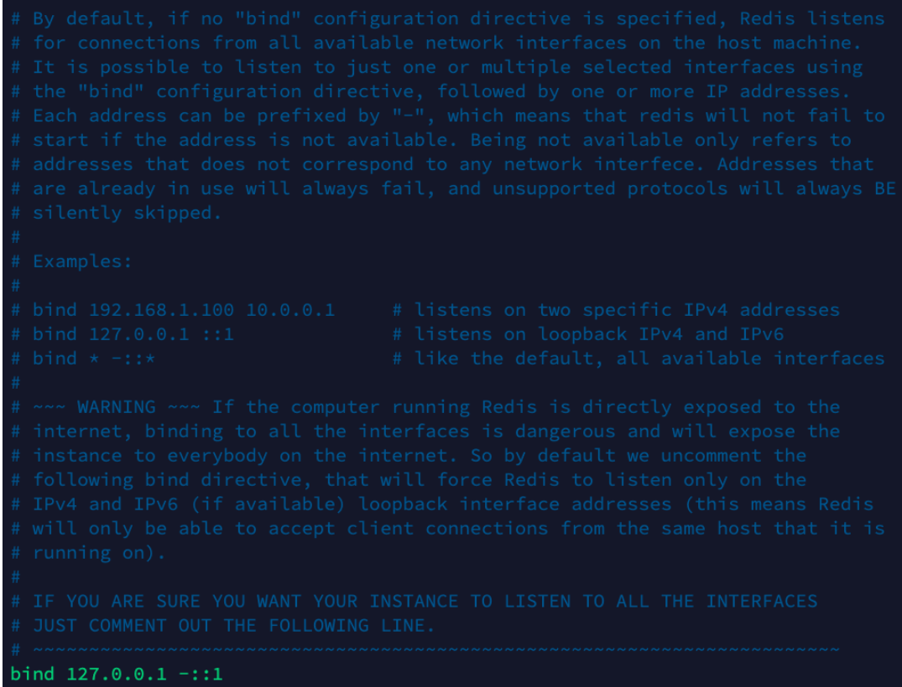
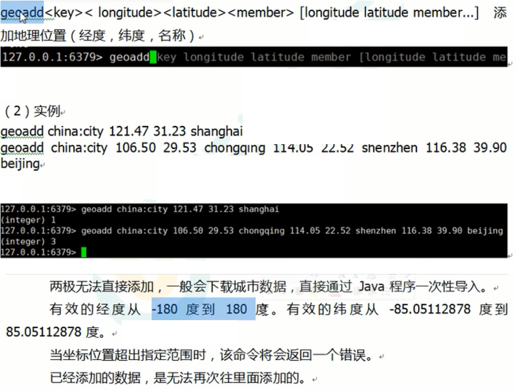

 

# 安装 

> 安装 ***C*** 语言的编译环境
>
> ```
> yum install centos-release-scl scl-utils-build
> yum install -y devtoolset-8-toolchain
> scl enable devtoolset-8 bash
> ```
>
> 通过 ***wget*** 下载
>
> ```
> wget https://download.redis.io/releases/redis-6.2.6.tar.gz
> 
> // 下载路径：/opt 
> ```
>
> 解压至当前目录
>
> ```
> tar -zxvf redis-6.2.6.tar.gz 
> ```
>
> 解压完成后进入目录
>
> ```
> cd redis-6.2.6 
> ```
>
> + 在当前目录下执行 ***make*** 编译
>
>   make
>
>   
>
> + 安装
>
>   make install 
>
>   默认安装在 `/usr/local/bin`
>   
>   
>
> ```
> redis-benchmark：性能测试工具 
> redis-check-aof：修复有问题的AOF文件，rdb和aof后面讲
> redis-check-dump：修复有问题的dump.rdb文件
> redis-sentinel：Redis集群使用
> redis-server：Redis服务器启动命令
> redis-cli：客户端，操作入口 
> ```

# 启动

+ 前台启动：

  `/usr/local/bin` 目录下启动 ***redis***

> ```
> redis-server(前台启动) 
> ```

+ 后台启动（推荐，关窗口依旧运行）：

> - 安装 ***redis*** 的目录 ***/opt/redis-6.2.6*** 中将 ***redis.conf*** 复制到任意一个文件夹下
>
>   ```
> cp redis.conf /etc/redis.conf 
>   ```
>
> - 修改 ***/etc/redis.conf*** 配置文件
>
>   ```
> vim redis.conf
>    # daemonize no 改为 daemonize yes 
>   ```
> - ***/usr/local/bin*** 目录下启动 ***redis*** 
>
>   redis-server /etc/redis.conf
>
>
> + 关闭 ***redis***
>   + ***kill*** -9 进程ID
>      + 命令 ***shutdown***

**默认端口号：6379**

+ 连接 redis 命令行

  redis-cli -p 端口号


# NoSQL数据库


**访问量增加**

+ 解决 ***CPU*** 及内存压力：

  负载均衡 + 应用服务器集群

  问题：session共享。用户登录，登录信息session存在应用服务器A，再次请求 负载均衡到 应用服务器B不含session，未记录登陆状态


- 解决 ***IO*** 压力

  RDB 切分 破坏
  
  Cache存频繁查询数据


***NoSQL（ NoSQL = Not Only SQL ）***，意即不仅仅是 ***SQL***，

非关系数据库：不依赖业务逻辑方式存储，以简单的 ***key-value*** 存储。

大大的增加了数据库的扩展能力 

- 不遵循 ***SQL*** 标准
- 不支持 ***ACID***。不代表不支持事务
- 远超于 ***SQL*** 的性能

**适用场景**

- 数据高并发的读写（秒杀
- 海量数据的读写
- 对数据高可扩展性的

**不适用**

- 需要事务支持；
- 基于 ***sql*** 的结构化查询存储，处理复杂的关系，需要即席查询。

常见的 ***NoSQL*** 数据库

- Memcache 不能持久化
- Redis
- MongoDB 文档型数据库

大数据时代常用的数据库类型

- 行式数据库

- 列式数据库

  
  
  


### Redis介绍

- 开源

- key-value存储系统。

- Memcached类似，支持存储的value类型更多

  string(字符串)、list(链表)、set(集合)、zset(sorted set –有序集合)和hash（哈希类型）

- 这些数据类型都支持push/pop、add/remove及取交集并集和差集及更丰富的操作，而且这些操作都是原子性的。

- 支持各种不同方式排序

- 与memcached一样，为了保证效率，数据都是缓存在内存中。

- 区别：Redis周期性把更新数据写入磁盘或把修改操作写入追加的记录文件。

- 并且在此基础上实现了master-slave(主从)同步。

应用场景

**配合关系型数据库做高速缓存**

- 高频次，热门访问的数据，降低数据库IO。
- 分布式架构，做session共享。

**多样的数据结构存储持久化数据**


### 相关知识

与Memcache三点不同: 

支持多数据类型，支持持久化，单线程+多路IO复用

操作的执行： 

+ **串行 **

+ **多线程+锁（memcached）  **

+ **单线程+多路IO复用(Redis)**

  

  实现多线程效果，且效率高

  多路复用：一个线程检查多个文件描述符（Socket）的就绪状态，比如调用select和poll函数，传入多个文件描述符，

  如果有一个文件描述符就绪，则返回，否则阻塞到超时。

  得到就绪状态后进行真正的操作，可以在同一个线程里执行，也可以启动线程执行（如使用线程池）

# 配置文件

***redis.conf***

初始设置：

+ 注释 bind

+ protected-mode no

## ***Units***

> 配置大小单位，开头定义了一些基本的度量单位，只支持 ***bytes***，不支持 ***bit***。
>
> 大小写不敏感。


## ***INCLUDES***

> 包含
>
> 多实例的情况，把公用的配置文件提取出来。


## ***NETWORK***

> 网络相关配置。
>
> ***bind***
>
> 默认  `bind=127.0.0.1` redis只能接受本机的访问请求
>
> 不写的情况下，无限制接受任何 ***ip*** 地址的访问。
>
> 生产环境，写应用服务器地址
>
> 服务器，需要远程访问，将其注释掉
>
> 
>
> ***protected-mode***
>
> yes，开启***protected-mode***。若没设定 ***bind ip*** 且没有设密码的情况下，***Redis*** 只接受本机的响应。
>
> 将本机访问保护模式设置 ***no***。 
>
> 
>
> 
>
> ***port***
>
> 端口号，默认 ***6379***。
>
> ***tcp-backlog***
>
> 设置 ***tcp*** 的 ***backlog***，***backlog*** 其实是一个连接队列
>
> ***backlog*** 队列总和 = 未完成三次握手队列 + 已经完成三次握手队列
>
> 高并发，需要高 ***backlog*** 值来避免慢客户端连接问题。
>
> 
>
> ***timeout***
>
> 一个空闲的redis客户端维持多少秒会关闭
>
> 0 表示关闭该功能。即永不关闭。
>
> 
>
> ***tcp-keepalive*** n
>
> 对访问客户端的一种心跳检测，每 ***n*** 秒检测一次。
>
> 若 tcp 连接存活，继续提供服务，否则释放tcp连接
>
> 单位为秒，如果设置为 0，则不会进行 ***Keepalive*** 检测，建议设置成 60。
>
> 

## ***GENERAL***

> 通用。
>
> ***daemonize***
>
> redis 是否为后台进程，设置为 ***yes***。
>
> 守护进程，后台启动。
>
> 
>
> ***pidfile***
>
> 存放 ***pid*** 文件的位置
>
> redis每次操作对应一个进程号，将pid存在pidfile 
>
> 每个实例会产生一个不同的 ***pid*** 文件。
>
>  
>
> ***loglevel***
>
> 指定日志记录级别，
>
> 支持四个级别：***debug、verbose、notice、warning***，默认为 ***notice***。
>
>  
>
> ***logfile***
>
> 日志文件路径。
>
> 
>
> ***database***
>
> 设定库的数量 默认16，默认数据库为 0，可以使用 `SELECT <dbid>` 命令在连接上指定数据库 ***id***。
>
> 
>
> 

## ***SECURITY***

> 访问密码的查看、设置和取消。
>
> 在命令中设置密码，只是临时的。重启 ***redis*** 服务器，密码就还原了。
>
> 永久设置，需要在配置文件中进行设置。


## ***LIMITS***

> ***maxclients***
>
> 设置 ***redis*** 同时可以与多少个客户端进行连接。
>
> 默认 ***10000*** 个客户端。
>
> 如果达到了此限制，***redis*** 则会拒绝新的连接请求，并且向这些连接请求方发出 ***max number of clients reached*** 以作回应。
>
> 
>
> ***maxmemory***
>
> 建议**必须设置**，否则，将内存占满，造成服务器宕机。
>
> 设置 ***redis*** 可以使用的内存量。一旦到达内存使用上限，***redis*** 将会试图移除内部数据，移除规则可以通过 ***maxmemory-policy*** 来指定。
>
> 如果 ***redis*** 无法根据移除规则来移除内存中的数据，或者设置了不允许移除，那么 ***redis*** 则会针对那些需要申请内存的指令返回错误信息，比如 ***SET、LPUSH*** 等。
>
> 但是对于无内存申请的指令，仍然会正常响应，比如 ***GET*** 等。如果你的 ***redis*** 是主 ***redis***（ 说明你的 ***redis*** 有从 ***redis*** ），那么在设置内存使用上限时，需要在系统中留出一些内存空间给同步队列缓存，只有在你设置的是“不移除”的情况下，才不用考虑这个因素。
>
> 
>
> ***maxmemory-policy***
>
> + ***volatile-lru***：使用 ***LRU*** 算法移除 ***key***，只对设置了过期时间的键（最近最少使用）。
>+ ***allkeys-lru***：在所有集合 ***key*** 中，使用 ***LRU*** 算法移除 ***key***。
> + ***volatile-random***：在过期集合中移除随机的 ***key***，只对设置了过期时间的键。
>+ ***allkeys-random***：在所有集合 ***key*** 中，移除随机的 ***key***。
> + ***volatile-ttl***：移除那些 ***TTL*** 值最小的 ***key***，即那些最近要过期的 ***key***。
>+ ***noeviction***：不进行移除。针对写操作，只是返回错误信息。
> 
>
> 
>***maxmemory-samples***
> 
>设置样本数量，***LRU*** 算法和最小 ***TTL*** 算法都并非是精确的算法，而是估算值，所以你可以设置样本的大小，***redis*** 默认会检查这么多个 ***key*** 并选择其中 ***LRU*** 的那个。
> 
>一般设置 3 到 7 的数字，数值越小样本越不准确，但性能消耗越小。
> 
>

# 五大数据类型

## key操作

> `keys *`：查看当前库所有 ***key***
>
> `exists key`：判断某个 ***key*** 是否存在
>
> `type key`：查看你的 ***key*** 是什么类型
>
> `del key` ：删除指定的 ***key*** 数据
>
> `unlink key`：根据 ***value*** 选择非阻塞删除，仅将 ***keys*** 从 ***keyspace*** 元数据中删除，真正的删除会在后续异步操作
>
> 
>
> `expire key 10` ：为给定的 ***key*** 设置过期时间 秒
>
> `ttl key`：查看还有多少秒过期，-1表示永不过期，-2表示已过期
>
> `select 数字`：命令切换数据库

> `dbsize`：查看当前数据库的 ***key*** 的数量
>
> `flushdb`：清空当前库
>
> `flushall`：通杀全部库

## 1.字符串（String）

最基本的数据类型，一个 ***Redis*** 中字符串 ***value*** 最多可以是 512M。

二进制安全的。意味着 ***Redis*** 的 ***string*** 可以包含任何数据。如 ***jpg*** 图片、序列化对象

> `set <key><value>`：添加键值对
>
> `get <key>`：查询对应键值
>
> `append <key><value>`：将给定的 ***<value>*** 追加到原值的末尾
>
> 返回新value的长度
>
> `setnx <key><value>`：只有在 ***key*** 不存在时，设置 ***key*** 的值
>
> 
>
> `strlen <key>`：获得值的长度 
>
> `incr <key>`：将 ***key*** 中储存的数字值增 1，只能对数字值操作，如果为空，新增值为 1（**具有原子性**）
>
> `decr <key>`：将 ***key*** 中储存的数字值减 1，只能对数字值操作，如果为空，新增值为 -1
>
> `incrby/decrby <key><步长>`：将 ***key*** 中储存的数字值增减。自定义步长
>
> 
>
> `mset <key1><value1><key2><value2>` ：同时设置一个或多个 ***key-value*** 对
>
> `mget <key1><key2><key3>...`：同时获取一个或多个 ***value***
>
> `msetnx <key1><value1><key2><value2>... `：同时设置一个或多个 ***key-value*** 对，当且仅当所有给定 ***key*** 都不存在
>
> 
>
> `getrange <key><起始位置><结束位置>`：获得值的范围
>
> 闭区间 [起, 止]
>
> `setrange <key><起始位置><value>`：用 ***<value>*** 插入 ***<key>*** 所储存的字符串值
>
> `setex <key><过期时间><value>`：设置键值的同时，设置过期时间，单位秒。
>
> `getset <key><value>`：以新换旧，设置了新值同时获得旧值。

### **原子性**

+  **原子** 操作： 

  操作一旦开始，就一直运行到结束，中间不会有任何 ***context switch*** （切换线程） 不会被线程调度机制打断

  + 在单线程中， 能够在单条指令中完成的操作都可以认为是”原子操作”，因为中断只能发生于指令之间。
  + 在多线程中，不能被其它进程（线程）打断的操作就叫原子操作

  **区分**事务的原子性：事务含许多原子操作，事务的原子性 指事务所含原子操作全发生 或全不发生

+ ***Redis*** 单命令的原子性主要得益于 ***Redis*** 的单线程。

+ 对比java，非原子操作：

  

  i++非原子，在单次执行中 被打断 （上下文切换）

  redis多个客户端对 i++，实际上是io多路复用，只有一个线程执行操作，so原子

  

+ 


## 2.列表（List）

单键多值

***Redis*** 列表是简单的字符串列表，按照插入顺序排序。

可添加一个元素到列表的头部（左边）或尾部（右边）

底层：双向链表，对两端的操作性能很高，通过索引下标的操作中间节点性能较差。


> `lpush/rpush <key><value1><value2><value3> ....`： 从左边/右边插入一个或多个值。
>
> ```
> lpush k1 v1 v2 v3
> lrange k1 0 -1
> 输出：v3 v2 v1
> // 类似栈，输出顺序反向
> ----
> rpush k1 v1 v2 v3
> rrange k1 0 -1
> 输出：v1 v2 v3
> ```
>
> `lpop/rpop <key>`：从左边/右边吐出一个值。值在键在，值光键亡。
>
> `rpoplpush <key1><key2>`：从 ***<key1>*** 列表右边吐出一个值，插到 ***<key2>*** 列表左边
>
> 
>
> `lrange <key><start><stop>`：按照索引下标获得元素（从左到右）
>
> `lrange mylist 0 -1 0`：左边第一个，-1右边第一个，（0 -1表示获取所有）

> `lindex <key><index>`：按照索引下标获得元素（从左到右）
>
> 
>
> `llen <key>`：获得列表长度
>
> `linsert <key> before/after <value><newvalue>`：在 ***<value>*** 的前面/后面插入 ***<newvalue>*** 插入值
>
> `lrem <key><n><value>`：从左删 ***n*** 个 值为***value***的元素（从左到右）
>
> `ltrim <key><start><end>`：按索引截取下标元素（从左到右）
>
> `lset<key><index><value>`：将列表 ***key*** 下标为 ***index*** 的值替换成 ***value***

**数据结构**

快速链表 ***quickList***。

+ 元素较少

  ​    ***ziplist*** 压缩列表

  所有元素紧挨着一起存储，分配一块连续的内存

+ 数据量多

  ​    ***quicklist***

  若使用普通链表，指针空间太大，浪费。（如列表存 ***int*** 数据，还需2个额外指针 ***prev*** 和 ***next***

  ***Redis*** 将链表和 ***ziplist*** 结合起来组成了 ***quicklist***。多个 ***ziplist*** 用双向指针串起来。既满足了快速插入删除，又不会出现太大空间冗余（指针域占比少）
  
  
  
  

## 3.Set（集合）

提供的功能与 ***List*** 类似，

特殊：***Set*** 可 **自动排重**，当需要存一个列表数据，又不希望出现重复数据时，***Set*** 是一个很好的选择，

提供了判断某个成员是否在一个 ***Set*** 集合内的重要接口，这个也是 ***List*** 所不能提供的。

***Redis*** 的 ***Set*** 是 ***String*** 类型的无序集合。

底层是一个 ***value*** 为 ***null*** 的 ***hash*** 表，所以添加，删除，查找的复杂度都是 ***O(1)***。

> `sadd <key><value1><value2> ..... `：将一个或多个 ***member*** 元素加入到集合 ***key*** 中，已经存在的 ***member*** 元素将被忽略
>
> `smembers <key>`：取出该集合的所有值。
>
> `sismember <key><value>`：判断集合 ***<key>*** 是否为含有该 ***<value>*** 值，有返回 1，没有返回 0
>
> `scard<key>`：返回该集合的元素个数。
>
> 
>
> `srem <key><value1><value2> ....`：删除集合中的某个元素
>
> `spop <key>`：随机从该集合中吐出一个值
>
> `srandmember <key><n>`：随机从该集合中取出 ***n*** 个值，不会从集合中删除
>
> 
>
> `smove <source><destination>value`：把集合中一个值从一个集合移动到另一个集合
>
> `sinter <key1><key2>`：返回两个集合的交集元素
>
> `sunion <key1><key2>`：返回两个集合的并集元素
>
> `sdiff <key1><key2>`：返回两个集合的差集元素（***key1*** 中的，不在 ***key2***  

**数据结构**

+ Set数据结构是dict字典，字典是用哈希表实现的。
+ Java中HashSet的内部实现使用的是HashMap，只不过所有value都指向同一个对象
+ Redis的set结构也是一样，它的内部也使用hash结构，所有value都指向同一个内部值

## 4.Hash（哈希）

***Redis hash*** 是一个键值对集合。

***Redis hash*** 是一个 ***String*** 类型的 ***field*** 和 ***value*** 的映射表

适合用于存储对象。

+ 如何存储？

1. 整个对象 作为字符串 存到redis：

   key：用户ID

   value：序列化的用户对象（含姓名，年龄，生日 

   问题：改值。反序列化为对象，修改，序列化为字符串，存

2. 对象：属性 字符串，作为

   key：用户ID:属性标签

   value：属性值

   存储过于分散

3. hash 

   key：用户ID

   value：属性标签 - 属性值

   既不需要重复存数据，也不会带来序列化和并发修改控制问题

   

> `hset <key><field><value>`：给 ***<key>*** 集合中的 ***<field>*** 键赋值 ***<value>***
>
> `hget <key1><field>`：从 ***<key1>*** 集合 ***<field>*** 取出 ***value***
>
> `hmset <key1><field1><value1><field2><value2>...`： 批量设置 ***hash*** 的值
>
> `hexists <key1><field>`：查看哈希表 ***key*** 中， ***field*** 是否存在
>
> 
>
> `hkeys <key>`：列出该 ***hash*** 集合的所有 ***field***
>
> `hvals <key>`：列出该 ***hash*** 集合的所有 ***value***
>
> 
>
> `hincrby <key><field><increment>`：为哈希表 ***key*** 中的域 ***field*** 的值加上**increment** 1 -1
>
> `hsetnx <key><field><value>`：将哈希表 ***key*** 中的域 ***field*** 的值设置为 ***value*** ，当且仅当域 ***field*** 不存在

**数据结构**

两种：***ziplist***（压缩列表），***hashtable***（哈希表）。

当 ***field-value*** 长度较短且个数较少时，使用 ***ziplist***，否则使用 ***hashtable***。

## 5.Zset（有序集合）

与普通集合 ***set*** 相似，没有重复元素的字符串集合

不同之处：每个成员关联一个评分（***score***）,按从低到高排序。集合成员唯一，但评分可重复

因为元素是有序的，所以可以很快的根据评分（***score***）或者次序（***position***）来获取一个范围的元素。

访问中间元素非常快，因此能够使用有序集合作为一个没有重复成员的智能列表。

> `zadd <key><score1><value1><score2><value2>…`：将一个或多个 ***member*** 元素及其 ***score*** 值加入到有序集 ***key*** 当中
>
> 
>
> `zrange <key><start><stop> [WITHSCORES] `：返回有序集 ***key*** 中，下标在 ***<start><stop>*** 之间的元素
>
> 当带 ***WITHSCORES***，可以让分数一起和值返回到结果集
>
> `zrangebyscore <key><min><max> [withscores] [limit offset count]`：返回有序集 ***key*** 中，所有 ***score*** 值介于 ***min*** 和 ***max*** 之间（包括等于 ***min*** 或 ***max*** ）的成员。有序集成员按 ***score*** 值递增（从小到大）次序排列。
>
> `zrevrangebyscore key max min [withscores] [limit offset count] `：同上，改为从大到小排列
>
> 
>
> `zincrby <key><increment><value>`：为元素的 ***score*** 加上增量
>
> `zrem <key><value>`：删除该集合下，指定值的元素
>
> `zcount <key><min><max>`：统计该集合，分数区间内的元素个数
>
> `zrank <key><value>`：返回该值在集合中的排名，从 0 开始。

**数据结构**

一方面它等价于 ***Java*** 的数据结构 ***Map<String, Double>***，可以给每一个元素 ***value*** 赋予一个权重 ***score***，

另一方面类似于 ***TreeSet***，元素按 ***score*** 排序，可得每个元素的名次，还可以通过 ***score*** 的范围来获取元素的列表。

***zset*** 底层使用了两个数据结构

- ***hash***，高效的单点查询

  关联元素 ***value*** 和权重 ***score***，

  保障元素 ***value*** 的唯一性，

  可通过元素 ***value*** 找到相应的 ***score*** 值

- 跳跃表，高效的范围查询

  目的：按元素 ***value*** 排序，根据 ***score*** 范围获取元素列表

  有序集合在生活中比较常见，例如根据成绩对学生排名，根据得分对玩家排名等。
  
  底层实现，可以用数组、平衡树、链表等。
  
  数组不便元素的插入、删除；平衡树或红黑树虽然效率高但结构复杂；链表查询需要遍历所有效率低。
  
  Redis采用跳跃表，效率堪比红黑树，实现远比红黑树简单。
  
  
  
  

## Bitmaps

 实现对位的操作：

- Bitmaps本身不是一种数据类型， 实际上是字符串（key-value） ， 但它可以对字符串的位进行操作
- Bitmaps单独提供了一套命令， 所以在Redis中使用Bitmaps和使用字符串的方法不太相同
- 可以把Bitmaps想象成一个以位为单位的数组， 数组的每个单元只能存储0和1， 数组的下标在Bitmaps中叫偏移量


 


 

 

+ bitop


bitop 返回值 = 被设置为1的bit数


#### **Bitmaps** 与 set对比

假设网站有1亿用户， 每天独立访问的用户有5千万， 如果每天用集合类型和Bitmaps分别存储活跃用户可以得到表：

| set和Bitmaps存一天活跃用户 |                    |                   |                        |
| -------------------------- | ------------------ | ----------------- | ---------------------- |
| 数据类型                   | 每个用户id占用空间 | 需要存储的用户量  | 全部内存量             |
| 集合                       | 64位               | 活跃用户50000000  | 64位*50000000 = 400MB  |
| Bitmaps                    | 1位                | 所有用户100000000 | 1位*100000000 = 12.5MB |

Bitmaps 节省很多内存空间，随着时间推移节省的内存还是非常可观的。

| set和Bitmaps存储独立用户空间对比 |        |        |       |
| -------------------------------- | ------ | ------ | ----- |
| 数据类型                         | 一天   | 一个月 | 一年  |
| 集合                             | 400MB  | 12GB   | 144GB |
| Bitmaps                          | 12.5MB | 375MB  | 4.5GB |

但Bitmaps并不是万金油， 假如该网站每天活跃用户很少， 例如只有10万（大量的僵尸用户） ， 那么两者的对比如下表所示， 很显然， 这时候使用Bitmaps就不太合适了，大部分位都是0。

| set和Bitmaps存储一天活跃用户对比（用户较少） |                    |                    |                        |
| -------------------------------------------- | ------------------ | ------------------ | ---------------------- |
| 数据类型                                     | 每个userid占用空间 | 需要存储的用户量   | 全部内存量             |
| 集合                                         | 64位               | 活跃用户100000     | 64位*100000 = 800KB    |
| Bitmaps                                      | 1位                | 所有用户 100000000 | 1位*100000000 = 12.5MB |

## **HyperLogLog**

+ 计数

  统计网站PV（PageView页面访问量），可以使用Redis的incr、incrby轻松实现

  

+ 需去重和计数

  若同一个用户只记一次：UV（UniqueVisitor独立访客）、独立IP数、搜索记录数等

  求集合中不重复元素个数的问题称为基数问题

  

+ 方案：

1. MySQL：使用distinct count计算不重复访客数
2. Redis：hash、set、bitmaps等数据结构来处理

+ 随着数据不断增加，导致占用空间越来越大，对于非常大的数据集是不切实际的 

  HyperLogLog。降低一定的精度来平衡存储空间

+ Redis HyperLogLog 是用来做基数统计的算法

  比如数据集 {1, 3, 5, 7, 5, 7, 8}，基数集为 {1, 3, 5 ,7, 8}

  基数(不重复元素)为5。 基数估计就是在误差可接受的范围内，快速计算基数

+ 只根据输入元素来计算基数，而不储存输入元素本身

  不能像集合，返回输入的各个元素。

+ 优点：在输入元素的数量或者体积非常非常大时，计算基数所需的空间总是固定的、并且是很小的。

+ 每个 HyperLogLog 花费 12 KB 内存，可计算近 2^64 个不同元素的基数

  这和计算基数时，元素越多耗费内存就越多的集合形成鲜明对比。
  
  


## **Geospatial**

Redis 3.2 中增加了对GEO类型的支持。地理信息

元素的2维坐标，地图经纬度

redis 基于该类型，提供了经纬度设置，查询，范围查询，距离查询，经纬度Hash等常见操作。

+ 设置




# value 底层


## SDS

简单动态字符串(Simple Dynamic String,缩写SDS)，是可以修改的字符串

内部结构实现上类似于 ***Java*** 的 ***ArrayList***，采用预分配冗余空间的方式来减少内存的频繁分配.


如图中所示，内部为当前字符串实际分配的空间capacity一般要高于实际字符串长度len。当字符串长度小于1M时，扩容都是加倍现有的空间，如果超过1M，扩容时一次只会多扩1M的空间。需要注意的是字符串最大长度为512M。