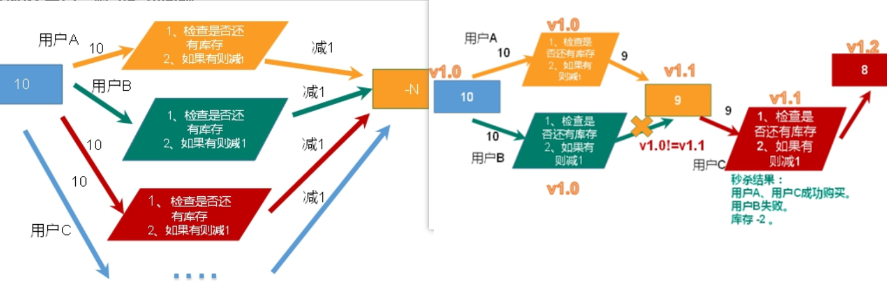
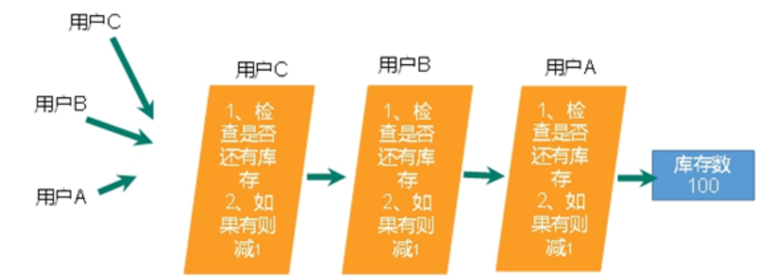

# 发布与订阅

***Redis*** 发布订阅（ ***pub/sub*** ）是一种消息通信模式：

+ 发送者（ ***pub*** ）发送消息

+ 订阅者（ ***sub*** ）接收消息。

***Redis*** 客户端可以订阅任意数量的频道。

+ 客户端可以订阅频道

+ 发布者 给这个频道发布消息

  消息就会发送给订阅的客户端


eg

+ 1. 客户端A，订阅channel1

     subscribe channel1

  2. 客户端B，给channel1发布消息hello，返回订阅者数量

     publish channel1 hello

  3. 客户端A，可以看到发送的消息


# Jedis

 ***Java*** 操作 ***Redis***。

1. maven工程，添加依赖

```xml
<dependency>
	<groupId>redis.clients</groupId>
  	<artifactId>jedis</artifactId>
  	<version>3.2.0</version>
</dependency> 
```

1. 连接 ***Redis***

```java
public class JedisDemo {
  	public static void main(String[] args) {
    	Jedis jedis = new Jedis("192.168.57.101", 6379);
      	// 连接需先改redis配置文件
        //		注释bind，protected-mode no)     // 虚拟机关防火墙
        
    	// 测试连接
    	String pong = jedis.ping();
    	System.out.println("连接成功：" + pong);
    	jedis.close();
  	}
} 
```

> ***Key***
>
> ```java
> Set<String> keys = jedis.keys("*");
> System.out.println(keys.size());
> for (String key : keys) {
> 	System.out.println(key);
> }
> System.out.println(jedis.exists("k1"));
> System.out.println(jedis.ttl("k1"));   
> ```
>
> ***String***
>
> ```java
> jedis.set("k1", "v1");
> jedis.set("k2", "v2");
> jedis.set("k3", "v3");
> System.out.println(jedis.get("k1"));
> 
> jedis.mset("str1","v1","str2","v2","str3","v3");
> System.out.println(jedis.mget("str1","str2","str3")); 
> ```
>
> ***List***
>
> ```java
> jedis.lpush("mylist", "a", "b", "c");
> List<String> list = jedis.lrange("mylist",0,-1);
> for (String element : list) {
> 	System.out.println(element);
> } 
> ```
>
> ***Set***
>
> ```java
> jedis.sadd("orders", "order01");
> jedis.sadd("orders", "order02");
> jedis.sadd("orders", "order03");
> jedis.sadd("orders", "order04");
> Set<String> smembers = jedis.smembers("orders");
> for (String order : smembers) {
> 	System.out.println(order);
> }
> jedis.srem("orders", "order02");
> ```
>
> ***Hash***
>
> ```java
> jedis.hset("hash1","userName","lisi");
> System.out.println(jedis.hget("hash1","userName"));
> 
> Map<String,String> map = new HashMap<String,String>();
> map.put("telphone","13810169999");
> map.put("address","atguigu");
> map.put("email","abc@163.com");
> jedis.hmset("hash2",map);
> 
> List<String> result = jedis.hmget("hash2", "telphone","email");
> for (String element : result) {
> 	System.out.println(element);
> } 
> ```
>
> ***zset***
>
> ```java
> jedis.zadd("zset01", 100d, "z3");
> jedis.zadd("zset01", 90d, "l4");
> jedis.zadd("zset01", 80d, "w5");
> jedis.zadd("zset01", 70d, "z6");
> 
> Set<String> zrange = jedis.zrange("zset01", 0, -1);
> for (String e : zrange) {
> 	System.out.println(e);
> } 
> ```

## 实例


+ how存储：

  手机号 发送次数：一对一

  手机号 验证码：一对一，ttl 120s

  需要两个key，用 : 拼接

| key                     | value | ttl  |
| ----------------------- | ----- | ---- |
| "verify:"+phone+":code" |       | 120  |
| "verify:"+phone+":cnt"  |       |      |

```java
import redis.clients.jedis.Jedis; 
import java.util.Random;

public class VerifyCode {
	// 流程: 发手机号 - 返回验证码 - 发手机号+验证码 - 登录 成功/失败
	//              - 超过三次 
    static final Jedis jedis = new Jedis("localhost", 6379); // todo：close

    // 1.生成code
    static String generateCode(){
        final Random random = new Random();
        String code = "";
        for(int i = 0; i < 6; i++)
            code += random.nextInt(9);
        return code;
    }

    // 2.手机号申请新code
    public static String getCode(String phone){
        // key
        String phoneCnt = "verify:" + phone + ":cnt";
        String phoneCode = "verify:" + phone + ":code";
        // 根据申请次数 分类讨论，并更新申请次数
        String cnt = jedis.get(phoneCnt);
        if(cnt == null){ // 发送过0次
            jedis.setex(phoneCnt, 24*60*60,"1"); // 每天更新次数限制
        } else if(Integer.parseInt(cnt) <= 2){ // 发送过1-2
            jedis.incr(phoneCnt);
        } else { // 用完所有次数 （3
            return "ERROR：今日已发送3次";
        }
        // 记录：手机号 - 验证码
        String code = jedis.setex(phoneCnt, 120, generateCode());
        return "验证码：" + code;
    }

    // 3.手机号验证code
    public static void verifyCode(String phone, String code){
        // key
        String phoneCode = "verify:" + phone + ":code";
        // 查存储的正确验证码
        String rightCode = jedis.get(phoneCode);
        if(code.equals(rightCode))
            System.out.println("登录成功");
        else
            System.out.println("登录失败");
    }

    public static void main(String[] args) {
        String phone = "12345678911";
        String result = getCode(phone);
        System.out.println(result);

        String code = "";
        verifyCode(phone, code);
    }
} 
```


 

## 主从复制

+ 配置哨兵

```java
private static JedisSentinelPool jedisSentinelPool=null;

public static  Jedis getJedisFromSentinel(){

  	if(jedisSentinelPool==null){
        Set<String> sentinelSet=new HashSet<>();
        sentinelSet.add("172.16.88.168:26379"); // 端口为sentinal
        JedisPoolConfig jedisPoolConfig =new JedisPoolConfig();
        jedisPoolConfig.setMaxTotal(10); // 最大可用连接数
        jedisPoolConfig.setMaxIdle(5); // 最大闲置连接数
        jedisPoolConfig.setMinIdle(5); // 最小闲置连接数
        jedisPoolConfig.setBlockWhenExhausted(true); // 连接耗尽是否等待
        jedisPoolConfig.setMaxWaitMillis(2000); // 等待时间
        jedisPoolConfig.setTestOnBorrow(true); // 取连接的时候进行测试

        jedisSentinelPool=new JedisSentinelPool("mymaster",sentinelSet,jedisPoolConfig); 		// 服务主机名
        return jedisSentinelPool.getResource();
  	} else {
    	return jedisSentinelPool.getResource();
  	}
} 
```

+ 测试 主从

  ```java
  import redis.clients.jedis.Jedis;
  
  public class TestMS {
  	public static void main(String[] args) {
  		Jedis jedis_M = new Jedis("127.0.0.1",6379);
  		Jedis jedis_S = new Jedis("127.0.0.1",6380);
  		
  		jedis_S.slaveof("127.0.0.1",6379);
  		
  		jedis_M.set("class","1122V2");
  		
  		String result = jedis_S.get("class");
  		System.out.println(result);
  	}
  } 
  ```

  

## 集群

即使连接的不是主机，集群会自动切换。主机写，从机读。

无中心化主从集群。无论哪台主机写数据，其他主机上都能读到数据。

```java
public class JedisClusterTest {
  public static void main(String[] args) { 
      // ip，端口
      // 可用集群中任意一个节点，连接到集群
      // set 可以放入多个 ip+端口，但无中心化集群 只用一个
     Set<HostAndPort>set =new HashSet<HostAndPort>();
     set.add(new HostAndPort("172.16.88.168",6379)); 
     // 连接集群
      JedisCluster jedisCluster = new JedisCluster(set);
     jedisCluster.set("k1", "v1");
     System.out.println(jedisCluster.get("k1"));
      jedisCluster.close();
  }
} 
```

# SpringBoot

1. 依赖

```xml
<!-- redis -->
<dependency>
  <groupId>org.springframework.boot</groupId>
  <artifactId>spring-boot-starter-data-redis</artifactId>
</dependency>

<!-- spring2.X集成redis所需common-pool2 连接池-->
<dependency>
  <groupId>org.apache.commons</groupId>
  <artifactId>commons-pool2</artifactId>
  <version>2.6.0</version>
</dependency>
```

1. 配置文件配置 ***Redis***

```properties
#Redis服务器地址
spring.redis.host= ip
#Redis服务器连接端口
spring.redis.port=6379
#Redis数据库索引（默认为0）
spring.redis.database= 0
#连接超时时间（毫秒）
spring.redis.timeout=1800000
#连接池最大连接数（使用负值表示没有限制）
spring.redis.lettuce.pool.max-active=20
#最大阻塞等待时间(负数表示没限制)
spring.redis.lettuce.pool.max-wait=-1
#连接池中的最大空闲连接
spring.redis.lettuce.pool.max-idle=5
#连接池中的最小空闲连接
spring.redis.lettuce.pool.min-idle=0
```

1. ***Redis*** 配置类（需要继承 ***CachingConfigurerSupport***）

   SpringBoot启动时加载配置类，设置Redis相关

```java
@EnableCaching
@Configuration
public class RedisConfig extends CachingConfigurerSupport {
    @Bean
    public RedisTemplate<String, Object> redisTemplate(RedisConnectionFactory factory) {
        RedisTemplate<String, Object> template = new RedisTemplate<>();
        RedisSerializer<String> redisSerializer = new StringRedisSerializer();
        Jackson2JsonRedisSerializer jackson2JsonRedisSerializer = new Jackson2JsonRedisSerializer(Object.class);
        ObjectMapper om = new ObjectMapper();
        om.setVisibility(PropertyAccessor.ALL, JsonAutoDetect.Visibility.ANY);
        om.enableDefaultTyping(ObjectMapper.DefaultTyping.NON_FINAL);
        jackson2JsonRedisSerializer.setObjectMapper(om);
        template.setConnectionFactory(factory);
				// key序列化方式
        template.setKeySerializer(redisSerializer);
				// value序列化
        template.setValueSerializer(jackson2JsonRedisSerializer);
				// value hashmap序列化
        template.setHashValueSerializer(jackson2JsonRedisSerializer);
        return template;
    }

    // 缓存管理
    @Bean
    public CacheManager cacheManager(RedisConnectionFactory factory) {
        RedisSerializer<String> redisSerializer = new StringRedisSerializer();
        Jackson2JsonRedisSerializer jackson2JsonRedisSerializer = new Jackson2JsonRedisSerializer(Object.class);
				// 解决查询缓存转换异常的问题
        ObjectMapper om = new ObjectMapper();
        om.setVisibility(PropertyAccessor.ALL, JsonAutoDetect.Visibility.ANY);
        om.enableDefaultTyping(ObjectMapper.DefaultTyping.NON_FINAL);
        jackson2JsonRedisSerializer.setObjectMapper(om);
				// 配置序列化（解决乱码的问题）,过期时间600秒
        RedisCacheConfiguration config = 
          RedisCacheConfiguration.defaultCacheConfig()
                .entryTtl(Duration.ofSeconds(600))
      .serializeValuesWith(RedisSerializationContext.SerializationPair.fromSerializer(jackson2JsonRedisSerializer))
                .disableCachingNullValues();
        RedisCacheManager cacheManager = RedisCacheManager.builder(factory)
                .cacheDefaults(config)
                .build();
        return cacheManager;
    }
} 
```

用 redisTemplate 操作 redis

```java
@RestController
@RequestMapping("test")
public class TestController {
    @Autowired
    private StringRedisTemplate redisTemplate;
    
    @GetMapping("testRedis")
    public String testRedis(){
        redisTemplate.opsForValue().set("test", "abc");
        String test = redisTemplate.opsForValue().get("test");
        return test;
    }
}
```

# 事务和锁

***Redis*** 事务是一个单独的隔离操作：

事务所有命令都会序列化、按顺序执行（redis单线程）

事务执行过程中，不会被其他请求打断

作用：串联多个命令防止别的命令插队

## *Multi*、*Exec*、*Discard*


> ***Multi*** 组队（命令行显示 (TX)
>
> ***Exec*** 依次执行
>
> ***Discard*** 放弃
>
> 从输入 ***Multi*** 命令开始，输入的命令都会依次进入命令队列中，但不会执行
>
> 直到输入 ***Exec*** 后，***Redis*** 会将之前的命令队列中的命令依次执行
>
> 组队的过程中可以通过 ***Discard*** 来放弃组队

- 组队过程 命令出错，全不执行

- 组队过程 命令无错，执行过程出错，除出错命令 都执行

| 1         | 2       | 3              | 4          |
| --------- | ------- | -------------- | ---------- |
| multi     | multi   | multi          | multi      |
| a         | a       | a 出错         | a          |
| b         | b       | b              | b          |
| exec      | discard | exec（不执行） | exec b出错 |
| 效果：a b | 无      | 无             | a          |


当组队中某个命令出现了报告错误，执行时整个的所有队列都会被取消。


## 事务冲突

每条命令：拿数据 - 操作 - 更新数据


- 一个请求想给金额减8000；

- 一个请求想给金额减5000；

- 一个请求想给金额减1000。

  最终我们可以发现，总共金额是10000，如果请求全部执行，那最后的金额变为-4000，很明显不合理。


2种机制 解决：

### 悲观锁

（***Pessimistic Lock***）


1-2：拿数据，认为有其他线程会修改（悲观），拿到数据时 上锁

3：其他线程 拿数据，被 block 直到成功拿到锁

传统的关系型数据库里边就用到了很多这种锁机制，比如行锁**，**表锁等，读锁**，**写锁等，都是在做操作之前先上锁。

效率低：多个请求，逐个执行，无法并发

### 乐观锁

（***Optimistic Lock***）

redis使用乐观锁

给字段加 version 字段


1：拿数据，认为其他线程不会改（乐观），so 不上锁

2：其他线程拿数据，不被阻止，都可拿到当前版本数据

3-4：更新数据时，判断在此期间有没有其他线程更新数据

（要求：线程所持有数据的版本号 == 数据库中数据版本）才能更新数据 并同步 更新版本号


**适用：多读的应用类型，这样可以提高吞吐量**

***Redis*** 就是利用这种 ***check-and-set*** 机制实现事务


### 使用乐观锁

+ ***multi*** 之前，

  先执行 **watch key1 [key2]，**

  **监视一个（或多个）key** 

  如果在事务执行前，这个 ***key*** 被其他命令改动，那么事务将被打断。

  （图中标出 balance值 和 版本号

  

+ unwatch

  取消 ***WATCH*** 命令对所有 ***key*** 的监视。

  如果在执行 ***WATCH***  后，***EXEC*** 命令或 ***DISCARD*** 命令先被执行，那么就不需要再执行 ***UNWATCH*** 。

## Redis 事务三特性

- 不保证原子性

  事务中，如果有一条命令执行失败，其后的命令仍执行，没有回滚

- 单独的隔离操作

  事务中的所有命令都会序列化、按顺序执行

  事务执行中，不被其他客户端发来的命令请求打断。

  （没有并发执行事务的概念

- 没有隔离级别的概念

  队列中的命令提交前都不会实际执行，因为事务提交前任何指令都不会被实际执行。

## 秒杀案例

1. 基本实现（未考虑并发）

   


2. 模拟并发，出现问题

   **使用工具ab模拟测试：**

   - CentOS6 默认安装

   - CentOS7需要手动安装

   - ab -n 2000 -c 200 -k -p ~/postfile -T application/x-www-form-urlencoded http://192.168..:80

     2000 次请求，其中200次是并发的

     -T 请求类型：若使用 POST/PUT 请求方法，需要指定

     -p 请求参数存在哪个文件 

     文件 内容：prodid=0101&（以&符号结尾，存放当前目录。


### 连接超时：连接池

2000个请求，redis不能同时处理，等待出现连接超时

连接池：节省每次连接redis服务的消耗，复用连接好的实例

+ 使用连接池

  ```java
  import redis.clients.jedis.Jedis;
  import redis.clients.jedis.JedisPool;
  
  public class TestPool { 
  	public static void main(String[] args) {
  		JedisPool jedisPool = JedisPoolUtil.getJedisPoolInstance();
   
  		Jedis jedis = null;
  		try {
  			jedis = jedisPool.getResource();
  			jedis.set("aa","bb");
  		} catch (Exception e) {
  			e.printStackTrace();
  		}finally{
  			JedisPoolUtil.release(jedisPool, jedis);
  		}
  	}
  }
  ```

+ 参数

  - MaxTotal：控制一个pool可分配多少个jedis实例，通过pool.getResource()来获取；如果赋值为-1，则表示不限制；如果pool已经分配了MaxTotal个jedis实例，则此时pool的状态为exhausted。
  - maxIdle：控制一个pool最多有多少个状态为idle(空闲)的jedis实例；
  - MaxWaitMillis：表示当borrow一个jedis实例时，最大的等待毫秒数，如果超过等待时间，则直接抛JedisConnectionException；
  - testOnBorrow：获得一个jedis实例的时候是否检查连接可用性（ping()）；如果为true，则得到的jedis实例均是可用的。

```java
import redis.clients.jedis.Jedis;
import redis.clients.jedis.JedisPool;
import redis.clients.jedis.JedisPoolConfig;

// JedisPool 单例
public class JedisPoolUtil {
	private static volatile JedisPool jedisPool = null;
	
	private JedisPoolUtil(){}
	
	public static JedisPool getJedisPoolInstance() {
		if(null == jedisPool) {
			synchronized (JedisPoolUtil.class) {
				if(null == jedisPool) {
                    // 配置连接池
					JedisPoolConfig poolConfig = new JedisPoolConfig();
					poolConfig.setMaxTotal(200);
					poolConfig.setMaxIdle(32);
                 poolConfig.setMaxWaitMillis(100*1000);	                   poolConfig.setBlockWhenExhausted(true);				poolConfig.setTestOnBorrow(true); 
					jedisPool = new JedisPool(poolConfig,"127.0.0.1",6379, 60000);
                    // 配置，ip，端口号，超时时间
				}
			}
		}
		return jedisPool;
	}

	public static void release(JedisPool jedisPool,Jedis jedis){
		if(null != jedis){
			jedisPool.returnResourceObject(jedis);
		}
	} 
} 
```

### 问题：超卖




+ 问题：库存出现负数

+ 原因：每个用户的秒杀，含多条 redis 指令，这些指令的执行不是原子的

+ 解决： 事务 乐观锁，每个用户的秒杀，都不被打断

  购买时，通过watch来监视库存，如果库存在watch监视后改变，就会捕获异常而放弃 库存减一

+ 弊端：事务失败而重新执行，对服务器压力过大


### 问题：库存遗留

+ 解决超卖后，出现新问题：

  2000人参加秒杀500件商品，商品未全部被秒杀

+ 原因：

  乐观锁，导致很多请求失败（更新时失败，因 版本号 != 数据库版本号）

  先点的没秒到，后点的可能秒到了。

+ 解决：Lua （嵌入式脚本语言）

  + Redis 2.6以上

  + 多步redis操作，写为一个LUA脚本，

    + 一次提交给redis执行，减少反复连接redis次数，提升性能

    + LUA脚本，类似redis事务，有一定的原子性，不会被其他命令插队，可以完成一些redis事务性的操作。

  + 利用lua脚本淘汰用户，解决超卖，

    redis 2.6版本以后，通过lua脚本解决**争抢问题**，实际上是**redis** **利用其单线程的特性，用任务队列的方式解决多任务并发问题**。



  + lua脚本

    

  + 调用lua脚本

    

  


# 持久化

|          | rdb                                                 | aof                                       |
| -------- | --------------------------------------------------- | ----------------------------------------- |
|          | Redis DataBase                                      | Append Of File                            |
| 备份     | 虽使用**写时拷贝**，但若数据庞大，比较消耗性能      | 若每次读写都同步，有性能压力              |
| 数据丢失 | 最后一次持久化后，写的数据may丢失                   | 概率低                                    |
| 磁盘     | 节省                                                | 更多                                      |
| 内存     | Fork 时，内存中的数据被克隆了一份，最多 2倍的膨胀性 |                                           |
| 恢复速度 | 快                                                  | 慢（都执行一遍                            |
|          | 适合大规模的数据恢复                                | 可读的日志文本，可处理误操作（恢复aof文件 |
|          | 适合对数据完整性和一致性要求不高                    | 存在个别Bug，造成不能恢复                 |

官方推荐两个都启用。

- 如果对数据不敏感，可以单独用RDB。
- 不建议单独用 AOF，因为可能会出现Bug。
- 如果只是做纯内存缓存，可以都不用。
- 性能建议：
  - 因为RDB文件只用作后备用途，建议只在Slave上持久化RDB文件，而且只要15分钟备份一次就够了，只保留save 9001这条规则。
  - 如果使用AOF，好处是在最恶劣情况下也只会丢失不超过两秒数据，启动脚本较简单，只load自己的AOF文件就可以了。
  - aof代价：一是带来了持续的IO，二是AOF rewrite的最后，将rewrite过程中产生的新数据写到新文件造成的阻塞几乎是不可避免的。
  - 只要硬盘许可，应该尽量减少AOF rewrite的频率，AOF重写的基础大小默认值64M太小了，可以设到5G以上。默认超过原大小100%大小时重写可以改到适当的数值。

## RDB 

指定的**时间间隔**内（每隔一段时间）

将内存中的**数据集快照**（全量备份）写入磁盘（***Snapshot*** 快照）

恢复，将快照文件直接读到内存里。

+ 并发 处理请求 + io备份

  + 问题：单线程 同时负责多个客户端的读写请求，还要周期性 IO操作 内存数据 写到快照文件中，IO操作严重影响Redis性能，甚至在持久化的过程中，读写请求会阻塞，
  + 解决：同时进行读写请求和持久化， 

  + 如何备份：***Redis*** 会单独创建一个子进程（***fork***）来进行持久化。

    先将数据写入到一个临时文件，待持久化过程完成后，再将这个临时文件内容覆盖到 ***dump.rdb***。

    否则若直接写到 dump.rdb（旧数据），写入过程中服务器出错，导致数据缺失

  + 主进程不进行任何 ***IO*** 操作，确保了极高的性能。如果需要进行大规模数据的恢复，且对于数据恢复的完整性不是非常敏感，那 ***RDB*** 方式要比 ***AOF*** 方式更加的高效。

  

  

   


+ how 恢复

  RDB备份文件 dump.rdb 拷贝到 redis工作目录

  启动 redis 后，自动加载并恢复备份数据

+ 备份原理：COW（多进程写时复制）

  + 问题：持久化中，内存中数据改变。假如Redis正持久化一个大数据结构，这个过程中客户端发送一个删除请求，把这个大数据结构删掉了，这时候持久化还没完成，Redis怎么办？

  + 解决：

    fork()子进程，进行快照持久化。父进程继续处理客户端读写请求。

    子进程和父进程，共享内存里代码段和数据段（含redis数据库内容）

    父线程收到的客户端的读写请求，需改某块数据，内存复制一份副本，在副本上修改。子进程备份的数据未改变

    所以，即使修改数据，Redis持久化到RDB的数据也是未改的数据。

    这也是把RDB文件称为"快照"文件的原因，子进程所看到的数据在它被创建的一瞬间就固定了，父进程改的数据只是该数据的复制品。

  + 正因父进程修改数据，会被额外复制一份，so 占额外内存
  
  + **此期间，父进程处理请求，写入的数据去哪？** 
  
    存在内存中，并没有写入当前的持久化文件中，等下次进行RDB持久化时才会把 ” 写入的数据 ” 落盘到RDB文件中
  
    + 也就是说，父子进程的虚拟空间不同，但其对应的物理空间（内存区）是同一个。这是Linux操作系统的机制，为了节约内存资源，所以尽可能让父子进程共享内存，这样在进程分离的一瞬间，内存的增长几乎没有明显变化。
    + 如果fork操作本身耗时过长，将导致主进程阻塞，可以执行info stats命令获取到latest_fork_usec指标，表示最近一次fork操作的耗时，若操作1s则需优化)
    + 再深入一点，Redis内存中的全量数据由一个个的"数据段页面"组成，每个数据段页面的大小为4K，客户端要修改的数据在哪个页面中，就会复制一份这个页面到内存中，这个复制的过程称为"页面分离"，在持久化过程中，随着分离出的页面越来越多，内存就会持续增长，但是不会超过原内存的2倍，因为在一次持久化的过程中，几乎不会出现所有的页面都会分离的情况，读写请求针对的只是原数据中的小部分，大部分Redis数据还是"冷数据"。

+ 操作系统 fork() 写时复制

  复制一个与当前进程一样的进程，所有数据（变量、环境变量、程序计数器等） 数值都和原进程一致，作为原进程的子进程

  子进程此后，大多会 ***exec*** 系统调用，出于效率考虑，***Linux*** 中引入了 **写时复制技术**  On Write

  **一般情况，父子进程，共用同一段物理内存**，只有进程空间的各段的内容要发生变化时（写时），才会将父进程的内容复制一份给子进程（复制）

### 配置

/etc/redis.conf

搜索 SNAPSHOTING

> **dump 文件名字**
>
> 默认为 ***dump.rdb***。
>
> **dump 保存位置**
>
> ***rdb*** 文件的保存路径。默认为 ***Redis*** 启动时命令行所在的目录下。  “dir ./”
>
> ***stop-writes-on-bgsave-error***
>
> 即当 ***redis*** 无法写入磁盘，关闭 ***redis*** 的写入操作。
>
> 
>
> 
>
> ***rdbcompression***
>
> 持久化的文件是否进行压缩存储。
>
> ***rdbchecksum***
>
> 完整性的检查， 持久化后 检查数据是否完整性、准确性。
>
> 
>
> ***save***
>
> RDB 的触发条件
>
> xx秒内，至少发生多少次写操作，就触发持久化。
>
> ```
> 格式：save 秒 写操作次数
> ```
>
> 

+ 如何停止

  动态停止RDB：redis-cli config set save “”

  #save后给空值，表示禁用保存策略。

**命令save VS bgsave**

- save ：save时只管保存，其它不管，全部阻塞。手动保存，不建议。
- **bgsave：Redis会在后台异步进行快照操作，** **快照同时还可以响应客户端请求。**
- 可以通过lastsave 命令获取最后一次成功执行快照的时间。

**flushall命令**

执行flushall命令，也会产生dump.rdb文件，但里面是空的，无意义。


## AOF

+ ***AOF*** 和 ***RDB*** 同时开启

  系统默认读取 ***AOF*** 的数据（AOF存的数据集，比RDB完整）

+ **执行流程**

  + 客户端的请求写命令会被 ***append*** 追加到 ***AOF*** 缓冲区内；

    ***AOF*** 缓冲区根据 ***AOF*** 持久化策略 `[always, everysec, no]` 将操作 ***sync*** 同步到磁盘的 ***AOF*** 文件中；

    + 只追加文件，不改写文件 
    + 日志形式 记录 所有写操作（增量保存）（读操作不记）

  + ***AOF*** 文件大小超过重写策略或手动重写时，

    会对 ***AOF*** 文件 ***Rewrite*** 重写，压缩 ***AOF*** 文件容量

  + ***Redis*** 服务重启时，会重新 ***load*** 加载 ***AOF*** 文件中的写操作

    从前到后执行一次，重新构建数据，达到数据恢复。

  + 若AOF文件损坏，恢复：

    `/usr/local/bin/redis-check-aof   --fix  appendonly.aof`

### 配置

文件 redis.conf 


> **AOF 默认不开启**
>
> **文件名字**
>
> 默认 appendonly.aof
>
> 生成路径 同rdb
>
> 


+ **AOF 同步频率设置**

> ***appendfsync always***
>
> 始终同步，每次 ***Redis*** 的写入都会立刻记入日志；
>
> 性能较差但数据完整性较好。
>
> ***appendfsync everysec***
>
> 每秒同步，每秒记入日志一次，如果宕机，本秒的数据可能丢失。
>
> ***appendfsync no***
>
> ***Redis*** 不主动进行同步，把同步时机交给操作系统。
>
> 

+ **Rewrite 压缩**

>  文件追加，***AOF*** 文件大小超阈值
>
>  启动 ***AOF*** 文件的内容压缩，只保留可以恢复数据的最小指令集。
>
>  可以使用命令 ***bgrewriteaof***
>
>  
>
>  如：
>
>  set a a
>
>  set b b
>
>  => set a a b b
>
>  AOF文件持续增长而过大时，会fork出一条新进程来将文件重写(先写临时文件最后再rename)，redis4.0版本后的重写，是指把rdb 的快照，以二进制的形式附在新的aof头部，作为已有的历史数据，替换掉原来的流水账操作。
>
>  **no-appendfsync-on-rewrite：**
>
>  - yes ，不写入aof文件只写入缓存，用户请求不会阻塞，但是在这段时间如果宕机会丢失这段时间的缓存数据
>
>    （降低数据安全性，提高性能）
>
>  - no，还是会把数据往磁盘里刷，但是遇到重写操作，可能会发生阻塞
>
>    （数据安全，但是性能降低）

>  
>
>  
>
>  + rewrite 触发时机，何时重写
>
>    Redis会记录上次重写时的AOF大小
>
>    默认：AOF文件大小是上次rewrite后大小的一倍，且文件大于64M。
>
>    重写虽然可以节约大量磁盘空间，减少恢复时间。但是每次重写还是有一定的负担的，因此设定Redis要满足一定条件才会进行重写。
>
>    + auto-aof-rewrite-percentage：设置重写的基准值，文件达到100%时开始重写（文件是原来重写后文件的2倍时触发）。
>    + auto-aof-rewrite-min-size：设置重写的基准值，最小文件64MB。达到这个值开始重写。
>    + 系统载入时或者上次重写完毕时，Redis会记录此时AOF大小，设为base_size,
>    + 如果Redis的AOF当前大小>= base_size +base_size*100% (默认)且当前大小>=64mb(默认)的情况下，Redis会对AOF进行重写。
>    + 例如：文件达到70MB开始重写，降到50MB，下次什么时候开始重写？100MB
>
>  
>
>  + 重写流程 
>    1. bgrewriteaof触发重写，判断是否当前有bgsave或bgrewriteaof在运行，如果有，则等待该命令结束后再继续执行
>    2. 主进程fork出子进程执行重写操作，保证主进程不阻塞
>    3. 子进程遍历redis内存中数据到临时文件，客户端的写请求同时写入aof_buf缓冲区和aof_rewrite_buf重写缓冲区，保证原AOF文件完整以及新AOF文件生成期间的新的数据修改动作不会丢失
>    4. 子进程写完新的AOF文件后，向主进程发信号，父进程更新统计信息。主进程把aof_rewrite_buf中的数据写入到新的AOF文件
>    5. 使用新的AOF文件覆盖旧的AOF文件，完成AOF重写

