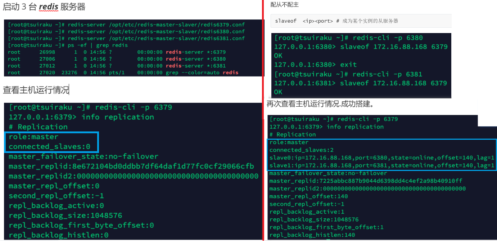
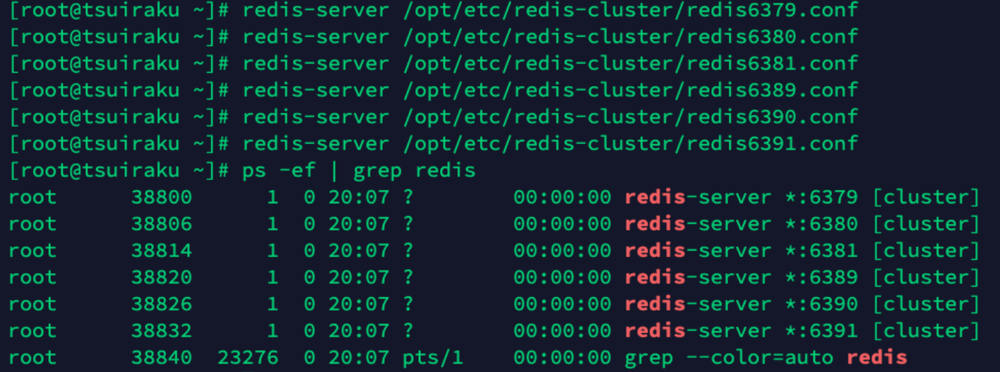

# 主从复制


+ ***master/slaver*** 机制

  + 主机 数据更新后，根据配置和策略，自动同步到 从机
  + ***Master*** 以写为主，***Slaver*** 以读为主
  + 一般为：一主多从

+ 优点

  + 读写分离，性能扩展

  + 容灾快速恢复

    一个从服务器挂掉，可以读其他 从服务器

    （主服务器挂掉，由集群解决
  
+ **复制延时**

  由于所有的写操作都是先在 ***master*** 上操作，然后同步更新到 ***slave*** 上，

  所以从 ***master*** 同步到 ***slave*** 从机有一定的延迟，

  当系统很繁忙，延迟加重，***slave*** 机器数量的增加也会加重。

## 搭建

**一主两从**

+ 创建文件目录 /myredis

+ 将 ***redis.conf*** 复制到当前目录

  开启 daemonize yes

  appendonly 关闭 / 换名字

```
cp /etc/redis.conf /myredis/redis.conf
```

+ 创建 3 个 ***redis.conf*** 配置文件

```
# 分别用不同端口
/myredis/redis6379.conf
/myredis/redis6380.conf
/myredis/redis6381.conf

# redis6379.conf
include /myredis/redis.conf
pidfile /var/run/redis_6379.pid
port 6379
dbfilename dump6379.rdb

# redis6380.conf
include /myredis/redis.conf
pidfile /var/run/redis_6380.pid
port 6380
dbfilename dump6380.rdb

# redis6381.conf
include /myredis/redis.conf
pidfile /var/run/redis_6381.pid
port 6381
dbfilename dump6381.rdb 
```




## 复制原理

- ***slave*** 启动成功，连接到 ***master*** 后，向 ***master*** 发送 ***sync*** 命令（同步命令）

- ***master*** 接到命令

  启动后台的存盘进程，对数据持久化

  同时收集所有接收到的修改数据集命令

  后台持久化完毕，***master*** 传送整个数据文件（***rdb***）到 ***slave***，以完成一次完全同步


- 每次，主服务进行写操作后，和从服务器进行数据同步


- 全量复制：***slave*** 服务在接收到数据库文件数据后，将其存盘并加载到内存中。

  只要是重新连接 ***master***，一次完全同步（全量复制）将被自动执行。

- 增量复制：***master*** 继续将新的所有收集到的修改命令，依次传给 ***slave***，完成同步。

## 常见问题 * 3

### 一主二仆

主机 ***6379***，从机 ***6380*** 和 ***6381***。

+ 假设从机 ***6380*** 挂掉

  6380重启后，6380不再是6379的从机，而是作为新的master；

  若 slaveof 再次把6380作为6379的从机，从机 会从头到尾 复制数据。

+ 假设主机 ***6379*** 挂掉 

  6380和6381仍然是6379的从机，不会做任何事；

  当6379重启后，依然是主服务器。

### 薪火相传


+ 问题：slave过多，master难管理所有

+ 解决：形成层级结构

  ***slave*** 可以是 其他 ***slave*** 的 ***master***，***slave*** 可以接收其他 ***slave***的连接和同步请求，

  那么该 ***slave*** 作为了链条中下一个的 ***master***，可以有效减轻 ***master*** 的写压力，去中心化降低风险。

  `slaveof <ip><port> `

+ 缺点：一台slave挂掉，其管理的所有slave都无法同步数据

+ 中途变更转向：会清除之前的数据，重新建立拷贝最新的。


### 反客为主

+ 默认：***master*** 宕机后，从机仍是其从机，不会做任何事

+ 反客为主：后面的 ***slave*** 可立刻升为 新***master***

  而新 master 原本的 ***slave*** 不用做任何修改，仍是其 slave

+ 缺点：需要手动

```
slaveof no one
```


## 哨兵模式 (sentinel)


+ **反客为主的自动版**

  1. 哨兵 **监控**主机
  2. 主机挂掉
  3. 从机中 **选举** 新主机

  4. 哨兵 向原主机的从机，发送 slaveof 新主机命令

     成为新主机的从机

  5. 原主机重启后，哨兵 向原主机的从机，发送 slaveof 新主机命令 

     成为新主机的从机 

+ **选举规则**

  + 优先级高

    redis.conf 中 slave-priority/replica-priority

    默认100，越小优先级越高 

  + 偏移量大

    和原主机同步量最高。指获得原主机数据最全的概率

  + ***runid*** 最小

    每个redis实例启动后都会随机生成一个40位的runid

### 配置

例：一主（6379）二仆（6380，6381）

创建 ***sentinel.conf*** 文件

```
/myredis/sentinel.conf 
```

配置哨兵

```
sentinel monitor mymaster 172.16.88.168 6379 1

# mymaster：监控对象起的服务器名称
# 主机ip port
# 1：至少有多少个哨兵同意迁移   
```

启动哨兵

```
redis-sentinel  /myredis/sentinel.conf
```


# 集群

+ 解决问题：

  + 容量不够，***redis*** 如何扩容？

    ***Redis*** 集群实现：对 ***Redis*** 的水平扩容，即启动 ***N*** 个 ***Redis*** 节点，

    整个数据库分布存储在 ***N*** 个节点，每个节点存总数据的 ***1/N*** 

  + 并发写入1台主机，压力大， ***redis*** 如何分摊压力？

  + 若主机宕机，反客为主 导致 ***ip*** 变化。client配置需改 主机 ip、端口？

    集群，请求可发到任意节点，由该入口节点转发请求

  + ***Redis*** 集群通过分区（***partition***）来提供一定程度的可用性（***availability***），

    即使集群中有一部分节点失效或者无法进行通讯， 集群也可以继续处理命令请求。

  + 无中心，配置相对简单 

    可通过集群的任意一个节点，连接到集群

+ 该模式的redis集群特点是：分治、分片。

+ 2种架构：

  
  + 代理主机

    如：将用户、订单、商品分别存在不同主机。

    client 请求代理主机，代理主机根据请求，决定请求哪个主机

    利用哨兵模式，主机宕机时，从机反客为主（代理主机，也可为其设置从机

    问题：所需服务器过多，代理节点 压力大

  + 无中心化集群 （分布式）

    任何主机都可作为集群入口，

    主机间可以互相访问，若操作数据不在主机上，将请求转发到其他主机

    

## 搭建

注：此处为了模拟，在一个linux服务器运行多个redis。实际中，每个linux服务器运行1个redis

**三主三从**

+ 删 原dump文件（rdb）

+ 创建文件目录 /myredis

+ 将 ***redis.conf*** 复制到当前目录

  开启 daemonize yes

  appendonly 关闭 / 换名字

+ 创建6个配置文件

  /myredis/redis63xx.conf

```
# 以redis6379.conf为例
include /myredis/redis.conf
pidfile /var/run/redis_6379.pid # 更改
port 6379 # 更改
dbfilename dump6379.rdb # 更改
# 打开集群模式
cluster-enabled yes 
# 设置节点配置文件名称 
cluster-config-file nodes-6379.conf 
# 设置节点失联事件，超过该时间（ms），集群自动进行主从切换
cluster-node-timeout 15000  
```

+ 启动6个 redis

  

+ 将 6 个节点合成一个集群

  （先确保所有redis实例启动后，nodes-xxxx.conf文件都生成正常。

  ```
  # 进入redis安装目录
  cd /opt/redis-6.2.6/src
   
  # 执行 (使用真实IP，不可用127.0.0.1)
  # -replicas 1 采用最简单方式配置集群：每个主节点创建一个从节点，共三组
  redis-cli --cluster create --cluster-replicas 1 172.16.88.168:6379 172.16.88.168:6380 172.16.88.168:6381 172.16.88.168:6389 172.16.88.168:6390 172.16.88.168:6391 
  ```
  
  
  
  注：工具支持 Cluster 
  
  老版搭建集群，需要安装Ruby环境
  
  Redis 5 将 redis-trib.rb 的功能，集成到 redis-cli
  
  另外，官方 redis-benchmark 支持 cluster模式，通过多线程 对多个分片进行压测
  
+ 采用集群策略连接 redis

  redis-cli -c -p PORT

+ 查看集群信息

  cluster nodes 


## 问题

### IP 分配节点?

+ 一个集群 至少 三个主节点

+ 分配原则：尽量 每个主库和主库 在不同***IP*** ，每个从库和主库 在不同 ***IP*** 

  （为了保证：一台宕机，其他能继续提供服务。否则主从一起宕

  

### slots ？


+ 一个 ***Redis*** 集群含 ***16384*** 个插槽（***hash slot***）

  每个 **key** 属于 1个 **slot**，每个 **slot** 含多个 **key**

  公式 ***CRC16(key) % 16384*** 来计算 ***key*** 属于哪个槽，其中 ***CRC16(key)*** 计算键 ***key*** 的 ***CRC16*** 校验和 

+ 每个节点负责一部分 **slot**。如：

  节点 ***A*** 负责处理 ***0*** 号至 ***5460*** 号插槽。

  节点 ***B*** 负责处理 ***5461*** 号至 ***10922*** 号插槽。

  节点 ***C*** 负责处理 ***10923*** 号至 ***16383*** 号插槽。

+ 在集群中录入值

  + 在 ***redis-cli*** 每次录入、查键值

    ***redis*** 都会计算出该 ***key*** 对应的插槽

    如果不是该客户端对应服务器的插槽，***redis*** 报错，并告知应前往的 ***redis*** 实例地址和端口。

  + ***redis-cli*** 客户端提供了 ***–c*** 参数，实现自动重定向。

    如 ***redis-cli -c –p 6379*** 登入后，再录入、查询键值对可以自动重定向
    
    
    
  + 不支持：多键操作 mset，无法对每个key计算slot，分别重定向到不同的主机
  
    解决：mset 分组，根据组名计算slot，都存到同一台主机

  + 不支持：多键的 ***Redis*** 事务。***lua*** 脚本

+ 查集群中，key 与 slot 对应关系

  `cluster keyslot <key>`：查某个 ***key*** 的 ***slot* **

  `cluster countkeysinslot <slot>`：查某个 ***slot*** 有几个 **key**

  注意：每个主机只能查询自己范围内部的 slot

  `CLUSTER GETKEYSINSLOT <slot><count>`：将***slot*** 中的 **key**，返回 ***count*** 个 

### 缺点

+ 不支持：多键操作 mset，需要设定分组

+ 不支持：多键的 ***Redis*** 事务。***lua*** 脚本

+ 由于集群方案出现较晚，很多公司已经采用了其他的集群方案，

  而代理或者客户端分片的方案想要迁移至***redis cluster***，需要整体迁移而不是逐步过渡，复杂度大

### 故障恢复？

如果主节点下线？从节点能否自动升为主节点？注意：***15*** 秒超时。


- 当 ***6379*** 挂掉后，***6389*** 成为新主机。

  当 ***6379*** 重启恢复后，***6379*** 成为 ***6389*** 的从机。

+ 如果某段插槽的主从节点都宕掉，***redis*** 服务能否继续?

  ***cluster-require-full-coverage=yes***，整个集群挂掉

  ***cluster-require-full-coverage=no***，该插槽数据全不能用，也不能存储。其他插槽可继续提供服务

# 应用问题 

+ 正常：请求web服务，

  + 缓存命中，返回数据

  + 缓存未命中，查数据库，存到缓存，返回数据

+ 前3个，都是缓存 大量未命中，导致访问 DB

## 缓存穿透


+ 黑客攻击，大量请求 不存在的 资源（非正常 url 访问）

  缓存未命中，去查DB，瞬间把后端 ***DB*** 压垮。

+ 如：用一个不存在的用户 ***id*** 获取用户信息，不论缓存还是数据库都没有 

+ 现象：
  1. 大量请求，应用服务器压力变大。
  2. ***redis*** 命中率下降，去 查数据库 。
  3. 一直查数据库，使得数据库压力太大而压垮
  
+ 穿透：redis 正常运行，但未起到缓存的作用


### 解决

- **对空值缓存**

  **简单的应急方案**

  如果 DB查询返回空（不管是数据是否不存在），仍缓存空结果（***null***）

  但：应当设置空结果的过期时间很短（不超五分钟

- **设置可访问的名单（白名单）**

   ***bitmaps*** 定义白名单，名单 ***id*** 作为 ***bitmaps*** 的偏移量

  每次访问，访问id 与 ***bitmap*** 进行比较，如果 ***id*** 不在 ***bitmaps*** 里面，进行拦截，不允许访问

  缺点：每次访问，都要查 白名单，效率低

- **采用布隆过滤器**（***Bloom Filter***）

  （底层和bitmap一样，但进行了优化

  实际上是一个很长的二进制向量（位图）和一系列随机映射函数（哈希函数）用于检索一个元素是否在一个集合中。

  优点：空间效率和查询时间都远远超过一般的算法，

  缺点：有一定的误识别率和删除困难。

  将所有可能存在的数据哈希到一个足够大的 ***bitmaps*** 中，一个一定不存在的数据会被这个 ***bitmaps*** 拦截掉，从而避免了对底层存储系统的查询压力。

- **进行实时监控**

  发现 ***Redis*** 的命中率开始急速降低，
  
  排查访问对象和访问的数据，
  
  和运维人员配合，设置黑名单限制

## 缓存击穿


+ 原因：

  某个 ***key*** 在 ***redis*** 中过期，

  突然 大量并发请求 这个 key，

  发现缓存过期，去查DB，瞬间把后端 ***DB*** 压垮

+ 现象：
  1. 数据库访问压力瞬间增大
  2. ***redis*** 中没有出现大量 ***key*** 过期，***redis*** 正常运行

### 解决

- 预先设置热门数据

  在 ***redis*** 高峰访问前，热门数据，提前存入 ***redis*** ，加大 时长

- 实时调整

  现场监控哪些  ***key***  热门，实时调整 过期时长

- 使用锁，st 按顺序执行

  缺点：效率低

  1. 就是在缓存失效的时候（判断拿出来的值为空），不是立即去load db。
  2. 先使用缓存工具的某些带成功操作返回值的操作（比如Redis的SETNX）去set一个mutex key。
  3. 当操作返回成功时，再进行load db的操作，并回设缓存，最后删除mutex key；
  4. 当操作返回失败，证明有线程在load db，当前线程睡眠一段时间再重试整个get缓存的方法。
  
  


## 缓存雪崩

+ 原因：

  极少时间段，在 ***redis*** 中 大量 ***key*** 集中过期

  大量并发请求，

  发现缓存过期，请求***DB***，瞬间把后端 ***DB*** 压垮。

+ 区别缓存击穿：雪崩 针对很多 ***key*** 缓存，前者则是某一个 ***key***。

### 解决

- **构建多级缓存架构**

  ***nginx*** 缓存 + ***redis*** 缓存 + 其他缓存（***ehcache***等）

  在其他级缓存，可以查到所需数据

  缺点：应用结构过于复杂

- **使用锁或队列：**

  保证不会有大量的线程对数据库一次性进行读写，

  从而避免失效时大量的并发请求落到底层存储系统上。

  效率低，不适用高并发情况。

- **设置过期标志更新缓存：**

  记录缓存数据是否过期（设置提前量），

  如果过期会触发，通知另外的线程，后台更新实际 ***key*** 的缓存。

- **分散 缓存失效时间：**

  在原有的失效时间基础上加一个随机值，比如 1～5 分钟随机，
  
  这样每个缓存的过期时间的重复率就会降低，很难引发集体失效的事件。

## 分布式锁

+ 问题描述

  原单体系统 演化成 分布式集群系统，分布式系统多线程的特点，分布在不同机器上

  原单机的并发控制锁策略失效：在某机器上锁，其他机器不知

  解决：共享锁，需要跨JVM的互斥机制，来控制共享资源的访问。锁对所有节点都有效

+ 分布式锁，主流实现方案：
  + 基于数据库实现分布式锁
  + 基于缓存（Redis等）
  + 基于Zookeeper

+ 根据实现方式，分布式锁还可以分为： 
  + 类CAS自旋式分布式锁：
  
    询问的方式，类似java并发编程中的线程获询问的方式尝试加锁，
  
    如mysql、redis。
  
  + event事件类型分布式锁：
  
    event事件通知进程后续锁的变化，轮询向外的过程，
  
    如zookeeper、etcd。
  
+ 解决方案 的 优缺点：

  + 性能：redis最高

  + 可靠性：zookeeper最高

### RedLock

+ redis 实现方案？使用redis命令

  1. setnx 键 值：尝试获得锁，没有获得锁的线程会不断等待尝试。

     del 键： 释放锁

     问题：若业务异常，不放锁，其他线程一直等待

  2. setnx

     **设置过期时间**

     del 键

     问题：上锁非原子。setnx 后宕机，未设置过期时间

  3. set 键 值 nx ex 3000：**原子操作** （上锁 并 设置过期时间）

     del 键： 释放锁

     问题：（下左图）误删他人的锁

     

     

  4. set 键 **uuid** nx ex 3000 （uuid，每个线程的操作，对应唯一的 uuid）

     获取值，**判断是否自己的锁**（当前线程的uuid == 被释放锁的uuid）

     del 键：释放锁

     问题：（上右图）删除非原子。判断uuid后，过期释放，之后再 del。共释放两次

  5. Lua 脚本

     **原子操作**：判断UUID + 释放锁

+ 流程图

  

+ 实现代码

  

+ 分布式锁的实现，需要满足 4 个条件：

  1. 互斥访问：只有一个 client 能拿到锁。（set nx）
  2. 避免死锁：持有锁的服务崩溃，仍能释放锁（设置过期时间）
  3. 加锁解锁，必须是同一个客户端，不能误释放别人的锁（uuid）
  4. 原子性：加锁、解锁操作（Lua解锁）

+ 容错性：只要大部分 Redis 节点存活（一半以上），就可以正常提供服务

+ Redis Distributed Lock
  
  一种算法，可用实现多节点redis的分布式锁。
  
  RedLock官方推荐，Redisson完成了对Redlock算法封装。
  
+ RedLock原理（了解）
  
  1. 获取当前Unix时间，以毫秒为单位。
  2. 依次尝试从N个实例，使用相同的key和随机值获取锁。在步骤2，当向Redis设置锁时，客户端应该设置一个网络连接和响应超时时间，这个超时时间应该小于锁的失效时间。例如你的锁自动失效时间为10秒，则超时时间应该在5-50毫秒之间。这样可以避免服务器端Redis已经挂掉的情况下，客户端还在死死地等待响应结果。如果服务器端没有在规定时间内响应，客户端应该尽快尝试另外一个Redis实例。
  3. 客户端使用当前时间减去开始获取锁时间（步骤1记录的时间）就得到获取锁使用的时间。当且仅当从大多数（这里是3个节点）的Redis节点都取到锁，并且使用的时间小于锁失效时间时，锁才算获取成功。
  4. 如果取到了锁，key的真正有效时间等于有效时间减去获取锁所使用的时间（步骤3计算的结果）。
  5. 如果因为某些原因，获取锁失败（没有在至少N/2+1个Redis实例取到锁或者取锁时间已经超过了有效时间），客户端应该在所有的Redis实例上进行解锁（即便某些Redis实例根本就没有加锁成功）。

# Redis 6

## ACL 

Access Control List （访问权限列表）

+ Redis 5 及之前

  只可密码控制、rename 调整高危命令（flushdb KEYS* shutdown）

+ Redis 6 

  更细粒度 权限控制（用户密码，对哪些key，执行哪些命令）


## Redis IO多线程

+ Redis 6 加入多线程

  只是用来：处理网络数据的读写和协议解析 

  指**客户端交互部分**的**网络IO**交互处理模块**多线程**， 

+ 但跟 Memcached 这种从 IO处理到数据访问多线程的实现模式有些差异

  Redis6执行命令依然是单线程 + 多路IO复用

  原因：不想因多线程而变得复杂，需要去控制 key、lua、事务，LPUSH/LPOP 等等的并发问题

+ 整体的设计大体如下:

  


+ 多线程IO默认不开启，配置文件：

  io-threads-do-reads yes

  io-threads 4

